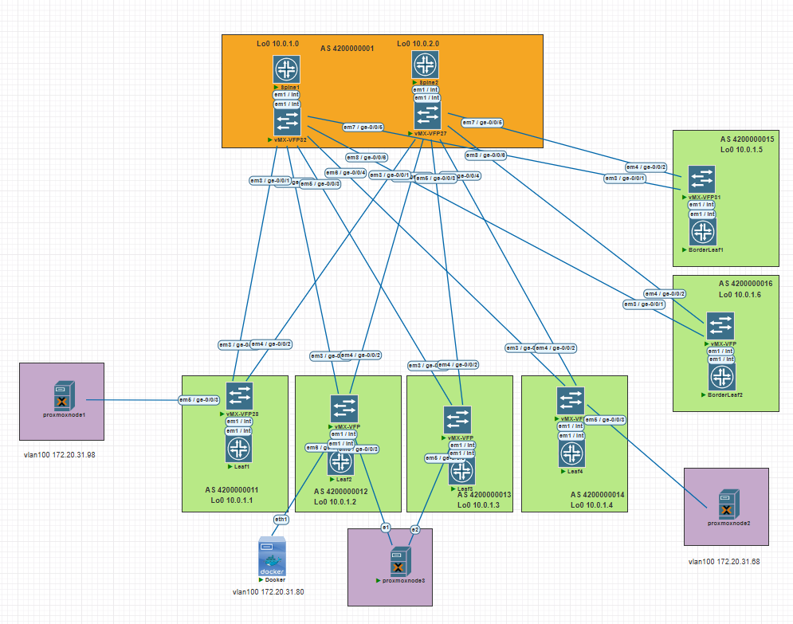
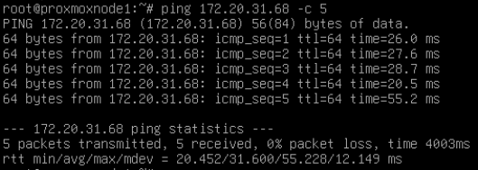
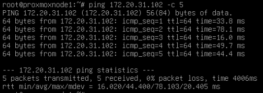
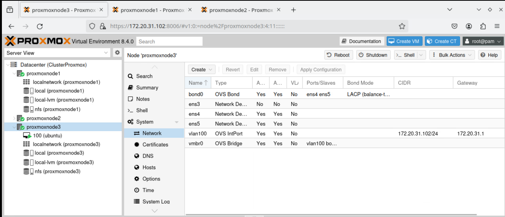
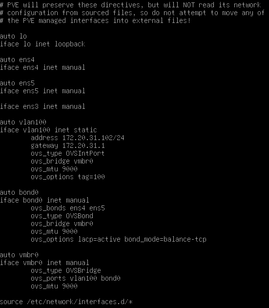
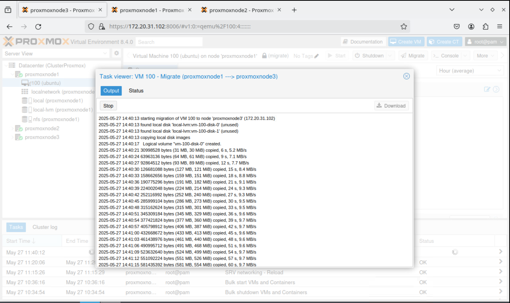

# Проектная работа.
# "Настройка и тестирование EVPN/VXLAN для обеспечения бесшовной миграции виртуальных машин на оборудовании Juniper"

### Цели:
* Реализация сетевой фабрики с использованием Overlay технологии VxLAN
* Сети Overlay и Underlay используется eBGP

### Описание/Пошаговая инструкция выполнения проектной работы:
Построения сетевой фабрики на основе протокола VxLAN:
#### 1) Необходимо настроить подключение нод Proxmox сразу к двум коммутаторам с использованием технологии ESI;
#### 2) Настроить маршрутизацию между сетями;
#### 3) Зафиксировать в документации - план работы, адресное пространство, схему сети, настройки сетевого оборудования.

# Выполнение:

## План выполнения проектной работы:

1) Зафиксировать параметры сети;
2) Привести схему сети;
3) Опубликовать список реализованных функций;
4) Провести проверку работы сети;
7) Опубликовать листинг команд для проверки корректной работы сети;
8) Привести конфигурации устройств.

## Параметры сети.

IP адреса Loopack интерфейсов:
Loopack-s:
<div align="center">

|             | Lo0 /32  |
|-------------|----------|
| Spine1      | 10.0.1.0 |
| Spine2      | 10.0.2.0 |

|             | Lo0 /32  |
|-------------|----------|
| Leaf1       | 10.0.1.1 |
| Leaf2       | 10.0.1.2 |
| Leaf3       | 10.0.1.3 |
| Leaf4       | 10.0.1.4 |
| BorderLeaf1 | 10.0.1.5 |
| BorderLeaf2 | 10.0.1.6 |
</div>

IP адреса P-t-P сетей

| **Connection**   	| **Spine Address** 	| **Leaf Address** 	| **Subnet**  	|
|------------------	|-------------------	|------------------	|-------------	|
| Spine 1 → Leaf 1 	| 10.2.1.0          	| 10.2.1.1         	| 10.2.1.0/31 	|
| Spine 1 → Leaf 2 	| 10.2.1.2              | 10.2.1.3          | 10.2.1.2/31  	|
| Spine 1 → Leaf 3 	| 10.2.1.4              | 10.2.1.5          | 10.2.1.4/31  	|
| Spine 1 → Leaf 4 	| 10.2.1.6          	| 10.2.1.7         	| 10.2.1.6/31 	|
| Spine 1 → BorderLeaf 1 | 10.2.1.8         | 10.2.1.9          | 10.2.1.8/31  	|
| Spine 1 → BorderLeaf 2 | 10.2.1.10        | 10.2.1.11        	| 10.2.1.10/31 	|
|------------------	|----------------------	|------------------	|-------------	|
| Spine 2 → Leaf 1 	| 10.2.2.0              | 10.2.2.1          | 10.2.2.0/31  	|
| Spine 2 → Leaf 2 	| 10.2.2.2              | 10.2.2.3          | 10.2.1.2/31  	|
| Spine 2 → Leaf 3 	| 10.2.2.4              | 10.2.2.5          | 10.2.1.4/31  	|
| Spine 2 → Leaf 4 	| 10.2.2.6              | 10.2.2.7          | 10.2.1.6/31  	|
| Spine 2 → BorderLeaf 1 | 10.2.2.8         | 10.2.2.9         | 10.2.1.8/31  	|
| Spine 2 → BorderLeaf 2 | 10.2.2.10        | 10.2.2.11          | 10.2.1.10/31 |

Таблица номеров автономных систем (AS)
<div align="center">

| Switch      |     AS     |
|-------------|------------|
| Spine1      | 4200000001 |
| Spine2      | 4200000001 |
| Leaf1       | 4200000011 |
| Leaf2       | 4200000012 |
| Leaf3       | 4200000013 |
| Leaf4       | 4200000014 |
| BorderLeaf1 | 4200000015 |
| BorderLeaf2 | 4200000016 |
</div>

#### Прочее.
В сзязи с реализацией схемы сети в виртуальной среде, необходимо в реальной сети настроить протокол BFD и выставить таймеры в протоколе BGP

### Схема связи


#### Описание сети 
Необходимо реализовать схему связи предоставленную на рисунке 1. 

Cеть состоит из:

* трех Spine (Spine3 нужен для лучшей резервирования сети);
* семи Leaf из них два BorderLeaf;
* двух серверов СХД.

В процессе настройки сети в виртуальной среде потребовалось внести корректировки в исходную схему, которая предоставлена на рисунке 2 


Для проверки работоспособности сети был настроена одна сеть с параментами 
| Назначение | Сервисная модель | VLAN ID/VRF name | VNI | RD | RT |
| ------------ |:---------------:|:---------------:|:---------------:|:---------------:|:---------------:|
| MAC-VRF 1 | VLAN-Aware-Bundle | 100 | 10100 | (Router ID):100 | 3:3 |
| IP-VRF 1 | Symmetric IRB | Tenant1 | 10500 | (Router ID):500 | 500:500 |

### Параметры ESI для серверов:

#### Агрегация между Leaf2, Leaf3 и proxmoxnode3.
| Интерфейс | ESI ID | lacp system-id | Site |
|:---------------:|:---------------:|:---------------:|:---------------:|
| ae0 | 00:12:12:12:12:12:12:12:12:12 | 12:12:12:12:12:12 | 1 |

### Параметры на proxmoxnode3:
| Назначение | IP-шлюза | MAC | VLAN ID | VRF name | Site |
| ------------ |:---------------:|:---------------:|:---------------:|:---------------:|:---------------:|
| Bond0 | 172.20.31.120/24 | 6a:26:9a:42:60:e1 | 100 | Tenant1 | 1 |

## Список реализованных функций:

* Протокол маршрутизации для Overlay/Underlay-сети - eBGP;
* Протоколы Overlay-сети - VXLAN и EVPN;
* Проверена L2-связность L3-связность между нодами proxmox;
* Схема подключения нод proxmox - Multi-Homing (ESI);
* Трафик внутри и меджу сайтами балансируется по ECMP.

## Проверка работы сети:

#### Связь между серверами proxmoxnode1 и proxmoxnode2


#### Связь между серверами proxmoxnode1 и proxmoxnode3


## Листинг команд с примерами вывода:
#### Листинг:
```
show evpn database
show mac-vrf routing database
show evpn instance extensive
show route  
```


show evpn database
<details>
<summary>Leaf2</summary>

``` text
root@Leaf2> show evpn database 
Instance: macvrf-1
VLAN  DomainId  MAC address        Active source                  Timestamp        IP address
     10100      00:00:5e:00:01:01  05:fa:56:ea:10:00:00:27:74:00  May 27 11:05:23  172.20.31.1
     10100      00:50:56:80:26:6c  10.0.1.4                       May 27 11:05:23  172.20.31.68
     10100      00:50:56:80:b0:e9  10.0.1.1                       May 27 11:05:23  172.20.31.98
     10100      00:50:56:80:bb:b7  10.0.1.1                       May 27 11:05:23  172.20.31.75
     10100      00:50:56:80:f7:71  10.0.1.1                       May 27 11:13:51  172.20.31.81
     10100      50:00:00:5e:00:01  ge-0/0/4.0                     May 27 11:38:55  172.20.31.80
     10100      6a:26:9a:42:60:e1  00:12:12:12:12:12:12:12:12:12  May 27 14:54:31  172.20.31.102
   ```
</details>

<details>
<summary>Leaf3</summary>

``` text
root@Leaf3> show evpn database 
Instance: macvrf-1
VLAN  DomainId  MAC address        Active source                  Timestamp        IP address
     10100      00:00:5e:00:01:01  05:fa:56:ea:10:00:00:27:74:00  May 27 12:08:00  172.20.31.1
     10100      00:50:56:80:26:6c  10.0.1.4                       May 27 12:08:00  172.20.31.68
     10100      00:50:56:80:b0:e9  10.0.1.1                       May 27 12:08:00  172.20.31.98
     10100      00:50:56:80:bb:b7  10.0.1.1                       May 27 12:08:00  172.20.31.75
     10100      00:50:56:80:f7:71  10.0.1.1                       May 27 12:08:00  172.20.31.81
     10100      50:00:00:5e:00:01  10.0.1.2                       May 27 12:08:00  172.20.31.80
     10100      6a:26:9a:42:60:e1  00:12:12:12:12:12:12:12:12:12  May 27 14:54:31  172.20.31.102
```
</details>
show mac-vrf routing database
<details>
<summary>Leaf2</summary>

``` text
root@Leaf2> show mac-vrf routing database 
Instance: macvrf-1
VLAN  DomainId  MAC address        Active source                  Timestamp        IP address
     10100      00:00:5e:00:01:01  05:fa:56:ea:10:00:00:27:74:00  May 27 11:05:23  172.20.31.1
     10100      00:50:56:80:26:6c  10.0.1.4                       May 27 11:05:23  172.20.31.68
     10100      00:50:56:80:b0:e9  10.0.1.1                       May 27 11:05:23  172.20.31.98
     10100      00:50:56:80:bb:b7  10.0.1.1                       May 27 11:05:23  172.20.31.75
     10100      00:50:56:80:f7:71  10.0.1.1                       May 27 15:29:34  172.20.31.81
     10100      50:00:00:5e:00:01  ge-0/0/4.0                     May 27 11:38:55  172.20.31.80
     10100      6a:26:9a:42:60:e1  00:12:12:12:12:12:12:12:12:12  May 27 14:54:31  172.20.31.102
   ```
</details>
<details>
<summary>Leaf3</summary>

``` text

root@Leaf3> show mac-vrf routing database    
Instance: macvrf-1
VLAN  DomainId  MAC address        Active source                  Timestamp        IP address
     10100      00:00:5e:00:01:01  05:fa:56:ea:10:00:00:27:74:00  May 27 12:08:00  172.20.31.1
     10100      00:50:56:80:26:6c  10.0.1.4                       May 27 12:08:00  172.20.31.68
     10100      00:50:56:80:b0:e9  10.0.1.1                       May 27 12:08:00  172.20.31.98
     10100      00:50:56:80:bb:b7  10.0.1.1                       May 27 12:08:00  172.20.31.75
     10100      00:50:56:80:f7:71  10.0.1.1                       May 27 15:29:34  172.20.31.81
     10100      50:00:00:5e:00:01  10.0.1.2                       May 27 12:08:00  172.20.31.80
     10100      6a:26:9a:42:60:e1  00:12:12:12:12:12:12:12:12:12  May 27 14:54:31  172.20.31.102
```
</details>

show evpn instance extensive

<details>
<summary>Leaf2</summary>

``` text

root@Leaf2> show evpn instance extensive 
Instance: __default_evpn__
  Route Distinguisher: 10.0.1.2:0
  Number of bridge domains: 0
  Number of neighbors: 1
    Address               MAC    MAC+IP        AD        IM        ES Leaf-label Remote-DCI-Peer Flow-label
    10.0.1.3                0         0         0         0         1                            NO  

Instance: macvrf-1
  Route Distinguisher: 10.0.1.2:100
  Encapsulation type: VXLAN
  Control word enabled
  Duplicate MAC detection threshold: 5
  Duplicate MAC detection window: 180
  MAC database status                     Local  Remote
    MAC advertisements:                       2       6
    MAC+IP advertisements:                    2       6
    Default gateway MAC advertisements:       0       0
  Number of local interfaces: 3 (3 up)
    Interface name  ESI                            Mode             Status     AC-Role
    .local..9       00:00:00:00:00:00:00:00:00:00  single-homed     Up         Root 
    ae0.100         00:12:12:12:12:12:12:12:12:12  all-active       Up         Root 
    ge-0/0/4.0      00:00:00:00:00:00:00:00:00:00  single-homed     Up         Root 
  Number of IRB interfaces: 1 (0 up)
    Interface name  VLAN   VNI    Status  L3 context
    irb.100                10100   Down   Not assigned                     
  Number of protect interfaces: 0
  Number of bridge domains: 1
    VLAN  Domain-ID Intfs/up   IRB-intf  Mode            MAC-sync v4-SG-sync v6-SG-sync
    100   10100        2  2    irb.100   Extended        Enabled  Disabled   Disabled  
  Number of neighbors: 4
    Address               MAC    MAC+IP        AD        IM        ES Leaf-label Remote-DCI-Peer Flow-label
    10.0.1.1                3         3         0         1         0                            NO  
    10.0.1.3                1         1         2         1         0                            NO  
    10.0.1.4                1         1         0         1         0                            NO  
    10.0.1.6                1         1         1         1         0                            NO  
  Number of ethernet segments: 3
    ESI: 00:12:12:12:12:12:12:12:12:12
      Status: Resolved by IFL ae0.100
      Local interface: ae0.100, Status: Up/Forwarding
      Number of remote PEs connected: 1
        Remote-PE        MAC-label  Aliasing-label  Mode
        10.0.1.3         10100      0               all-active   
      DF Election Algorithm: MOD based
      Designated forwarder: 10.0.1.2
      Backup forwarder: 10.0.1.3
      Last designated forwarder update: May 27 12:08:24
    ESI: 05:fa:56:ea:0c:00:00:27:74:00
      Status: Resolved
      Local interface: irb.100, Status: Down
    ESI: 05:fa:56:ea:10:00:00:27:74:00
      Status: Resolved
      Number of remote PEs connected: 1
        Remote-PE        MAC-label  Aliasing-label  Mode
        10.0.1.6         10100      0               all-active   
  Router-ID: 10.0.1.2                   
  Source VTEP interface IP: 10.0.1.2
  SMET Forwarding: Disabled

   ```
</details>

<details>
<summary>Leaf3</summary>

``` text
root@Leaf3> show evpn instance extensive 
Instance: __default_evpn__
  Route Distinguisher: 10.0.1.3:0
  Number of bridge domains: 0
  Number of neighbors: 1
    Address               MAC    MAC+IP        AD        IM        ES Leaf-label Remote-DCI-Peer Flow-label
    10.0.1.2                0         0         0         0         1                            NO  

Instance: macvrf-1
  Route Distinguisher: 10.0.1.3:100
  Encapsulation type: VXLAN
  Control word enabled
  Duplicate MAC detection threshold: 5
  Duplicate MAC detection window: 180
  MAC database status                     Local  Remote
    MAC advertisements:                       1       7
    MAC+IP advertisements:                    1       7
    Default gateway MAC advertisements:       0       0
  Number of local interfaces: 2 (2 up)
    Interface name  ESI                            Mode             Status     AC-Role
    .local..9       00:00:00:00:00:00:00:00:00:00  single-homed     Up         Root 
    ae0.100         00:12:12:12:12:12:12:12:12:12  all-active       Up         Root 
  Number of IRB interfaces: 1 (0 up)
    Interface name  VLAN   VNI    Status  L3 context
    irb.100                10100   Down   Not assigned                     
  Number of protect interfaces: 0
  Number of bridge domains: 1
    VLAN  Domain-ID Intfs/up   IRB-intf  Mode            MAC-sync v4-SG-sync v6-SG-sync
    100   10100        1  1    irb.100   Extended        Enabled  Disabled   Disabled  
  Number of neighbors: 4
    Address               MAC    MAC+IP        AD        IM        ES Leaf-label Remote-DCI-Peer Flow-label
    10.0.1.1                3         3         0         1         0                            NO  
    10.0.1.2                2         2         2         1         0                            NO  
    10.0.1.4                1         1         0         1         0                            NO  
    10.0.1.6                1         1         1         1         0                            NO  
  Number of ethernet segments: 3
    ESI: 00:12:12:12:12:12:12:12:12:12
      Status: Resolved by IFL ae0.100
      Local interface: ae0.100, Status: Up/Forwarding
      Number of remote PEs connected: 1
        Remote-PE        MAC-label  Aliasing-label  Mode
        10.0.1.2         10100      0               all-active   
      DF Election Algorithm: MOD based
      Designated forwarder: 10.0.1.2
      Backup forwarder: 10.0.1.3
      Last designated forwarder update: May 27 12:08:23
    ESI: 05:fa:56:ea:0d:00:00:27:74:00
      Status: Resolved
      Local interface: irb.100, Status: Down
    ESI: 05:fa:56:ea:10:00:00:27:74:00
      Status: Resolved
      Number of remote PEs connected: 1
        Remote-PE        MAC-label  Aliasing-label  Mode
        10.0.1.6         10100      0               all-active   
  Router-ID: 10.0.1.3
  Source VTEP interface IP: 10.0.1.3
  SMET Forwarding: Disabled

   ```

</details>

show route

<details>

<summary>Leaf2</summary>

``` text

root@Leaf2> show route  

inet.0: 11 destinations, 15 routes (11 active, 0 holddown, 0 hidden)

* = Active Route, - = Last Active, * = Both

10.0.1.0/32        *[BGP/170] 04:39:14, localpref 100
                      AS path: 4200000001 I, validation-state: unverified
                    >  to 10.2.1.2 via ge-0/0/1.0
10.0.1.1/32        *[BGP/170] 04:36:15, localpref 100, from 10.2.1.2
                      AS path: 4200000001 4200000011 I, validation-state: unverified
                       to 10.2.1.2 via ge-0/0/1.0
                    >  to 10.2.2.2 via ge-0/0/2.0
                    [BGP/170] 04:36:15, localpref 100
                      AS path: 4200000001 4200000011 I, validation-state: unverified
                    >  to 10.2.2.2 via ge-0/0/2.0
10.0.1.2/32        *[Direct/0] 6d 02:11:49
                    >  via lo0.0
10.0.1.3/32        *[BGP/170] 03:37:47, localpref 100, from 10.2.1.2
                      AS path: 4200000001 4200000013 I, validation-state: unverified
                       to 10.2.1.2 via ge-0/0/1.0
                    >  to 10.2.2.2 via ge-0/0/2.0
                    [BGP/170] 03:37:47, localpref 100
                      AS path: 4200000001 4200000013 I, validation-state: unverified
                    >  to 10.2.2.2 via ge-0/0/2.0
10.0.1.4/32        *[BGP/170] 04:36:15, localpref 100, from 10.2.1.2
                      AS path: 4200000001 4200000014 I, validation-state: unverified
                       to 10.2.1.2 via ge-0/0/1.0
                    >  to 10.2.2.2 via ge-0/0/2.0
                    [BGP/170] 04:36:15, localpref 100
                      AS path: 4200000001 4200000014 I, validation-state: unverified
                    >  to 10.2.2.2 via ge-0/0/2.0
10.0.1.6/32        *[BGP/170] 04:36:15, localpref 100, from 10.2.1.2
                      AS path: 4200000001 4200000016 I, validation-state: unverified
                       to 10.2.1.2 via ge-0/0/1.0
                    >  to 10.2.2.2 via ge-0/0/2.0
                    [BGP/170] 04:36:15, localpref 100
                      AS path: 4200000001 4200000016 I, validation-state: unverified
                    >  to 10.2.2.2 via ge-0/0/2.0
10.0.2.0/32        *[BGP/170] 04:36:15, localpref 100
                      AS path: 4200000001 I, validation-state: unverified
                    >  to 10.2.2.2 via ge-0/0/2.0
10.2.1.2/31        *[Direct/0] 04:40:24
                    >  via ge-0/0/1.0
10.2.1.3/32        *[Local/0] 04:40:24
                       Local via ge-0/0/1.0
10.2.2.2/31        *[Direct/0] 04:40:24
                    >  via ge-0/0/2.0
10.2.2.3/32        *[Local/0] 04:40:24
                       Local via ge-0/0/2.0

Tenant1.inet.0: 1 destinations, 1 routes (1 active, 0 holddown, 0 hidden)
+ = Active Route, - = Last Active, * = Both

172.20.31.0/24     *[EVPN/170] 04:40:22
                    >  to 10.2.1.2 via ge-0/0/1.0
                       to 10.2.2.2 via ge-0/0/2.0

inet6.0: 2 destinations, 2 routes (2 active, 0 holddown, 0 hidden)
+ = Active Route, - = Last Active, * = Both

fe80::52a9:3ff:fe00:6400/128
                   *[Local/0] 6d 02:55:07
                       Reject           
ff02::2/128        *[INET6/0] 6d 02:55:08
                       MultiRecv

Tenant1.inet6.0: 1 destinations, 1 routes (1 active, 0 holddown, 0 hidden)
+ = Active Route, - = Last Active, * = Both

ff02::2/128        *[INET6/0] 6d 02:11:49
                       MultiRecv

bgp.evpn.0: 29 destinations, 50 routes (29 active, 0 holddown, 0 hidden)
+ = Active Route, - = Last Active, * = Both

1:10.0.1.2:0::121212121212121212::FFFF:FFFF/192 AD/ESI        
                   *[EVPN/170] 04:06:42
                       Indirect
1:10.0.1.2:100::121212121212121212::0/192 AD/EVI        
                   *[EVPN/170] 04:06:43
                       Indirect
1:10.0.1.3:0::121212121212121212::FFFF:FFFF/192 AD/ESI        
                   *[BGP/170] 03:37:20, localpref 100, from 10.0.1.0
                      AS path: 4200000001 4200000013 I, validation-state: unverified
                    >  to 10.2.1.2 via ge-0/0/1.0
                       to 10.2.2.2 via ge-0/0/2.0
                    [BGP/170] 03:37:20, localpref 100, from 10.0.2.0
                      AS path: 4200000001 4200000013 I, validation-state: unverified
                    >  to 10.2.1.2 via ge-0/0/1.0
                       to 10.2.2.2 via ge-0/0/2.0
1:10.0.1.3:100::121212121212121212::0/192 AD/EVI        
                   *[BGP/170] 03:37:21, localpref 100, from 10.0.2.0
                      AS path: 4200000001 4200000013 I, validation-state: unverified
                    >  to 10.2.1.2 via ge-0/0/1.0
                       to 10.2.2.2 via ge-0/0/2.0
                    [BGP/170] 03:37:20, localpref 100, from 10.0.1.0
                      AS path: 4200000001 4200000013 I, validation-state: unverified
                    >  to 10.2.1.2 via ge-0/0/1.0
                       to 10.2.2.2 via ge-0/0/2.0
1:10.0.1.6:0::05fa56ea100000277400::FFFF:FFFF/192 AD/ESI        
                   *[BGP/170] 04:40:22, localpref 100, from 10.0.1.0
                      AS path: 4200000001 4200000016 I, validation-state: unverified
                    >  to 10.2.1.2 via ge-0/0/1.0
                       to 10.2.2.2 via ge-0/0/2.0
                    [BGP/170] 04:40:22, localpref 100, from 10.0.2.0
                      AS path: 4200000001 4200000016 I, validation-state: unverified
                    >  to 10.2.1.2 via ge-0/0/1.0
                       to 10.2.2.2 via ge-0/0/2.0
2:10.0.1.1:100::10100::00:50:56:80:b0:e9/304 MAC/IP        
                   *[BGP/170] 04:40:22, localpref 100, from 10.0.1.0
                      AS path: 4200000001 4200000011 I, validation-state: unverified
                    >  to 10.2.1.2 via ge-0/0/1.0, Push 631
                       to 10.2.2.2 via ge-0/0/2.0, Push 631
                    [BGP/170] 04:40:22, localpref 100, from 10.0.2.0
                      AS path: 4200000001 4200000011 I, validation-state: unverified
                    >  to 10.2.1.2 via ge-0/0/1.0, Push 631
                       to 10.2.2.2 via ge-0/0/2.0, Push 631
2:10.0.1.1:100::10100::00:50:56:80:bb:b7/304 MAC/IP        
                   *[BGP/170] 04:40:22, localpref 100, from 10.0.1.0
                      AS path: 4200000001 4200000011 I, validation-state: unverified
                    >  to 10.2.1.2 via ge-0/0/1.0, Push 631
                       to 10.2.2.2 via ge-0/0/2.0, Push 631
                    [BGP/170] 04:40:22, localpref 100, from 10.0.2.0
                      AS path: 4200000001 4200000011 I, validation-state: unverified
                    >  to 10.2.1.2 via ge-0/0/1.0, Push 631
                       to 10.2.2.2 via ge-0/0/2.0, Push 631
2:10.0.1.1:100::10100::00:50:56:80:f7:71/304 MAC/IP        
                   *[BGP/170] 00:03:21, localpref 100, from 10.0.1.0
                      AS path: 4200000001 4200000011 I, validation-state: unverified
                       to 10.2.1.2 via ge-0/0/1.0, Push 631
                    >  to 10.2.2.2 via ge-0/0/2.0, Push 631
                    [BGP/170] 00:03:21, localpref 100, from 10.0.2.0
                      AS path: 4200000001 4200000011 I, validation-state: unverified
                       to 10.2.1.2 via ge-0/0/1.0, Push 631
                    >  to 10.2.2.2 via ge-0/0/2.0, Push 631
2:10.0.1.2:100::10100::50:00:00:5e:00:01/304 MAC/IP        
                   *[EVPN/170] 04:17:55
                       Indirect
2:10.0.1.2:100::10100::6a:26:9a:42:60:e1/304 MAC/IP        
                   *[EVPN/170] 03:23:33
                       Indirect
2:10.0.1.3:100::10100::6a:26:9a:42:60:e1/304 MAC/IP        
                   *[BGP/170] 03:37:21, localpref 100, from 10.0.2.0
                      AS path: 4200000001 4200000013 I, validation-state: unverified
                       to 10.2.1.2 via ge-0/0/1.0, Push 631
                    >  to 10.2.2.2 via ge-0/0/2.0, Push 631
                    [BGP/170] 03:37:20, localpref 100, from 10.0.1.0
                      AS path: 4200000001 4200000013 I, validation-state: unverified
                       to 10.2.1.2 via ge-0/0/1.0, Push 631
                    >  to 10.2.2.2 via ge-0/0/2.0, Push 631
2:10.0.1.4:100::10100::00:50:56:80:26:6c/304 MAC/IP        
                   *[BGP/170] 04:40:22, localpref 100, from 10.0.1.0
                      AS path: 4200000001 4200000014 I, validation-state: unverified
                    >  to 10.2.1.2 via ge-0/0/1.0, Push 631
                       to 10.2.2.2 via ge-0/0/2.0, Push 631
                    [BGP/170] 04:40:22, localpref 100, from 10.0.2.0
                      AS path: 4200000001 4200000014 I, validation-state: unverified
                    >  to 10.2.1.2 via ge-0/0/1.0, Push 631
                       to 10.2.2.2 via ge-0/0/2.0, Push 631
2:10.0.1.6:100::10100::00:00:5e:00:01:01/304 MAC/IP        
                   *[BGP/170] 04:40:22, localpref 100, from 10.0.1.0
                      AS path: 4200000001 4200000016 I, validation-state: unverified
                    >  to 10.2.1.2 via ge-0/0/1.0, Push 631
                       to 10.2.2.2 via ge-0/0/2.0, Push 631
                    [BGP/170] 04:40:22, localpref 100, from 10.0.2.0
                      AS path: 4200000001 4200000016 I, validation-state: unverified
                    >  to 10.2.1.2 via ge-0/0/1.0, Push 631
                       to 10.2.2.2 via ge-0/0/2.0, Push 631
2:10.0.1.1:100::10100::00:50:56:80:b0:e9::172.20.31.98/304 MAC/IP        
                   *[BGP/170] 04:40:22, localpref 100, from 10.0.1.0
                      AS path: 4200000001 4200000011 I, validation-state: unverified
                       to 10.2.1.2 via ge-0/0/1.0, Push 631
                    >  to 10.2.2.2 via ge-0/0/2.0, Push 631
                    [BGP/170] 04:40:22, localpref 100, from 10.0.2.0
                      AS path: 4200000001 4200000011 I, validation-state: unverified
                       to 10.2.1.2 via ge-0/0/1.0, Push 631
                    >  to 10.2.2.2 via ge-0/0/2.0, Push 631
2:10.0.1.1:100::10100::00:50:56:80:bb:b7::172.20.31.75/304 MAC/IP        
                   *[BGP/170] 04:40:22, localpref 100, from 10.0.2.0
                      AS path: 4200000001 4200000011 I, validation-state: unverified
                    >  to 10.2.1.2 via ge-0/0/1.0, Push 631
                       to 10.2.2.2 via ge-0/0/2.0, Push 631
                    [BGP/170] 04:40:22, localpref 100, from 10.0.1.0
                      AS path: 4200000001 4200000011 I, validation-state: unverified
                    >  to 10.2.1.2 via ge-0/0/1.0, Push 631
                       to 10.2.2.2 via ge-0/0/2.0, Push 631
2:10.0.1.1:100::10100::00:50:56:80:f7:71::172.20.31.81/304 MAC/IP        
                   *[BGP/170] 00:03:21, localpref 100, from 10.0.1.0
                      AS path: 4200000001 4200000011 I, validation-state: unverified
                    >  to 10.2.1.2 via ge-0/0/1.0, Push 631
                       to 10.2.2.2 via ge-0/0/2.0, Push 631
                    [BGP/170] 00:03:21, localpref 100, from 10.0.2.0
                      AS path: 4200000001 4200000011 I, validation-state: unverified
                    >  to 10.2.1.2 via ge-0/0/1.0, Push 631
                       to 10.2.2.2 via ge-0/0/2.0, Push 631
2:10.0.1.2:100::10100::50:00:00:5e:00:01::172.20.31.80/304 MAC/IP        
                   *[EVPN/170] 04:17:47
                       Indirect
2:10.0.1.2:100::10100::6a:26:9a:42:60:e1::172.20.31.102/304 MAC/IP        
                   *[EVPN/170] 02:54:31
                       Indirect
2:10.0.1.3:100::10100::6a:26:9a:42:60:e1::172.20.31.102/304 MAC/IP        
                   *[BGP/170] 00:51:13, localpref 100, from 10.0.1.0
                      AS path: 4200000001 4200000013 I, validation-state: unverified
                    >  to 10.2.1.2 via ge-0/0/1.0, Push 631
                       to 10.2.2.2 via ge-0/0/2.0, Push 631
                    [BGP/170] 00:51:13, localpref 100, from 10.0.2.0
                      AS path: 4200000001 4200000013 I, validation-state: unverified
                    >  to 10.2.1.2 via ge-0/0/1.0, Push 631
                       to 10.2.2.2 via ge-0/0/2.0, Push 631
2:10.0.1.4:100::10100::00:50:56:80:26:6c::172.20.31.68/304 MAC/IP        
                   *[BGP/170] 04:40:22, localpref 100, from 10.0.1.0
                      AS path: 4200000001 4200000014 I, validation-state: unverified
                       to 10.2.1.2 via ge-0/0/1.0, Push 631
                    >  to 10.2.2.2 via ge-0/0/2.0, Push 631
                    [BGP/170] 04:40:22, localpref 100, from 10.0.2.0
                      AS path: 4200000001 4200000014 I, validation-state: unverified
                       to 10.2.1.2 via ge-0/0/1.0, Push 631
                    >  to 10.2.2.2 via ge-0/0/2.0, Push 631
2:10.0.1.6:100::10100::00:00:5e:00:01:01::172.20.31.1/304 MAC/IP        
                   *[BGP/170] 04:40:22, localpref 100, from 10.0.1.0
                      AS path: 4200000001 4200000016 I, validation-state: unverified
                       to 10.2.1.2 via ge-0/0/1.0, Push 631
                    >  to 10.2.2.2 via ge-0/0/2.0, Push 631
                    [BGP/170] 04:40:22, localpref 100, from 10.0.2.0
                      AS path: 4200000001 4200000016 I, validation-state: unverified
                       to 10.2.1.2 via ge-0/0/1.0, Push 631
                    >  to 10.2.2.2 via ge-0/0/2.0, Push 631
3:10.0.1.1:100::10100::10.0.1.1/248 IM            
                   *[BGP/170] 04:40:22, localpref 100, from 10.0.1.0
                      AS path: 4200000001 4200000011 I, validation-state: unverified
                    >  to 10.2.1.2 via ge-0/0/1.0
                       to 10.2.2.2 via ge-0/0/2.0
                    [BGP/170] 04:40:22, localpref 100, from 10.0.2.0
                      AS path: 4200000001 4200000011 I, validation-state: unverified
                    >  to 10.2.1.2 via ge-0/0/1.0
                       to 10.2.2.2 via ge-0/0/2.0
3:10.0.1.2:100::10100::10.0.1.2/248 IM            
                   *[EVPN/170] 6d 02:11:48
                       Indirect
3:10.0.1.3:100::10100::10.0.1.3/248 IM            
                   *[BGP/170] 03:37:44, localpref 100, from 10.0.1.0
                      AS path: 4200000001 4200000013 I, validation-state: unverified
                    >  to 10.2.1.2 via ge-0/0/1.0
                       to 10.2.2.2 via ge-0/0/2.0
                    [BGP/170] 03:37:44, localpref 100, from 10.0.2.0
                      AS path: 4200000001 4200000013 I, validation-state: unverified
                    >  to 10.2.1.2 via ge-0/0/1.0
                       to 10.2.2.2 via ge-0/0/2.0
3:10.0.1.4:100::10100::10.0.1.4/248 IM            
                   *[BGP/170] 04:40:22, localpref 100, from 10.0.2.0
                      AS path: 4200000001 4200000014 I, validation-state: unverified
                    >  to 10.2.1.2 via ge-0/0/1.0
                       to 10.2.2.2 via ge-0/0/2.0
                    [BGP/170] 04:40:22, localpref 100, from 10.0.1.0
                      AS path: 4200000001 4200000014 I, validation-state: unverified
                    >  to 10.2.1.2 via ge-0/0/1.0
                       to 10.2.2.2 via ge-0/0/2.0
3:10.0.1.6:100::10100::10.0.1.6/248 IM            
                   *[BGP/170] 04:40:22, localpref 100, from 10.0.1.0
                      AS path: 4200000001 4200000016 I, validation-state: unverified
                    >  to 10.2.1.2 via ge-0/0/1.0
                       to 10.2.2.2 via ge-0/0/2.0
                    [BGP/170] 04:40:22, localpref 100, from 10.0.2.0
                      AS path: 4200000001 4200000016 I, validation-state: unverified
                    >  to 10.2.1.2 via ge-0/0/1.0
                       to 10.2.2.2 via ge-0/0/2.0
4:10.0.1.2:0::121212121212121212:10.0.1.2/296 ES            
                   *[EVPN/170] 04:06:43
                       Indirect
4:10.0.1.3:0::121212121212121212:10.0.1.3/296 ES            
                   *[BGP/170] 03:37:21, localpref 100, from 10.0.2.0
                      AS path: 4200000001 4200000013 I, validation-state: unverified
                    >  to 10.2.1.2 via ge-0/0/1.0
                       to 10.2.2.2 via ge-0/0/2.0
                    [BGP/170] 03:37:20, localpref 100, from 10.0.1.0
                      AS path: 4200000001 4200000013 I, validation-state: unverified
                    >  to 10.2.1.2 via ge-0/0/1.0
                       to 10.2.2.2 via ge-0/0/2.0
5:10.0.1.6:500::0::172.20.31.0::24/248               
                   *[BGP/170] 04:40:22, localpref 100, from 10.0.1.0
                      AS path: 4200000001 4200000016 I, validation-state: unverified
                    >  to 10.2.1.2 via ge-0/0/1.0, Push 656
                       to 10.2.2.2 via ge-0/0/2.0, Push 656
                    [BGP/170] 04:40:22, localpref 100, from 10.0.2.0
                      AS path: 4200000001 4200000016 I, validation-state: unverified
                    >  to 10.2.1.2 via ge-0/0/1.0, Push 656
                       to 10.2.2.2 via ge-0/0/2.0, Push 656

Tenant1.evpn.0: 1 destinations, 2 routes (1 active, 0 holddown, 0 hidden)
+ = Active Route, - = Last Active, * = Both

5:10.0.1.6:500::0::172.20.31.0::24/248               
                   *[BGP/170] 04:40:22, localpref 100, from 10.0.1.0
                      AS path: 4200000001 4200000016 I, validation-state: unverified
                    >  to 10.2.1.2 via ge-0/0/1.0, Push 656
                       to 10.2.2.2 via ge-0/0/2.0, Push 656
                    [BGP/170] 04:40:22, localpref 100, from 10.0.2.0
                      AS path: 4200000001 4200000016 I, validation-state: unverified
                    >  to 10.2.1.2 via ge-0/0/1.0, Push 656
                       to 10.2.2.2 via ge-0/0/2.0, Push 656

macvrf-1.evpn.0: 25 destinations, 44 routes (25 active, 0 holddown, 0 hidden)
+ = Active Route, - = Last Active, * = Both

1:10.0.1.2:100::121212121212121212::0/192 AD/EVI        
                   *[EVPN/170] 04:06:43
                       Indirect
1:10.0.1.3:0::121212121212121212::FFFF:FFFF/192 AD/ESI        
                   *[BGP/170] 03:37:20, localpref 100, from 10.0.1.0
                      AS path: 4200000001 4200000013 I, validation-state: unverified
                    >  to 10.2.1.2 via ge-0/0/1.0
                       to 10.2.2.2 via ge-0/0/2.0
                    [BGP/170] 03:37:20, localpref 100, from 10.0.2.0
                      AS path: 4200000001 4200000013 I, validation-state: unverified
                    >  to 10.2.1.2 via ge-0/0/1.0
                       to 10.2.2.2 via ge-0/0/2.0
1:10.0.1.3:100::121212121212121212::0/192 AD/EVI        
                   *[BGP/170] 03:37:21, localpref 100, from 10.0.2.0
                      AS path: 4200000001 4200000013 I, validation-state: unverified
                    >  to 10.2.1.2 via ge-0/0/1.0
                       to 10.2.2.2 via ge-0/0/2.0
                    [BGP/170] 03:37:20, localpref 100, from 10.0.1.0
                      AS path: 4200000001 4200000013 I, validation-state: unverified
                    >  to 10.2.1.2 via ge-0/0/1.0
                       to 10.2.2.2 via ge-0/0/2.0
1:10.0.1.6:0::05fa56ea100000277400::FFFF:FFFF/192 AD/ESI        
                   *[BGP/170] 04:40:22, localpref 100, from 10.0.1.0
                      AS path: 4200000001 4200000016 I, validation-state: unverified
                    >  to 10.2.1.2 via ge-0/0/1.0
                       to 10.2.2.2 via ge-0/0/2.0
                    [BGP/170] 04:40:22, localpref 100, from 10.0.2.0
                      AS path: 4200000001 4200000016 I, validation-state: unverified
                    >  to 10.2.1.2 via ge-0/0/1.0
                       to 10.2.2.2 via ge-0/0/2.0
2:10.0.1.1:100::10100::00:50:56:80:b0:e9/304 MAC/IP        
                   *[BGP/170] 04:40:22, localpref 100, from 10.0.1.0
                      AS path: 4200000001 4200000011 I, validation-state: unverified
                    >  to 10.2.1.2 via ge-0/0/1.0, Push 631
                       to 10.2.2.2 via ge-0/0/2.0, Push 631
                    [BGP/170] 04:40:22, localpref 100, from 10.0.2.0
                      AS path: 4200000001 4200000011 I, validation-state: unverified
                    >  to 10.2.1.2 via ge-0/0/1.0, Push 631
                       to 10.2.2.2 via ge-0/0/2.0, Push 631
2:10.0.1.1:100::10100::00:50:56:80:bb:b7/304 MAC/IP        
                   *[BGP/170] 04:40:22, localpref 100, from 10.0.1.0
                      AS path: 4200000001 4200000011 I, validation-state: unverified
                    >  to 10.2.1.2 via ge-0/0/1.0, Push 631
                       to 10.2.2.2 via ge-0/0/2.0, Push 631
                    [BGP/170] 04:40:22, localpref 100, from 10.0.2.0
                      AS path: 4200000001 4200000011 I, validation-state: unverified
                    >  to 10.2.1.2 via ge-0/0/1.0, Push 631
                       to 10.2.2.2 via ge-0/0/2.0, Push 631
2:10.0.1.1:100::10100::00:50:56:80:f7:71/304 MAC/IP        
                   *[BGP/170] 00:03:21, localpref 100, from 10.0.1.0
                      AS path: 4200000001 4200000011 I, validation-state: unverified
                       to 10.2.1.2 via ge-0/0/1.0, Push 631
                    >  to 10.2.2.2 via ge-0/0/2.0, Push 631
                    [BGP/170] 00:03:21, localpref 100, from 10.0.2.0
                      AS path: 4200000001 4200000011 I, validation-state: unverified
                       to 10.2.1.2 via ge-0/0/1.0, Push 631
                    >  to 10.2.2.2 via ge-0/0/2.0, Push 631
2:10.0.1.2:100::10100::50:00:00:5e:00:01/304 MAC/IP        
                   *[EVPN/170] 04:17:55
                       Indirect
2:10.0.1.2:100::10100::6a:26:9a:42:60:e1/304 MAC/IP        
                   *[EVPN/170] 03:23:33
                       Indirect
2:10.0.1.3:100::10100::6a:26:9a:42:60:e1/304 MAC/IP        
                   *[BGP/170] 03:37:21, localpref 100, from 10.0.2.0
                      AS path: 4200000001 4200000013 I, validation-state: unverified
                       to 10.2.1.2 via ge-0/0/1.0, Push 631
                    >  to 10.2.2.2 via ge-0/0/2.0, Push 631
                    [BGP/170] 03:37:20, localpref 100, from 10.0.1.0
                      AS path: 4200000001 4200000013 I, validation-state: unverified
                       to 10.2.1.2 via ge-0/0/1.0, Push 631
                    >  to 10.2.2.2 via ge-0/0/2.0, Push 631
2:10.0.1.4:100::10100::00:50:56:80:26:6c/304 MAC/IP        
                   *[BGP/170] 04:40:22, localpref 100, from 10.0.1.0
                      AS path: 4200000001 4200000014 I, validation-state: unverified
                    >  to 10.2.1.2 via ge-0/0/1.0, Push 631
                       to 10.2.2.2 via ge-0/0/2.0, Push 631
                    [BGP/170] 04:40:22, localpref 100, from 10.0.2.0
                      AS path: 4200000001 4200000014 I, validation-state: unverified
                    >  to 10.2.1.2 via ge-0/0/1.0, Push 631
                       to 10.2.2.2 via ge-0/0/2.0, Push 631
2:10.0.1.6:100::10100::00:00:5e:00:01:01/304 MAC/IP        
                   *[BGP/170] 04:40:22, localpref 100, from 10.0.1.0
                      AS path: 4200000001 4200000016 I, validation-state: unverified
                    >  to 10.2.1.2 via ge-0/0/1.0, Push 631
                       to 10.2.2.2 via ge-0/0/2.0, Push 631
                    [BGP/170] 04:40:22, localpref 100, from 10.0.2.0
                      AS path: 4200000001 4200000016 I, validation-state: unverified
                    >  to 10.2.1.2 via ge-0/0/1.0, Push 631
                       to 10.2.2.2 via ge-0/0/2.0, Push 631
2:10.0.1.1:100::10100::00:50:56:80:b0:e9::172.20.31.98/304 MAC/IP        
                   *[BGP/170] 04:40:22, localpref 100, from 10.0.1.0
                      AS path: 4200000001 4200000011 I, validation-state: unverified
                       to 10.2.1.2 via ge-0/0/1.0, Push 631
                    >  to 10.2.2.2 via ge-0/0/2.0, Push 631
                    [BGP/170] 04:40:22, localpref 100, from 10.0.2.0
                      AS path: 4200000001 4200000011 I, validation-state: unverified
                       to 10.2.1.2 via ge-0/0/1.0, Push 631
                    >  to 10.2.2.2 via ge-0/0/2.0, Push 631
2:10.0.1.1:100::10100::00:50:56:80:bb:b7::172.20.31.75/304 MAC/IP        
                   *[BGP/170] 04:40:22, localpref 100, from 10.0.2.0
                      AS path: 4200000001 4200000011 I, validation-state: unverified
                    >  to 10.2.1.2 via ge-0/0/1.0, Push 631
                       to 10.2.2.2 via ge-0/0/2.0, Push 631
                    [BGP/170] 04:40:22, localpref 100, from 10.0.1.0
                      AS path: 4200000001 4200000011 I, validation-state: unverified
                    >  to 10.2.1.2 via ge-0/0/1.0, Push 631
                       to 10.2.2.2 via ge-0/0/2.0, Push 631
2:10.0.1.1:100::10100::00:50:56:80:f7:71::172.20.31.81/304 MAC/IP        
                   *[BGP/170] 00:03:21, localpref 100, from 10.0.1.0
                      AS path: 4200000001 4200000011 I, validation-state: unverified
                    >  to 10.2.1.2 via ge-0/0/1.0, Push 631
                       to 10.2.2.2 via ge-0/0/2.0, Push 631
                    [BGP/170] 00:03:21, localpref 100, from 10.0.2.0
                      AS path: 4200000001 4200000011 I, validation-state: unverified
                    >  to 10.2.1.2 via ge-0/0/1.0, Push 631
                       to 10.2.2.2 via ge-0/0/2.0, Push 631
2:10.0.1.2:100::10100::50:00:00:5e:00:01::172.20.31.80/304 MAC/IP        
                   *[EVPN/170] 04:17:47
                       Indirect
2:10.0.1.2:100::10100::6a:26:9a:42:60:e1::172.20.31.102/304 MAC/IP        
                   *[EVPN/170] 02:54:31
                       Indirect
2:10.0.1.3:100::10100::6a:26:9a:42:60:e1::172.20.31.102/304 MAC/IP        
                   *[BGP/170] 00:51:13, localpref 100, from 10.0.1.0
                      AS path: 4200000001 4200000013 I, validation-state: unverified
                    >  to 10.2.1.2 via ge-0/0/1.0, Push 631
                       to 10.2.2.2 via ge-0/0/2.0, Push 631
                    [BGP/170] 00:51:13, localpref 100, from 10.0.2.0
                      AS path: 4200000001 4200000013 I, validation-state: unverified
                    >  to 10.2.1.2 via ge-0/0/1.0, Push 631
                       to 10.2.2.2 via ge-0/0/2.0, Push 631
2:10.0.1.4:100::10100::00:50:56:80:26:6c::172.20.31.68/304 MAC/IP        
                   *[BGP/170] 04:40:22, localpref 100, from 10.0.1.0
                      AS path: 4200000001 4200000014 I, validation-state: unverified
                       to 10.2.1.2 via ge-0/0/1.0, Push 631
                    >  to 10.2.2.2 via ge-0/0/2.0, Push 631
                    [BGP/170] 04:40:22, localpref 100, from 10.0.2.0
                      AS path: 4200000001 4200000014 I, validation-state: unverified
                       to 10.2.1.2 via ge-0/0/1.0, Push 631
                    >  to 10.2.2.2 via ge-0/0/2.0, Push 631
2:10.0.1.6:100::10100::00:00:5e:00:01:01::172.20.31.1/304 MAC/IP        
                   *[BGP/170] 04:40:22, localpref 100, from 10.0.1.0
                      AS path: 4200000001 4200000016 I, validation-state: unverified
                       to 10.2.1.2 via ge-0/0/1.0, Push 631
                    >  to 10.2.2.2 via ge-0/0/2.0, Push 631
                    [BGP/170] 04:40:22, localpref 100, from 10.0.2.0
                      AS path: 4200000001 4200000016 I, validation-state: unverified
                       to 10.2.1.2 via ge-0/0/1.0, Push 631
                    >  to 10.2.2.2 via ge-0/0/2.0, Push 631
3:10.0.1.1:100::10100::10.0.1.1/248 IM            
                   *[BGP/170] 04:40:22, localpref 100, from 10.0.1.0
                      AS path: 4200000001 4200000011 I, validation-state: unverified
                    >  to 10.2.1.2 via ge-0/0/1.0
                       to 10.2.2.2 via ge-0/0/2.0
                    [BGP/170] 04:40:22, localpref 100, from 10.0.2.0
                      AS path: 4200000001 4200000011 I, validation-state: unverified
                    >  to 10.2.1.2 via ge-0/0/1.0
                       to 10.2.2.2 via ge-0/0/2.0
3:10.0.1.2:100::10100::10.0.1.2/248 IM            
                   *[EVPN/170] 6d 02:11:48
                       Indirect
3:10.0.1.3:100::10100::10.0.1.3/248 IM            
                   *[BGP/170] 03:37:44, localpref 100, from 10.0.1.0
                      AS path: 4200000001 4200000013 I, validation-state: unverified
                    >  to 10.2.1.2 via ge-0/0/1.0
                       to 10.2.2.2 via ge-0/0/2.0
                    [BGP/170] 03:37:44, localpref 100, from 10.0.2.0
                      AS path: 4200000001 4200000013 I, validation-state: unverified
                    >  to 10.2.1.2 via ge-0/0/1.0
                       to 10.2.2.2 via ge-0/0/2.0
3:10.0.1.4:100::10100::10.0.1.4/248 IM            
                   *[BGP/170] 04:40:22, localpref 100, from 10.0.2.0
                      AS path: 4200000001 4200000014 I, validation-state: unverified
                    >  to 10.2.1.2 via ge-0/0/1.0
                       to 10.2.2.2 via ge-0/0/2.0
                    [BGP/170] 04:40:22, localpref 100, from 10.0.1.0
                      AS path: 4200000001 4200000014 I, validation-state: unverified
                    >  to 10.2.1.2 via ge-0/0/1.0
                       to 10.2.2.2 via ge-0/0/2.0
3:10.0.1.6:100::10100::10.0.1.6/248 IM            
                   *[BGP/170] 04:40:22, localpref 100, from 10.0.1.0
                      AS path: 4200000001 4200000016 I, validation-state: unverified
                    >  to 10.2.1.2 via ge-0/0/1.0
                       to 10.2.2.2 via ge-0/0/2.0
                    [BGP/170] 04:40:22, localpref 100, from 10.0.2.0
                      AS path: 4200000001 4200000016 I, validation-state: unverified
                    >  to 10.2.1.2 via ge-0/0/1.0
                       to 10.2.2.2 via ge-0/0/2.0

  __default_evpn__.evpn.0: 3 destinations, 4 routes (3 active, 0 holddown, 0 hidden)
  + = Active Route, - = Last Active, * = Both

1:10.0.1.2:0::121212121212121212::FFFF:FFFF/192 AD/ESI        
                   *[EVPN/170] 04:06:42
                       Indirect
4:10.0.1.2:0::121212121212121212:10.0.1.2/296 ES            
                   *[EVPN/170] 04:06:43
                       Indirect
4:10.0.1.3:0::121212121212121212:10.0.1.3/296 ES            
                   *[BGP/170] 03:37:21, localpref 100, from 10.0.2.0
                      AS path: 4200000001 4200000013 I, validation-state: unverified
                    >  to 10.2.1.2 via ge-0/0/1.0
                       to 10.2.2.2 via ge-0/0/2.0
                    [BGP/170] 03:37:20, localpref 100, from 10.0.1.0
                      AS path: 4200000001 4200000013 I, validation-state: unverified
                    >  to 10.2.1.2 via ge-0/0/1.0
                       to 10.2.2.2 via ge-0/0/2.0
```
</details>

<details>
<summary>Leaf3</summary>

``` text
root@Leaf3> show route 

inet.0: 11 destinations, 15 routes (11 active, 0 holddown, 0 hidden)
+ = Active Route, - = Last Active, * = Both

10.0.1.0/32        *[BGP/170] 07:12:32, localpref 100
                      AS path: 4200000001 I, validation-state: unverified
                    >  to 10.2.1.4 via ge-0/0/1.0
10.0.1.1/32        *[BGP/170] 07:12:32, localpref 100, from 10.2.1.4
                      AS path: 4200000001 4200000011 I, validation-state: unverified
                       to 10.2.1.4 via ge-0/0/1.0
                    >  to 10.2.2.4 via ge-0/0/2.0
                    [BGP/170] 07:12:32, localpref 100
                      AS path: 4200000001 4200000011 I, validation-state: unverified
                    >  to 10.2.2.4 via ge-0/0/2.0
10.0.1.2/32        *[BGP/170] 07:12:32, localpref 100, from 10.2.1.4
                      AS path: 4200000001 4200000012 I, validation-state: unverified
                       to 10.2.1.4 via ge-0/0/1.0
                    >  to 10.2.2.4 via ge-0/0/2.0
                    [BGP/170] 07:12:32, localpref 100
                      AS path: 4200000001 4200000012 I, validation-state: unverified
                    >  to 10.2.2.4 via ge-0/0/2.0
10.0.1.3/32        *[Direct/0] 6d 05:32:21
                    >  via lo0.0
10.0.1.4/32        *[BGP/170] 07:12:32, localpref 100, from 10.2.1.4
                      AS path: 4200000001 4200000014 I, validation-state: unverified
                       to 10.2.1.4 via ge-0/0/1.0
                    >  to 10.2.2.4 via ge-0/0/2.0
                    [BGP/170] 07:12:32, localpref 100
                      AS path: 4200000001 4200000014 I, validation-state: unverified
                    >  to 10.2.2.4 via ge-0/0/2.0
10.0.1.6/32        *[BGP/170] 07:12:32, localpref 100, from 10.2.1.4
                      AS path: 4200000001 4200000016 I, validation-state: unverified
                       to 10.2.1.4 via ge-0/0/1.0
                    >  to 10.2.2.4 via ge-0/0/2.0
                    [BGP/170] 07:12:32, localpref 100
                      AS path: 4200000001 4200000016 I, validation-state: unverified
                    >  to 10.2.2.4 via ge-0/0/2.0
10.0.2.0/32        *[BGP/170] 07:12:32, localpref 100
                      AS path: 4200000001 I, validation-state: unverified
                    >  to 10.2.2.4 via ge-0/0/2.0
10.2.1.4/31        *[Direct/0] 08:15:15
                    >  via ge-0/0/1.0
10.2.1.5/32        *[Local/0] 08:15:15
                       Local via ge-0/0/1.0
10.2.2.4/31        *[Direct/0] 08:15:15
                    >  via ge-0/0/2.0
10.2.2.5/32        *[Local/0] 08:15:15
                       Local via ge-0/0/2.0

Tenant1.inet.0: 1 destinations, 1 routes (1 active, 0 holddown, 0 hidden)
+ = Active Route, - = Last Active, * = Both

172.20.31.0/24     *[EVPN/170] 07:12:29
                    >  to 10.2.1.4 via ge-0/0/1.0
                       to 10.2.2.4 via ge-0/0/2.0

inet6.0: 2 destinations, 2 routes (2 active, 0 holddown, 0 hidden)
+ = Active Route, - = Last Active, * = Both

fe80::5253:a4ff:fe00:6600/128
                   *[Local/0] 6d 06:10:23
                       Reject
ff02::2/128        *[INET6/0] 6d 06:12:08
                       MultiRecv

Tenant1.inet6.0: 1 destinations, 1 routes (1 active, 0 holddown, 0 hidden)
+ = Active Route, - = Last Active, * = Both

ff02::2/128        *[INET6/0] 6d 05:32:22
                       MultiRecv

bgp.evpn.0: 29 destinations, 52 routes (29 active, 0 holddown, 0 hidden)
+ = Active Route, - = Last Active, * = Both

1:10.0.1.2:0::121212121212121212::FFFF:FFFF/192 AD/ESI        
                   *[BGP/170] 07:12:29, localpref 100, from 10.0.1.0
                      AS path: 4200000001 4200000012 I, validation-state: unverified
                    >  to 10.2.1.4 via ge-0/0/1.0
                       to 10.2.2.4 via ge-0/0/2.0
                    [BGP/170] 07:12:29, localpref 100, from 10.0.2.0
                      AS path: 4200000001 4200000012 I, validation-state: unverified
                    >  to 10.2.1.4 via ge-0/0/1.0
                       to 10.2.2.4 via ge-0/0/2.0
1:10.0.1.2:100::121212121212121212::0/192 AD/EVI        
                   *[BGP/170] 07:12:29, localpref 100, from 10.0.1.0
                      AS path: 4200000001 4200000012 I, validation-state: unverified
                    >  to 10.2.1.4 via ge-0/0/1.0
                       to 10.2.2.4 via ge-0/0/2.0
                    [BGP/170] 07:12:29, localpref 100, from 10.0.2.0
                      AS path: 4200000001 4200000012 I, validation-state: unverified
                    >  to 10.2.1.4 via ge-0/0/1.0
                       to 10.2.2.4 via ge-0/0/2.0
1:10.0.1.3:0::121212121212121212::FFFF:FFFF/192 AD/ESI        
                   *[EVPN/170] 07:12:06
                       Indirect
1:10.0.1.3:100::121212121212121212::0/192 AD/EVI        
                   *[EVPN/170] 07:12:07
                       Indirect
1:10.0.1.6:0::05fa56ea100000277400::FFFF:FFFF/192 AD/ESI        
                   *[BGP/170] 07:12:29, localpref 100, from 10.0.1.0
                      AS path: 4200000001 4200000016 I, validation-state: unverified
                    >  to 10.2.1.4 via ge-0/0/1.0
                       to 10.2.2.4 via ge-0/0/2.0
                    [BGP/170] 07:12:29, localpref 100, from 10.0.2.0
                      AS path: 4200000001 4200000016 I, validation-state: unverified
                    >  to 10.2.1.4 via ge-0/0/1.0
                       to 10.2.2.4 via ge-0/0/2.0
2:10.0.1.1:100::10100::00:50:56:80:b0:e9/304 MAC/IP        
                   *[BGP/170] 07:12:29, localpref 100, from 10.0.1.0
                      AS path: 4200000001 4200000011 I, validation-state: unverified
                    >  to 10.2.1.4 via ge-0/0/1.0, Push 631
                       to 10.2.2.4 via ge-0/0/2.0, Push 631
                    [BGP/170] 07:12:29, localpref 100, from 10.0.2.0
                      AS path: 4200000001 4200000011 I, validation-state: unverified
                    >  to 10.2.1.4 via ge-0/0/1.0, Push 631
                       to 10.2.2.4 via ge-0/0/2.0, Push 631
2:10.0.1.1:100::10100::00:50:56:80:bb:b7/304 MAC/IP        
                   *[BGP/170] 07:12:29, localpref 100, from 10.0.1.0
                      AS path: 4200000001 4200000011 I, validation-state: unverified
                    >  to 10.2.1.4 via ge-0/0/1.0, Push 631
                       to 10.2.2.4 via ge-0/0/2.0, Push 631
                    [BGP/170] 07:12:29, localpref 100, from 10.0.2.0
                      AS path: 4200000001 4200000011 I, validation-state: unverified
                    >  to 10.2.1.4 via ge-0/0/1.0, Push 631
                       to 10.2.2.4 via ge-0/0/2.0, Push 631
2:10.0.1.1:100::10100::00:50:56:80:f7:71/304 MAC/IP        
                   *[BGP/170] 00:00:16, localpref 100, from 10.0.2.0
                      AS path: 4200000001 4200000011 I, validation-state: unverified
                       to 10.2.1.4 via ge-0/0/1.0, Push 631
                    >  to 10.2.2.4 via ge-0/0/2.0, Push 631
                    [BGP/170] 00:00:16, localpref 100, from 10.0.1.0
                      AS path: 4200000001 4200000011 I, validation-state: unverified
                       to 10.2.1.4 via ge-0/0/1.0, Push 631
                    >  to 10.2.2.4 via ge-0/0/2.0, Push 631
2:10.0.1.2:100::10100::50:00:00:5e:00:01/304 MAC/IP        
                   *[BGP/170] 07:12:29, localpref 100, from 10.0.1.0
                      AS path: 4200000001 4200000012 I, validation-state: unverified
                    >  to 10.2.1.4 via ge-0/0/1.0, Push 631
                       to 10.2.2.4 via ge-0/0/2.0, Push 631
                    [BGP/170] 07:12:29, localpref 100, from 10.0.2.0
                      AS path: 4200000001 4200000012 I, validation-state: unverified
                    >  to 10.2.1.4 via ge-0/0/1.0, Push 631
                       to 10.2.2.4 via ge-0/0/2.0, Push 631
2:10.0.1.2:100::10100::6a:26:9a:42:60:e1/304 MAC/IP        
                   *[BGP/170] 06:58:18, localpref 100, from 10.0.2.0
                      AS path: 4200000001 4200000012 I, validation-state: unverified
                       to 10.2.1.4 via ge-0/0/1.0, Push 631
                    >  to 10.2.2.4 via ge-0/0/2.0, Push 631
                    [BGP/170] 06:58:18, localpref 100, from 10.0.1.0
                      AS path: 4200000001 4200000012 I, validation-state: unverified
                       to 10.2.1.4 via ge-0/0/1.0, Push 631
                    >  to 10.2.2.4 via ge-0/0/2.0, Push 631
2:10.0.1.3:100::10100::6a:26:9a:42:60:e1/304 MAC/IP        
                   *[EVPN/170] 07:12:06
                       Indirect
2:10.0.1.4:100::10100::00:50:56:80:26:6c/304 MAC/IP        
                   *[BGP/170] 07:12:29, localpref 100, from 10.0.1.0
                      AS path: 4200000001 4200000014 I, validation-state: unverified
                    >  to 10.2.1.4 via ge-0/0/1.0, Push 631
                       to 10.2.2.4 via ge-0/0/2.0, Push 631
                    [BGP/170] 07:12:29, localpref 100, from 10.0.2.0
                      AS path: 4200000001 4200000014 I, validation-state: unverified
                    >  to 10.2.1.4 via ge-0/0/1.0, Push 631
                       to 10.2.2.4 via ge-0/0/2.0, Push 631
2:10.0.1.6:100::10100::00:00:5e:00:01:01/304 MAC/IP        
                   *[BGP/170] 07:12:29, localpref 100, from 10.0.1.0
                      AS path: 4200000001 4200000016 I, validation-state: unverified
                    >  to 10.2.1.4 via ge-0/0/1.0, Push 631
                       to 10.2.2.4 via ge-0/0/2.0, Push 631
                    [BGP/170] 07:12:29, localpref 100, from 10.0.2.0
                      AS path: 4200000001 4200000016 I, validation-state: unverified
                    >  to 10.2.1.4 via ge-0/0/1.0, Push 631
                       to 10.2.2.4 via ge-0/0/2.0, Push 631
2:10.0.1.1:100::10100::00:50:56:80:b0:e9::172.20.31.98/304 MAC/IP        
                   *[BGP/170] 07:12:29, localpref 100, from 10.0.1.0
                      AS path: 4200000001 4200000011 I, validation-state: unverified
                       to 10.2.1.4 via ge-0/0/1.0, Push 631
                    >  to 10.2.2.4 via ge-0/0/2.0, Push 631
                    [BGP/170] 07:12:29, localpref 100, from 10.0.2.0
                      AS path: 4200000001 4200000011 I, validation-state: unverified
                       to 10.2.1.4 via ge-0/0/1.0, Push 631
                    >  to 10.2.2.4 via ge-0/0/2.0, Push 631
2:10.0.1.1:100::10100::00:50:56:80:bb:b7::172.20.31.75/304 MAC/IP        
                   *[BGP/170] 07:12:29, localpref 100, from 10.0.1.0
                      AS path: 4200000001 4200000011 I, validation-state: unverified
                    >  to 10.2.1.4 via ge-0/0/1.0, Push 631
                       to 10.2.2.4 via ge-0/0/2.0, Push 631
                    [BGP/170] 07:12:29, localpref 100, from 10.0.2.0
                      AS path: 4200000001 4200000011 I, validation-state: unverified
                    >  to 10.2.1.4 via ge-0/0/1.0, Push 631
                       to 10.2.2.4 via ge-0/0/2.0, Push 631
2:10.0.1.1:100::10100::00:50:56:80:f7:71::172.20.31.81/304 MAC/IP        
                   *[BGP/170] 00:00:16, localpref 100, from 10.0.2.0
                      AS path: 4200000001 4200000011 I, validation-state: unverified
                    >  to 10.2.1.4 via ge-0/0/1.0, Push 631
                       to 10.2.2.4 via ge-0/0/2.0, Push 631
                    [BGP/170] 00:00:16, localpref 100, from 10.0.1.0
                      AS path: 4200000001 4200000011 I, validation-state: unverified
                    >  to 10.2.1.4 via ge-0/0/1.0, Push 631
                       to 10.2.2.4 via ge-0/0/2.0, Push 631
2:10.0.1.2:100::10100::50:00:00:5e:00:01::172.20.31.80/304 MAC/IP        
                   *[BGP/170] 07:12:29, localpref 100, from 10.0.1.0
                      AS path: 4200000001 4200000012 I, validation-state: unverified
                       to 10.2.1.4 via ge-0/0/1.0, Push 631
                    >  to 10.2.2.4 via ge-0/0/2.0, Push 631
                    [BGP/170] 07:12:29, localpref 100, from 10.0.2.0
                      AS path: 4200000001 4200000012 I, validation-state: unverified
                       to 10.2.1.4 via ge-0/0/1.0, Push 631
                    >  to 10.2.2.4 via ge-0/0/2.0, Push 631
2:10.0.1.2:100::10100::6a:26:9a:42:60:e1::172.20.31.102/304 MAC/IP        
                   *[BGP/170] 06:11:03, localpref 100, from 10.0.1.0
                      AS path: 4200000001 4200000012 I, validation-state: unverified
                    >  to 10.2.1.4 via ge-0/0/1.0, Push 631
                       to 10.2.2.4 via ge-0/0/2.0, Push 631
                    [BGP/170] 06:11:03, localpref 100, from 10.0.2.0
                      AS path: 4200000001 4200000012 I, validation-state: unverified
                    >  to 10.2.1.4 via ge-0/0/1.0, Push 631
                       to 10.2.2.4 via ge-0/0/2.0, Push 631
2:10.0.1.3:100::10100::6a:26:9a:42:60:e1::172.20.31.102/304 MAC/IP        
                   *[EVPN/170] 02:28:09
                       Indirect
2:10.0.1.4:100::10100::00:50:56:80:26:6c::172.20.31.68/304 MAC/IP        
                   *[BGP/170] 07:12:29, localpref 100, from 10.0.1.0
                      AS path: 4200000001 4200000014 I, validation-state: unverified
                       to 10.2.1.4 via ge-0/0/1.0, Push 631
                    >  to 10.2.2.4 via ge-0/0/2.0, Push 631
                    [BGP/170] 07:12:29, localpref 100, from 10.0.2.0
                      AS path: 4200000001 4200000014 I, validation-state: unverified
                       to 10.2.1.4 via ge-0/0/1.0, Push 631
                    >  to 10.2.2.4 via ge-0/0/2.0, Push 631
2:10.0.1.6:100::10100::00:00:5e:00:01:01::172.20.31.1/304 MAC/IP        
                   *[BGP/170] 07:12:29, localpref 100, from 10.0.1.0
                      AS path: 4200000001 4200000016 I, validation-state: unverified
                       to 10.2.1.4 via ge-0/0/1.0, Push 631
                    >  to 10.2.2.4 via ge-0/0/2.0, Push 631
                    [BGP/170] 07:12:29, localpref 100, from 10.0.2.0
                      AS path: 4200000001 4200000016 I, validation-state: unverified
                       to 10.2.1.4 via ge-0/0/1.0, Push 631
                    >  to 10.2.2.4 via ge-0/0/2.0, Push 631
3:10.0.1.1:100::10100::10.0.1.1/248 IM            
                   *[BGP/170] 07:12:29, localpref 100, from 10.0.1.0
                      AS path: 4200000001 4200000011 I, validation-state: unverified
                    >  to 10.2.1.4 via ge-0/0/1.0
                       to 10.2.2.4 via ge-0/0/2.0
                    [BGP/170] 07:12:29, localpref 100, from 10.0.2.0
                      AS path: 4200000001 4200000011 I, validation-state: unverified
                    >  to 10.2.1.4 via ge-0/0/1.0
                       to 10.2.2.4 via ge-0/0/2.0
3:10.0.1.2:100::10100::10.0.1.2/248 IM            
                   *[BGP/170] 07:12:29, localpref 100, from 10.0.1.0
                      AS path: 4200000001 4200000012 I, validation-state: unverified
                    >  to 10.2.1.4 via ge-0/0/1.0
                       to 10.2.2.4 via ge-0/0/2.0
                    [BGP/170] 07:12:29, localpref 100, from 10.0.2.0
                      AS path: 4200000001 4200000012 I, validation-state: unverified
                    >  to 10.2.1.4 via ge-0/0/1.0
                       to 10.2.2.4 via ge-0/0/2.0
3:10.0.1.3:100::10100::10.0.1.3/248 IM            
                   *[EVPN/170] 6d 05:03:23
                       Indirect
3:10.0.1.4:100::10100::10.0.1.4/248 IM            
                   *[BGP/170] 07:12:29, localpref 100, from 10.0.1.0
                      AS path: 4200000001 4200000014 I, validation-state: unverified
                    >  to 10.2.1.4 via ge-0/0/1.0
                       to 10.2.2.4 via ge-0/0/2.0
                    [BGP/170] 07:12:29, localpref 100, from 10.0.2.0
                      AS path: 4200000001 4200000014 I, validation-state: unverified
                    >  to 10.2.1.4 via ge-0/0/1.0
                       to 10.2.2.4 via ge-0/0/2.0
3:10.0.1.6:100::10100::10.0.1.6/248 IM            
                   *[BGP/170] 07:12:29, localpref 100, from 10.0.1.0
                      AS path: 4200000001 4200000016 I, validation-state: unverified
                    >  to 10.2.1.4 via ge-0/0/1.0
                       to 10.2.2.4 via ge-0/0/2.0
                    [BGP/170] 07:12:29, localpref 100, from 10.0.2.0
                      AS path: 4200000001 4200000016 I, validation-state: unverified
                    >  to 10.2.1.4 via ge-0/0/1.0
                       to 10.2.2.4 via ge-0/0/2.0
4:10.0.1.2:0::121212121212121212:10.0.1.2/296 ES            
                   *[BGP/170] 07:12:29, localpref 100, from 10.0.1.0
                      AS path: 4200000001 4200000012 I, validation-state: unverified
                    >  to 10.2.1.4 via ge-0/0/1.0
                       to 10.2.2.4 via ge-0/0/2.0
                    [BGP/170] 07:12:29, localpref 100, from 10.0.2.0
                      AS path: 4200000001 4200000012 I, validation-state: unverified
                    >  to 10.2.1.4 via ge-0/0/1.0
                       to 10.2.2.4 via ge-0/0/2.0
4:10.0.1.3:0::121212121212121212:10.0.1.3/296 ES            
                   *[EVPN/170] 07:12:07
                       Indirect
5:10.0.1.6:500::0::172.20.31.0::24/248               
                   *[BGP/170] 07:12:29, localpref 100, from 10.0.1.0
                      AS path: 4200000001 4200000016 I, validation-state: unverified
                    >  to 10.2.1.4 via ge-0/0/1.0, Push 656
                       to 10.2.2.4 via ge-0/0/2.0, Push 656
                    [BGP/170] 07:12:29, localpref 100, from 10.0.2.0
                      AS path: 4200000001 4200000016 I, validation-state: unverified
                    >  to 10.2.1.4 via ge-0/0/1.0, Push 656
                       to 10.2.2.4 via ge-0/0/2.0, Push 656

Tenant1.evpn.0: 1 destinations, 2 routes (1 active, 0 holddown, 0 hidden)
+ = Active Route, - = Last Active, * = Both

5:10.0.1.6:500::0::172.20.31.0::24/248               
                   *[BGP/170] 07:12:29, localpref 100, from 10.0.1.0
                      AS path: 4200000001 4200000016 I, validation-state: unverified
                    >  to 10.2.1.4 via ge-0/0/1.0, Push 656
                       to 10.2.2.4 via ge-0/0/2.0, Push 656
                    [BGP/170] 07:12:29, localpref 100, from 10.0.2.0
                      AS path: 4200000001 4200000016 I, validation-state: unverified
                    >  to 10.2.1.4 via ge-0/0/1.0, Push 656
                       to 10.2.2.4 via ge-0/0/2.0, Push 656

macvrf-1.evpn.0: 25 destinations, 46 routes (25 active, 0 holddown, 0 hidden)
+ = Active Route, - = Last Active, * = Both

1:10.0.1.2:0::121212121212121212::FFFF:FFFF/192 AD/ESI        
                   *[BGP/170] 07:12:29, localpref 100, from 10.0.1.0
                      AS path: 4200000001 4200000012 I, validation-state: unverified
                    >  to 10.2.1.4 via ge-0/0/1.0
                       to 10.2.2.4 via ge-0/0/2.0
                    [BGP/170] 07:12:29, localpref 100, from 10.0.2.0
                      AS path: 4200000001 4200000012 I, validation-state: unverified
                    >  to 10.2.1.4 via ge-0/0/1.0
                       to 10.2.2.4 via ge-0/0/2.0
1:10.0.1.2:100::121212121212121212::0/192 AD/EVI        
                   *[BGP/170] 07:12:29, localpref 100, from 10.0.1.0
                      AS path: 4200000001 4200000012 I, validation-state: unverified
                    >  to 10.2.1.4 via ge-0/0/1.0
                       to 10.2.2.4 via ge-0/0/2.0
                    [BGP/170] 07:12:29, localpref 100, from 10.0.2.0
                      AS path: 4200000001 4200000012 I, validation-state: unverified
                    >  to 10.2.1.4 via ge-0/0/1.0
                       to 10.2.2.4 via ge-0/0/2.0
1:10.0.1.3:100::121212121212121212::0/192 AD/EVI        
                   *[EVPN/170] 07:12:07
                       Indirect
1:10.0.1.6:0::05fa56ea100000277400::FFFF:FFFF/192 AD/ESI        
                   *[BGP/170] 07:12:29, localpref 100, from 10.0.1.0
                      AS path: 4200000001 4200000016 I, validation-state: unverified
                    >  to 10.2.1.4 via ge-0/0/1.0
                       to 10.2.2.4 via ge-0/0/2.0
                    [BGP/170] 07:12:29, localpref 100, from 10.0.2.0
                      AS path: 4200000001 4200000016 I, validation-state: unverified
                    >  to 10.2.1.4 via ge-0/0/1.0
                       to 10.2.2.4 via ge-0/0/2.0
2:10.0.1.1:100::10100::00:50:56:80:b0:e9/304 MAC/IP        
                   *[BGP/170] 07:12:29, localpref 100, from 10.0.1.0
                      AS path: 4200000001 4200000011 I, validation-state: unverified
                    >  to 10.2.1.4 via ge-0/0/1.0, Push 631
                       to 10.2.2.4 via ge-0/0/2.0, Push 631
                    [BGP/170] 07:12:29, localpref 100, from 10.0.2.0
                      AS path: 4200000001 4200000011 I, validation-state: unverified
                    >  to 10.2.1.4 via ge-0/0/1.0, Push 631
                       to 10.2.2.4 via ge-0/0/2.0, Push 631
2:10.0.1.1:100::10100::00:50:56:80:bb:b7/304 MAC/IP        
                   *[BGP/170] 07:12:29, localpref 100, from 10.0.1.0
                      AS path: 4200000001 4200000011 I, validation-state: unverified
                    >  to 10.2.1.4 via ge-0/0/1.0, Push 631
                       to 10.2.2.4 via ge-0/0/2.0, Push 631
                    [BGP/170] 07:12:29, localpref 100, from 10.0.2.0
                      AS path: 4200000001 4200000011 I, validation-state: unverified
                    >  to 10.2.1.4 via ge-0/0/1.0, Push 631
                       to 10.2.2.4 via ge-0/0/2.0, Push 631
2:10.0.1.1:100::10100::00:50:56:80:f7:71/304 MAC/IP        
                   *[BGP/170] 00:00:16, localpref 100, from 10.0.2.0
                      AS path: 4200000001 4200000011 I, validation-state: unverified
                       to 10.2.1.4 via ge-0/0/1.0, Push 631
                    >  to 10.2.2.4 via ge-0/0/2.0, Push 631
                    [BGP/170] 00:00:16, localpref 100, from 10.0.1.0
                      AS path: 4200000001 4200000011 I, validation-state: unverified
                       to 10.2.1.4 via ge-0/0/1.0, Push 631
                    >  to 10.2.2.4 via ge-0/0/2.0, Push 631
2:10.0.1.2:100::10100::50:00:00:5e:00:01/304 MAC/IP        
                   *[BGP/170] 07:12:29, localpref 100, from 10.0.1.0
                      AS path: 4200000001 4200000012 I, validation-state: unverified
                    >  to 10.2.1.4 via ge-0/0/1.0, Push 631
                       to 10.2.2.4 via ge-0/0/2.0, Push 631
                    [BGP/170] 07:12:29, localpref 100, from 10.0.2.0
                      AS path: 4200000001 4200000012 I, validation-state: unverified
                    >  to 10.2.1.4 via ge-0/0/1.0, Push 631
                       to 10.2.2.4 via ge-0/0/2.0, Push 631
2:10.0.1.2:100::10100::6a:26:9a:42:60:e1/304 MAC/IP        
                   *[BGP/170] 06:58:18, localpref 100, from 10.0.2.0
                      AS path: 4200000001 4200000012 I, validation-state: unverified
                       to 10.2.1.4 via ge-0/0/1.0, Push 631
                    >  to 10.2.2.4 via ge-0/0/2.0, Push 631
                    [BGP/170] 06:58:18, localpref 100, from 10.0.1.0
                      AS path: 4200000001 4200000012 I, validation-state: unverified
                       to 10.2.1.4 via ge-0/0/1.0, Push 631
                    >  to 10.2.2.4 via ge-0/0/2.0, Push 631
2:10.0.1.3:100::10100::6a:26:9a:42:60:e1/304 MAC/IP        
                   *[EVPN/170] 07:12:06
                       Indirect
2:10.0.1.4:100::10100::00:50:56:80:26:6c/304 MAC/IP        
                   *[BGP/170] 07:12:29, localpref 100, from 10.0.1.0
                      AS path: 4200000001 4200000014 I, validation-state: unverified
                    >  to 10.2.1.4 via ge-0/0/1.0, Push 631
                       to 10.2.2.4 via ge-0/0/2.0, Push 631
                    [BGP/170] 07:12:29, localpref 100, from 10.0.2.0
                      AS path: 4200000001 4200000014 I, validation-state: unverified
                    >  to 10.2.1.4 via ge-0/0/1.0, Push 631
                       to 10.2.2.4 via ge-0/0/2.0, Push 631
2:10.0.1.6:100::10100::00:00:5e:00:01:01/304 MAC/IP        
                   *[BGP/170] 07:12:29, localpref 100, from 10.0.1.0
                      AS path: 4200000001 4200000016 I, validation-state: unverified
                    >  to 10.2.1.4 via ge-0/0/1.0, Push 631
                       to 10.2.2.4 via ge-0/0/2.0, Push 631
                    [BGP/170] 07:12:29, localpref 100, from 10.0.2.0
                      AS path: 4200000001 4200000016 I, validation-state: unverified
                    >  to 10.2.1.4 via ge-0/0/1.0, Push 631
                       to 10.2.2.4 via ge-0/0/2.0, Push 631
2:10.0.1.1:100::10100::00:50:56:80:b0:e9::172.20.31.98/304 MAC/IP        
                   *[BGP/170] 07:12:29, localpref 100, from 10.0.1.0
                      AS path: 4200000001 4200000011 I, validation-state: unverified
                       to 10.2.1.4 via ge-0/0/1.0, Push 631
                    >  to 10.2.2.4 via ge-0/0/2.0, Push 631
                    [BGP/170] 07:12:29, localpref 100, from 10.0.2.0
                      AS path: 4200000001 4200000011 I, validation-state: unverified
                       to 10.2.1.4 via ge-0/0/1.0, Push 631
                    >  to 10.2.2.4 via ge-0/0/2.0, Push 631
2:10.0.1.1:100::10100::00:50:56:80:bb:b7::172.20.31.75/304 MAC/IP        
                   *[BGP/170] 07:12:29, localpref 100, from 10.0.1.0
                      AS path: 4200000001 4200000011 I, validation-state: unverified
                    >  to 10.2.1.4 via ge-0/0/1.0, Push 631
                       to 10.2.2.4 via ge-0/0/2.0, Push 631
                    [BGP/170] 07:12:29, localpref 100, from 10.0.2.0
                      AS path: 4200000001 4200000011 I, validation-state: unverified
                    >  to 10.2.1.4 via ge-0/0/1.0, Push 631
                       to 10.2.2.4 via ge-0/0/2.0, Push 631
2:10.0.1.1:100::10100::00:50:56:80:f7:71::172.20.31.81/304 MAC/IP        
                   *[BGP/170] 00:00:16, localpref 100, from 10.0.2.0
                      AS path: 4200000001 4200000011 I, validation-state: unverified
                    >  to 10.2.1.4 via ge-0/0/1.0, Push 631
                       to 10.2.2.4 via ge-0/0/2.0, Push 631
                    [BGP/170] 00:00:16, localpref 100, from 10.0.1.0
                      AS path: 4200000001 4200000011 I, validation-state: unverified
                    >  to 10.2.1.4 via ge-0/0/1.0, Push 631
                       to 10.2.2.4 via ge-0/0/2.0, Push 631
2:10.0.1.2:100::10100::50:00:00:5e:00:01::172.20.31.80/304 MAC/IP        
                   *[BGP/170] 07:12:29, localpref 100, from 10.0.1.0
                      AS path: 4200000001 4200000012 I, validation-state: unverified
                       to 10.2.1.4 via ge-0/0/1.0, Push 631
                    >  to 10.2.2.4 via ge-0/0/2.0, Push 631
                    [BGP/170] 07:12:29, localpref 100, from 10.0.2.0
                      AS path: 4200000001 4200000012 I, validation-state: unverified
                       to 10.2.1.4 via ge-0/0/1.0, Push 631
                    >  to 10.2.2.4 via ge-0/0/2.0, Push 631
2:10.0.1.2:100::10100::6a:26:9a:42:60:e1::172.20.31.102/304 MAC/IP        
                   *[BGP/170] 06:11:03, localpref 100, from 10.0.1.0
                      AS path: 4200000001 4200000012 I, validation-state: unverified
                    >  to 10.2.1.4 via ge-0/0/1.0, Push 631
                       to 10.2.2.4 via ge-0/0/2.0, Push 631
                    [BGP/170] 06:11:03, localpref 100, from 10.0.2.0
                      AS path: 4200000001 4200000012 I, validation-state: unverified
                    >  to 10.2.1.4 via ge-0/0/1.0, Push 631
                       to 10.2.2.4 via ge-0/0/2.0, Push 631
2:10.0.1.3:100::10100::6a:26:9a:42:60:e1::172.20.31.102/304 MAC/IP        
                   *[EVPN/170] 02:28:09
                       Indirect
2:10.0.1.4:100::10100::00:50:56:80:26:6c::172.20.31.68/304 MAC/IP        
                   *[BGP/170] 07:12:29, localpref 100, from 10.0.1.0
                      AS path: 4200000001 4200000014 I, validation-state: unverified
                       to 10.2.1.4 via ge-0/0/1.0, Push 631
                    >  to 10.2.2.4 via ge-0/0/2.0, Push 631
                    [BGP/170] 07:12:29, localpref 100, from 10.0.2.0
                      AS path: 4200000001 4200000014 I, validation-state: unverified
                       to 10.2.1.4 via ge-0/0/1.0, Push 631
                    >  to 10.2.2.4 via ge-0/0/2.0, Push 631
2:10.0.1.6:100::10100::00:00:5e:00:01:01::172.20.31.1/304 MAC/IP        
                   *[BGP/170] 07:12:29, localpref 100, from 10.0.1.0
                      AS path: 4200000001 4200000016 I, validation-state: unverified
                       to 10.2.1.4 via ge-0/0/1.0, Push 631
                    >  to 10.2.2.4 via ge-0/0/2.0, Push 631
                    [BGP/170] 07:12:29, localpref 100, from 10.0.2.0
                      AS path: 4200000001 4200000016 I, validation-state: unverified
                       to 10.2.1.4 via ge-0/0/1.0, Push 631
                    >  to 10.2.2.4 via ge-0/0/2.0, Push 631
3:10.0.1.1:100::10100::10.0.1.1/248 IM            
                   *[BGP/170] 07:12:29, localpref 100, from 10.0.1.0
                      AS path: 4200000001 4200000011 I, validation-state: unverified
                    >  to 10.2.1.4 via ge-0/0/1.0
                       to 10.2.2.4 via ge-0/0/2.0
                    [BGP/170] 07:12:29, localpref 100, from 10.0.2.0
                      AS path: 4200000001 4200000011 I, validation-state: unverified
                    >  to 10.2.1.4 via ge-0/0/1.0
                       to 10.2.2.4 via ge-0/0/2.0
3:10.0.1.2:100::10100::10.0.1.2/248 IM            
                   *[BGP/170] 07:12:29, localpref 100, from 10.0.1.0
                      AS path: 4200000001 4200000012 I, validation-state: unverified
                    >  to 10.2.1.4 via ge-0/0/1.0
                       to 10.2.2.4 via ge-0/0/2.0
                    [BGP/170] 07:12:29, localpref 100, from 10.0.2.0
                      AS path: 4200000001 4200000012 I, validation-state: unverified
                    >  to 10.2.1.4 via ge-0/0/1.0
                       to 10.2.2.4 via ge-0/0/2.0
3:10.0.1.3:100::10100::10.0.1.3/248 IM            
                   *[EVPN/170] 6d 05:03:23
                       Indirect
3:10.0.1.4:100::10100::10.0.1.4/248 IM            
                   *[BGP/170] 07:12:29, localpref 100, from 10.0.1.0
                      AS path: 4200000001 4200000014 I, validation-state: unverified
                    >  to 10.2.1.4 via ge-0/0/1.0
                       to 10.2.2.4 via ge-0/0/2.0
                    [BGP/170] 07:12:29, localpref 100, from 10.0.2.0
                      AS path: 4200000001 4200000014 I, validation-state: unverified
                    >  to 10.2.1.4 via ge-0/0/1.0
                       to 10.2.2.4 via ge-0/0/2.0
3:10.0.1.6:100::10100::10.0.1.6/248 IM            
                   *[BGP/170] 07:12:29, localpref 100, from 10.0.1.0
                      AS path: 4200000001 4200000016 I, validation-state: unverified
                    >  to 10.2.1.4 via ge-0/0/1.0
                       to 10.2.2.4 via ge-0/0/2.0
                    [BGP/170] 07:12:29, localpref 100, from 10.0.2.0
                      AS path: 4200000001 4200000016 I, validation-state: unverified
                    >  to 10.2.1.4 via ge-0/0/1.0
                       to 10.2.2.4 via ge-0/0/2.0

__default_evpn__.evpn.0: 3 destinations, 4 routes (3 active, 0 holddown, 0 hidden)
+ = Active Route, - = Last Active, * = Both

1:10.0.1.3:0::121212121212121212::FFFF:FFFF/192 AD/ESI        
                   *[EVPN/170] 07:12:06
                       Indirect
4:10.0.1.2:0::121212121212121212:10.0.1.2/296 ES            
                   *[BGP/170] 07:12:29, localpref 100, from 10.0.1.0
                      AS path: 4200000001 4200000012 I, validation-state: unverified
                    >  to 10.2.1.4 via ge-0/0/1.0
                       to 10.2.2.4 via ge-0/0/2.0
                    [BGP/170] 07:12:29, localpref 100, from 10.0.2.0
                      AS path: 4200000001 4200000012 I, validation-state: unverified
                    >  to 10.2.1.4 via ge-0/0/1.0             

   ```
</details>

## Конфигурация оборудования:

<details>
<summary>Spine1</summary>

``` text
          
root@Spine1# show | display set 
set version 23.2R1-S1.6
set system host-name Spine1
set system root-authentication encrypted-password "$6$X4BhbVkm$o.FL7cFT4T298.ncBh21Q8RRireGU/RROdF0jMP0zCZYMniS2ZiPl2B3X7nMPAnvcZ75LzNKOJ5dxG.AXgNSq0"
set system syslog file interactive-commands interactive-commands any
set system syslog file messages any notice
set system syslog file messages authorization info
set system processes dhcp-service traceoptions file dhcp_logfile
set system processes dhcp-service traceoptions file size 10m
set system processes dhcp-service traceoptions level all
set system processes dhcp-service traceoptions flag packet
set interfaces ge-0/0/1 mtu 9000
set interfaces ge-0/0/1 unit 0 description "--- Spine1 - Leaf1 ---"
set interfaces ge-0/0/1 unit 0 family inet address 10.2.1.0/31
set interfaces ge-0/0/2 mtu 9000
set interfaces ge-0/0/2 unit 0 description "--- Spine1 - Leaf2 ---"
set interfaces ge-0/0/2 unit 0 family inet address 10.2.1.2/31
set interfaces ge-0/0/3 mtu 9000
set interfaces ge-0/0/3 unit 0 description "--- Spine1 - Leaf3 ---"
set interfaces ge-0/0/3 unit 0 family inet address 10.2.1.4/31
set interfaces ge-0/0/4 mtu 9000
set interfaces ge-0/0/4 unit 0 description "--- Spine1 - Leaf4 ---"
set interfaces ge-0/0/4 unit 0 family inet address 10.2.1.6/31
set interfaces ge-0/0/5 mtu 9000        
set interfaces ge-0/0/5 unit 0 description "--- Spine1 - BorderLeaf1 ---"
set interfaces ge-0/0/5 unit 0 family inet address 10.2.1.8/31
set interfaces ge-0/0/6 mtu 9000
set interfaces ge-0/0/6 unit 0 description "--- Spine1 - BorderLeaf2 ---"
set interfaces ge-0/0/6 unit 0 family inet address 10.2.1.10/31
set interfaces fxp0 unit 0 family inet dhcp vendor-id Juniper-vmx-VM67F6671D5D
set interfaces fxp0 unit 0 family inet6 dhcpv6-client client-type stateful
set interfaces fxp0 unit 0 family inet6 dhcpv6-client client-ia-type ia-na
set interfaces fxp0 unit 0 family inet6 dhcpv6-client client-identifier duid-type duid-ll
set interfaces fxp0 unit 0 family inet6 dhcpv6-client vendor-id Juniper:vmx:VM67F6671D5D
set interfaces lo0 unit 0 family inet address 10.0.1.0/32
set forwarding-options storm-control-profiles default all
set policy-options policy-statement BGP_LOOPBACK0 term TERM1 from protocol direct
set policy-options policy-statement BGP_LOOPBACK0 term TERM1 from route-filter 10.0.1.0/32 exact
set policy-options policy-statement BGP_LOOPBACK0 term TERM1 then accept
set policy-options policy-statement PFE-ECMP then load-balance per-packet
set policy-options policy-statement allow-loopback from interface lo0.0
set policy-options policy-statement allow-loopback then accept
set routing-options router-id 10.0.1.0  
set routing-options autonomous-system 4200000001
set routing-options forwarding-table export PFE-ECMP
set protocols router-advertisement interface fxp0.0 managed-configuration
set protocols bgp group UNDERLAY type external
set protocols bgp group UNDERLAY family inet unicast
set protocols bgp group UNDERLAY export BGP_LOOPBACK0
set protocols bgp group UNDERLAY multipath
set protocols bgp group UNDERLAY neighbor 10.2.1.1 peer-as 4200000011
set protocols bgp group UNDERLAY neighbor 10.2.1.3 peer-as 4200000012
set protocols bgp group UNDERLAY neighbor 10.2.1.5 peer-as 4200000013
set protocols bgp group UNDERLAY neighbor 10.2.1.7 peer-as 4200000014
set protocols bgp group UNDERLAY neighbor 10.2.1.9 peer-as 4200000015
set protocols bgp group UNDERLAY neighbor 10.2.1.11 peer-as 4200000016
set protocols bgp group OVERLAY type external
set protocols bgp group OVERLAY multihop no-nexthop-change
set protocols bgp group OVERLAY local-address 10.0.1.0
set protocols bgp group OVERLAY family evpn signaling
set protocols bgp group OVERLAY multipath
set protocols bgp group OVERLAY neighbor 10.0.1.1 description "Leaf1 loopback"
set protocols bgp group OVERLAY neighbor 10.0.1.1 peer-as 4200000011
set protocols bgp group OVERLAY neighbor 10.0.1.2 description "Leaf2 loopback"
set protocols bgp group OVERLAY neighbor 10.0.1.2 peer-as 4200000012
set protocols bgp group OVERLAY neighbor 10.0.1.3 description "Leaf3 loopback"
set protocols bgp group OVERLAY neighbor 10.0.1.3 peer-as 4200000013
set protocols bgp group OVERLAY neighbor 10.0.1.4 description "Leaf4 loopback"
set protocols bgp group OVERLAY neighbor 10.0.1.4 peer-as 4200000014
set protocols bgp group OVERLAY neighbor 10.0.1.5 description "BorderLeaf1 loopback"
set protocols bgp group OVERLAY neighbor 10.0.1.5 peer-as 4200000015
set protocols bgp group OVERLAY neighbor 10.0.1.6 description "BorderLeaf2 loopback"
set protocols bgp group OVERLAY neighbor 10.0.1.6 peer-as 4200000016

```
</details>

<details>
<summary>Spine2</summary>

``` text
root@Spine2# show | display set 
set version 23.2R1-S1.6
set system host-name Spine2
set system root-authentication encrypted-password "$6$i5li2oQt$Kfj1ntHyvGeSxp1ruCL0YhPNLQkyxBkiocAfMoi3HFIqRcCASW5oIiSx6SD62Qto6WcAqv10mbBepRJC7fzEI0"
set system syslog file interactive-commands interactive-commands any
set system syslog file messages any notice
set system syslog file messages authorization info
set system processes dhcp-service traceoptions file dhcp_logfile
set system processes dhcp-service traceoptions file size 10m
set system processes dhcp-service traceoptions level all
set system processes dhcp-service traceoptions flag packet
set interfaces ge-0/0/1 mtu 9000
set interfaces ge-0/0/1 unit 0 description "--- Spine2 - Leaf1 ---"
set interfaces ge-0/0/1 unit 0 family inet address 10.2.2.0/31
set interfaces ge-0/0/2 mtu 9000
set interfaces ge-0/0/2 unit 0 description "--- Spine2 - Leaf2 ---"
set interfaces ge-0/0/2 unit 0 family inet address 10.2.2.2/31
set interfaces ge-0/0/3 mtu 9000
set interfaces ge-0/0/3 unit 0 description "--- Spine2 - Leaf3 ---"
set interfaces ge-0/0/3 unit 0 family inet address 10.2.2.4/31
set interfaces ge-0/0/4 mtu 9000
set interfaces ge-0/0/4 unit 0 description "--- Spine2 - Leaf4 ---"
set interfaces ge-0/0/4 unit 0 family inet address 10.2.2.6/31
set interfaces ge-0/0/5 mtu 9000        
set interfaces ge-0/0/5 unit 0 description "--- Spine2 - BorderLeaf1 ---"
set interfaces ge-0/0/5 unit 0 family inet address 10.2.2.8/31
set interfaces ge-0/0/6 mtu 9000
set interfaces ge-0/0/6 unit 0 description "--- Spine2 - BorderLeaf2 ---"
set interfaces ge-0/0/6 unit 0 family inet address 10.2.2.10/31
set interfaces fxp0 unit 0 family inet dhcp vendor-id Juniper-vmx-VM67F66C1A14
set interfaces fxp0 unit 0 family inet6 dhcpv6-client client-type stateful
set interfaces fxp0 unit 0 family inet6 dhcpv6-client client-ia-type ia-na
set interfaces fxp0 unit 0 family inet6 dhcpv6-client client-identifier duid-type duid-ll
set interfaces fxp0 unit 0 family inet6 dhcpv6-client vendor-id Juniper:vmx:VM67F66C1A14
set interfaces lo0 unit 0 family inet address 10.0.2.0/32
set policy-options policy-statement BGP_LOOPBACK0 term TERM1 from protocol direct
set policy-options policy-statement BGP_LOOPBACK0 term TERM1 from route-filter 10.0.2.0/32 exact
set policy-options policy-statement BGP_LOOPBACK0 term TERM1 then accept
set policy-options policy-statement PFE-ECMP then load-balance per-packet
set policy-options policy-statement allow-loopback from interface lo0.0
set policy-options policy-statement allow-loopback then accept
set routing-options router-id 10.0.2.0
set routing-options autonomous-system 4200000001
set routing-options forwarding-table export PFE-ECMP
set protocols router-advertisement interface fxp0.0 managed-configuration
set protocols bgp group UNDERLAY type external
set protocols bgp group UNDERLAY family inet unicast
set protocols bgp group UNDERLAY export BGP_LOOPBACK0
set protocols bgp group UNDERLAY multipath
set protocols bgp group UNDERLAY neighbor 10.2.2.1 peer-as 4200000011
set protocols bgp group UNDERLAY neighbor 10.2.2.3 peer-as 4200000012
set protocols bgp group UNDERLAY neighbor 10.2.2.5 peer-as 4200000013
set protocols bgp group UNDERLAY neighbor 10.2.2.7 peer-as 4200000014
set protocols bgp group UNDERLAY neighbor 10.2.2.9 peer-as 4200000015
set protocols bgp group UNDERLAY neighbor 10.2.2.11 peer-as 4200000016
set protocols bgp group OVERLAY type external
set protocols bgp group OVERLAY multihop no-nexthop-change
set protocols bgp group OVERLAY local-address 10.0.2.0
set protocols bgp group OVERLAY family evpn signaling
set protocols bgp group OVERLAY multipath
set protocols bgp group OVERLAY neighbor 10.0.1.1 description "Leaf1 loopback"
set protocols bgp group OVERLAY neighbor 10.0.1.1 peer-as 4200000011
set protocols bgp group OVERLAY neighbor 10.0.1.2 description "Leaf2 loopback"
set protocols bgp group OVERLAY neighbor 10.0.1.2 peer-as 4200000012
set protocols bgp group OVERLAY neighbor 10.0.1.3 description "Leaf3 loopback"
set protocols bgp group OVERLAY neighbor 10.0.1.3 peer-as 4200000013
set protocols bgp group OVERLAY neighbor 10.0.1.4 description "Leaf4 loopback"
set protocols bgp group OVERLAY neighbor 10.0.1.4 peer-as 4200000014
set protocols bgp group OVERLAY neighbor 10.0.1.5 description "BorderLeaf1 loopback"
set protocols bgp group OVERLAY neighbor 10.0.1.5 peer-as 4200000015
set protocols bgp group OVERLAY neighbor 10.0.1.6 description "BorderLeaf2 loopback"
set protocols bgp group OVERLAY neighbor 10.0.1.6 peer-as 4200000016          

```
</details>

<details>
<summary>Leaf1</summary>

``` text
root@Leaf1> show configuration | display set 
set version 23.2R1-S1.6
set system host-name Leaf1
set system root-authentication encrypted-password "$6$sN3Ysqi/$YgsihrTjGtjJG3P8/Vhy.1tyCZ7dirYiHx1RR4Zt4ClNjfcmZdyS24ilQgfC6fulygvMCNTN.FcC5Rwa.iQEp0"
set system syslog file interactive-commands interactive-commands any
set system syslog file messages any notice
set system syslog file messages authorization info
set system processes dhcp-service traceoptions file dhcp_logfile
set system processes dhcp-service traceoptions file size 10m
set system processes dhcp-service traceoptions level all
set system processes dhcp-service traceoptions flag packet
set interfaces ge-0/0/1 mtu 9000
set interfaces ge-0/0/1 unit 0 description "--- Leaf1 - Spine1  ---"
set interfaces ge-0/0/1 unit 0 family inet address 10.2.1.1/31
set interfaces ge-0/0/2 mtu 9000
set interfaces ge-0/0/2 unit 0 description "--- Leaf1 - Spine2  ---"
set interfaces ge-0/0/2 unit 0 family inet address 10.2.2.1/31
set interfaces ge-0/0/3 mtu 9000
set interfaces ge-0/0/3 encapsulation ethernet-bridge
set interfaces ge-0/0/3 unit 0 family bridge
set interfaces ge-0/0/4 encapsulation ethernet-bridge
set interfaces ge-0/0/4 unit 0 family bridge
set interfaces fxp0 unit 0 family inet dhcp vendor-id Juniper-vmx-VM67F66E9C21
set interfaces fxp0 unit 0 family inet6 dhcpv6-client client-type stateful
set interfaces fxp0 unit 0 family inet6 dhcpv6-client client-ia-type ia-na
set interfaces fxp0 unit 0 family inet6 dhcpv6-client client-identifier duid-type duid-ll
set interfaces fxp0 unit 0 family inet6 dhcpv6-client vendor-id Juniper:vmx:VM67F66E9C21
set interfaces lo0 unit 0 family inet address 10.0.1.1/32
set interfaces lo0 unit 10500 family inet
set policy-options policy-statement BGP_LOOPBACK0 term TERM1 from protocol direct
set policy-options policy-statement BGP_LOOPBACK0 term TERM1 from route-filter 10.0.1.1/32 exact
set policy-options policy-statement BGP_LOOPBACK0 term TERM1 then accept
set policy-options policy-statement PFE-ECMP then load-balance per-packet
set policy-options policy-statement allow-loopback from interface lo0.0
set policy-options policy-statement allow-loopback then accept
set routing-instances Tenant1 instance-type vrf
set routing-instances Tenant1 protocols evpn irb-symmetric-routing vni 10500
set routing-instances Tenant1 protocols evpn ip-prefix-routes advertise direct-nexthop
set routing-instances Tenant1 protocols evpn ip-prefix-routes encapsulation vxlan
set routing-instances Tenant1 protocols evpn ip-prefix-routes vni 10500
set routing-instances Tenant1 interface irb.100
set routing-instances Tenant1 interface lo0.10500
set routing-instances Tenant1 route-distinguisher 10.0.1.1:500
set routing-instances Tenant1 vrf-target target:500:500
set routing-instances macvrf-1 instance-type mac-vrf
set routing-instances macvrf-1 protocols evpn encapsulation vxlan
set routing-instances macvrf-1 protocols evpn default-gateway do-not-advertise
set routing-instances macvrf-1 protocols evpn extended-vni-list all
set routing-instances macvrf-1 protocols evpn multicast-mode ingress-replication
set routing-instances macvrf-1 vtep-source-interface lo0.0
set routing-instances macvrf-1 bridge-domains bd-v100 domain-type bridge
set routing-instances macvrf-1 bridge-domains bd-v100 vlan-id 100
set routing-instances macvrf-1 bridge-domains bd-v100 interface ge-0/0/3.0
set routing-instances macvrf-1 bridge-domains bd-v100 routing-interface irb.100
set routing-instances macvrf-1 bridge-domains bd-v100 vxlan vni 10100
set routing-instances macvrf-1 service-type vlan-aware
set routing-instances macvrf-1 route-distinguisher 10.0.1.1:100
set routing-instances macvrf-1 vrf-target target:3:3
set routing-options router-id 10.0.1.1
set routing-options autonomous-system 4200000011
set routing-options forwarding-table export PFE-ECMP
set routing-options forwarding-table ecmp-fast-reroute
set protocols router-advertisement interface fxp0.0 managed-configuration
set protocols bgp group UNDERLAY type external
set protocols bgp group UNDERLAY family inet unicast
set protocols bgp group UNDERLAY export BGP_LOOPBACK0
set protocols bgp group UNDERLAY peer-as 4200000001
set protocols bgp group UNDERLAY multipath
set protocols bgp group UNDERLAY neighbor 10.2.1.0
set protocols bgp group UNDERLAY neighbor 10.2.2.0
set protocols bgp group OVERLAY type external
set protocols bgp group OVERLAY multihop
set protocols bgp group OVERLAY local-address 10.0.1.1
set protocols bgp group OVERLAY family evpn signaling
set protocols bgp group OVERLAY peer-as 4200000001
set protocols bgp group OVERLAY multipath
set protocols bgp group OVERLAY neighbor 10.0.1.0 description "Spine1 loopback"
set protocols bgp group OVERLAY neighbor 10.0.2.0 description "Spine2 loopback"

```
</details>

<details>
<summary>Leaf2</summary>

``` text
root@Leaf2> show configuration | display set 
set version 23.2R1-S1.6
set system host-name Leaf2
set system root-authentication encrypted-password "$6$R5kBkC6K$R.98.psAqNVNeXOux5AtokzXHaJVKCHZ8XG9h9QrQxrKhlZoFqiwIZRnkDG9IXCOarK5tRSpKi7EcU.dI.OM5/"
set system syslog file interactive-commands interactive-commands any
set system syslog file messages any notice
set system syslog file messages authorization info
set system processes dhcp-service traceoptions file dhcp_logfile
set system processes dhcp-service traceoptions file size 10m
set system processes dhcp-service traceoptions level all
set system processes dhcp-service traceoptions flag packet
set chassis aggregated-devices ethernet device-count 1
set interfaces ge-0/0/1 mtu 9000
set interfaces ge-0/0/1 unit 0 description "--- Leaf2 - Spine1  ---"
set interfaces ge-0/0/1 unit 0 family inet address 10.2.1.3/31
set interfaces ge-0/0/2 mtu 9000
set interfaces ge-0/0/2 unit 0 description "--- Leaf2 - Spine2  ---"
set interfaces ge-0/0/2 unit 0 family inet address 10.2.2.3/31
set interfaces ge-0/0/3 gigether-options 802.3ad ae0
set interfaces ge-0/0/4 mtu 9000
set interfaces ge-0/0/4 encapsulation ethernet-bridge
set interfaces ge-0/0/4 unit 0 family bridge
set interfaces ae0 vlan-tagging
set interfaces ae0 mtu 9000             
set interfaces ae0 encapsulation flexible-ethernet-services
set interfaces ae0 esi 00:12:12:12:12:12:12:12:12:12
set interfaces ae0 esi all-active
set interfaces ae0 aggregated-ether-options lacp active
set interfaces ae0 aggregated-ether-options lacp system-id 12:12:12:12:12:12
set interfaces ae0 unit 100 encapsulation vlan-bridge
set interfaces ae0 unit 100 vlan-id 100
set interfaces fxp0 unit 0 family inet dhcp vendor-id Juniper-vmx-VM67F66EAD66
set interfaces fxp0 unit 0 family inet6 dhcpv6-client client-type stateful
set interfaces fxp0 unit 0 family inet6 dhcpv6-client client-ia-type ia-na
set interfaces fxp0 unit 0 family inet6 dhcpv6-client client-identifier duid-type duid-ll
set interfaces fxp0 unit 0 family inet6 dhcpv6-client vendor-id Juniper:vmx:VM67F66EAD66
set interfaces lo0 unit 0 family inet address 10.0.1.2/32
set interfaces lo0 unit 10500 family inet
set policy-options policy-statement BGP_LOOPBACK0 term TERM1 from protocol direct
set policy-options policy-statement BGP_LOOPBACK0 term TERM1 from route-filter 10.0.1.2/32 exact
set policy-options policy-statement BGP_LOOPBACK0 term TERM1 then accept
set policy-options policy-statement PFE-ECMP then load-balance per-packet
set policy-options policy-statement allow-loopback from interface lo0.0
set policy-options policy-statement allow-loopback then accept
set routing-instances Tenant1 instance-type vrf
set routing-instances Tenant1 protocols evpn irb-symmetric-routing vni 10500
set routing-instances Tenant1 protocols evpn ip-prefix-routes advertise direct-nexthop
set routing-instances Tenant1 protocols evpn ip-prefix-routes encapsulation vxlan
set routing-instances Tenant1 protocols evpn ip-prefix-routes vni 10500
set routing-instances Tenant1 interface irb.100
set routing-instances Tenant1 interface irb.200
set routing-instances Tenant1 interface lo0.10500
set routing-instances Tenant1 route-distinguisher 10.0.1.2:500
set routing-instances Tenant1 vrf-target target:500:500
set routing-instances macvrf-1 instance-type mac-vrf
set routing-instances macvrf-1 protocols evpn encapsulation vxlan
set routing-instances macvrf-1 protocols evpn default-gateway do-not-advertise
set routing-instances macvrf-1 protocols evpn extended-vni-list all
set routing-instances macvrf-1 protocols evpn multicast-mode ingress-replication
set routing-instances macvrf-1 vtep-source-interface lo0.0
set routing-instances macvrf-1 bridge-domains bd-v100 domain-type bridge
set routing-instances macvrf-1 bridge-domains bd-v100 vlan-id 100
set routing-instances macvrf-1 bridge-domains bd-v100 interface ae0.100
set routing-instances macvrf-1 bridge-domains bd-v100 interface ge-0/0/4.0
set routing-instances macvrf-1 bridge-domains bd-v100 routing-interface irb.100
set routing-instances macvrf-1 bridge-domains bd-v100 vxlan vni 10100
set routing-instances macvrf-1 service-type vlan-aware
set routing-instances macvrf-1 route-distinguisher 10.0.1.2:100
set routing-instances macvrf-1 vrf-target target:3:3
set routing-options router-id 10.0.1.2
set routing-options autonomous-system 4200000012
set routing-options forwarding-table export PFE-ECMP
set routing-options forwarding-table ecmp-fast-reroute
set protocols router-advertisement interface fxp0.0 managed-configuration
set protocols bgp group UNDERLAY type external
set protocols bgp group UNDERLAY family inet unicast
set protocols bgp group UNDERLAY export BGP_LOOPBACK0
set protocols bgp group UNDERLAY peer-as 4200000001
set protocols bgp group UNDERLAY multipath
set protocols bgp group UNDERLAY neighbor 10.2.1.2
set protocols bgp group UNDERLAY neighbor 10.2.2.2
set protocols bgp group OVERLAY type external
set protocols bgp group OVERLAY multihop
set protocols bgp group OVERLAY local-address 10.0.1.2
set protocols bgp group OVERLAY family evpn signaling
set protocols bgp group OVERLAY peer-as 4200000001
set protocols bgp group OVERLAY multipath
set protocols bgp group OVERLAY neighbor 10.0.1.0 description "Spine1 loopback"
set protocols bgp group OVERLAY neighbor 10.0.2.0 description "Spine2 loopback"          
```
</details>

<details>
<summary>Leaf3</summary>

``` text
root@Leaf3> show configuration | display set 
set version 23.2R1-S1.6
set system host-name Leaf3
set system root-authentication encrypted-password "$6$cefIjkT0$VBSD1X.oSdg/vnYrz36TPCNvXI5T9WZjOtO1jYYfxo/u4cSeX.nSuoC/07IWzlDBQXq.xs4EpmEE5QxW0uqY81"
set system syslog file interactive-commands interactive-commands any
set system syslog file messages any notice
set system syslog file messages authorization info
set system processes dhcp-service traceoptions file dhcp_logfile
set system processes dhcp-service traceoptions file size 10m
set system processes dhcp-service traceoptions level all
set system processes dhcp-service traceoptions flag packet
set chassis aggregated-devices ethernet device-count 1
set interfaces ge-0/0/1 mtu 9000
set interfaces ge-0/0/1 unit 0 description "--- Leaf3 - Spine1  ---"
set interfaces ge-0/0/1 unit 0 family inet address 10.2.1.5/31
set interfaces ge-0/0/2 mtu 9000
set interfaces ge-0/0/2 unit 0 description "--- Leaf3 - Spine2  ---"
set interfaces ge-0/0/2 unit 0 family inet address 10.2.2.5/31
set interfaces ge-0/0/3 gigether-options 802.3ad ae0
set interfaces ae0 vlan-tagging
set interfaces ae0 mtu 9000
set interfaces ae0 encapsulation flexible-ethernet-services
set interfaces ae0 esi 00:12:12:12:12:12:12:12:12:12
set interfaces ae0 esi all-active
set interfaces ae0 aggregated-ether-options lacp active
set interfaces ae0 aggregated-ether-options lacp system-id 12:12:12:12:12:12
set interfaces ae0 unit 100 encapsulation vlan-bridge
set interfaces ae0 unit 100 vlan-id 100
set interfaces fxp0 unit 0 family inet dhcp vendor-id Juniper-vmx-VM682DD03496
set interfaces fxp0 unit 0 family inet6 dhcpv6-client client-type stateful
set interfaces fxp0 unit 0 family inet6 dhcpv6-client client-ia-type ia-na
set interfaces fxp0 unit 0 family inet6 dhcpv6-client client-identifier duid-type duid-ll
set interfaces fxp0 unit 0 family inet6 dhcpv6-client vendor-id Juniper:vmx:VM682DD03496
set interfaces lo0 unit 0 family inet address 10.0.1.3/32
set interfaces lo0 unit 10500 family inet
set policy-options policy-statement BGP_LOOPBACK0 term TERM1 from protocol direct
set policy-options policy-statement BGP_LOOPBACK0 term TERM1 from route-filter 10.0.1.3/32 exact
set policy-options policy-statement BGP_LOOPBACK0 term TERM1 then accept
set policy-options policy-statement PFE-ECMP then load-balance per-packet
set policy-options policy-statement allow-loopback from interface lo0.0
set policy-options policy-statement allow-loopback then accept
set routing-instances Tenant1 instance-type vrf
set routing-instances Tenant1 protocols evpn irb-symmetric-routing vni 10500
set routing-instances Tenant1 protocols evpn ip-prefix-routes advertise direct-nexthop
set routing-instances Tenant1 protocols evpn ip-prefix-routes encapsulation vxlan
set routing-instances Tenant1 protocols evpn ip-prefix-routes vni 10500
set routing-instances Tenant1 interface irb.100
set routing-instances Tenant1 interface lo0.10500
set routing-instances Tenant1 route-distinguisher 10.0.1.3:500
set routing-instances Tenant1 vrf-target target:500:500
set routing-instances macvrf-1 instance-type mac-vrf
set routing-instances macvrf-1 protocols evpn encapsulation vxlan
set routing-instances macvrf-1 protocols evpn default-gateway do-not-advertise
set routing-instances macvrf-1 protocols evpn extended-vni-list all
set routing-instances macvrf-1 protocols evpn multicast-mode ingress-replication
set routing-instances macvrf-1 vtep-source-interface lo0.0
set routing-instances macvrf-1 bridge-domains bd-v100 domain-type bridge
set routing-instances macvrf-1 bridge-domains bd-v100 vlan-id 100
set routing-instances macvrf-1 bridge-domains bd-v100 interface ae0.100
set routing-instances macvrf-1 bridge-domains bd-v100 routing-interface irb.100
set routing-instances macvrf-1 bridge-domains bd-v100 vxlan vni 10100
set routing-instances macvrf-1 service-type vlan-aware
set routing-instances macvrf-1 route-distinguisher 10.0.1.3:100
set routing-instances macvrf-1 vrf-target target:3:3
set routing-options router-id 10.0.1.3
set routing-options autonomous-system 4200000013
set routing-options forwarding-table export PFE-ECMP
set routing-options forwarding-table ecmp-fast-reroute
set protocols router-advertisement interface fxp0.0 managed-configuration
set protocols bgp group UNDERLAY type external
set protocols bgp group UNDERLAY family inet unicast
set protocols bgp group UNDERLAY export BGP_LOOPBACK0
set protocols bgp group UNDERLAY peer-as 4200000001
set protocols bgp group UNDERLAY multipath
set protocols bgp group UNDERLAY neighbor 10.2.1.4
set protocols bgp group UNDERLAY neighbor 10.2.2.4
set protocols bgp group OVERLAY type external
set protocols bgp group OVERLAY multihop
set protocols bgp group OVERLAY local-address 10.0.1.3
set protocols bgp group OVERLAY family evpn signaling
set protocols bgp group OVERLAY peer-as 4200000001
set protocols bgp group OVERLAY multipath
set protocols bgp group OVERLAY neighbor 10.0.1.0 description "Spine1 loopback"
set protocols bgp group OVERLAY neighbor 10.0.2.0 description "Spine2 loopback"
```
</details>

<details>
<summary>Leaf4</summary>

``` text
root@Leaf4> show configuration | display set 
set version 23.2R1-S1.6
set system host-name Leaf4
set system root-authentication encrypted-password "$6$eEQDtx1D$AEAhXbYL93ht7yQddE2e7FVjWdZcsNy5a3ffdm5lq.9iaeZ5OKINHgKBvvRVXujWtD.5aI2nuaEBBxpqvfgeZ1"
set system syslog file interactive-commands interactive-commands any
set system syslog file messages any notice
set system syslog file messages authorization info
set system processes dhcp-service traceoptions file dhcp_logfile
set system processes dhcp-service traceoptions file size 10m
set system processes dhcp-service traceoptions level all
set system processes dhcp-service traceoptions flag packet
set interfaces ge-0/0/1 mtu 9000
set interfaces ge-0/0/1 unit 0 description "--- Leaf4 - Spine1  ---"
set interfaces ge-0/0/1 unit 0 family inet address 10.2.1.7/31
set interfaces ge-0/0/2 mtu 9000
set interfaces ge-0/0/2 unit 0 description "--- Leaf4 - Spine2  ---"
set interfaces ge-0/0/2 unit 0 family inet address 10.2.2.7/31
set interfaces ge-0/0/3 mtu 9000
set interfaces ge-0/0/3 encapsulation ethernet-bridge
set interfaces ge-0/0/3 unit 0 family bridge
set interfaces fxp0 unit 0 family inet dhcp vendor-id Juniper-vmx-VM67F67B17E2
set interfaces fxp0 unit 0 family inet6 dhcpv6-client client-type stateful
set interfaces fxp0 unit 0 family inet6 dhcpv6-client client-ia-type ia-na
set interfaces fxp0 unit 0 family inet6 dhcpv6-client client-identifier duid-type duid-ll
set interfaces fxp0 unit 0 family inet6 dhcpv6-client vendor-id Juniper:vmx:VM67F67B17E2
set interfaces lo0 unit 0 family inet address 10.0.1.4/32
set policy-options policy-statement BGP_LOOPBACK0 term TERM1 from protocol direct
set policy-options policy-statement BGP_LOOPBACK0 term TERM1 from route-filter 10.0.1.4/32 exact
set policy-options policy-statement BGP_LOOPBACK0 term TERM1 then accept
set policy-options policy-statement PFE-ECMP then load-balance per-packet
set policy-options policy-statement allow-loopback from interface lo0.0
set policy-options policy-statement allow-loopback then accept
set routing-instances Tenant1 instance-type vrf
set routing-instances Tenant1 protocols evpn irb-symmetric-routing vni 10500
set routing-instances Tenant1 protocols evpn ip-prefix-routes advertise direct-nexthop
set routing-instances Tenant1 protocols evpn ip-prefix-routes encapsulation vxlan
set routing-instances Tenant1 protocols evpn ip-prefix-routes vni 10500
set routing-instances Tenant1 interface irb.100
set routing-instances Tenant1 interface lo0.10500
set routing-instances Tenant1 route-distinguisher 10.0.1.4:500
set routing-instances Tenant1 vrf-target target:500:500
set routing-instances macvrf-1 instance-type mac-vrf
set routing-instances macvrf-1 protocols evpn encapsulation vxlan
set routing-instances macvrf-1 protocols evpn default-gateway do-not-advertise
set routing-instances macvrf-1 protocols evpn extended-vni-list all
set routing-instances macvrf-1 protocols evpn multicast-mode ingress-replication
set routing-instances macvrf-1 vtep-source-interface lo0.0
set routing-instances macvrf-1 bridge-domains bd-v100 domain-type bridge
set routing-instances macvrf-1 bridge-domains bd-v100 vlan-id 100
set routing-instances macvrf-1 bridge-domains bd-v100 interface ge-0/0/3.0
set routing-instances macvrf-1 bridge-domains bd-v100 routing-interface irb.100
set routing-instances macvrf-1 bridge-domains bd-v100 vxlan vni 10100
set routing-instances macvrf-1 service-type vlan-aware
set routing-instances macvrf-1 route-distinguisher 10.0.1.4:100
set routing-instances macvrf-1 vrf-target target:3:3
set routing-options router-id 10.0.1.4
set routing-options autonomous-system 4200000014
set routing-options forwarding-table export PFE-ECMP
set protocols router-advertisement interface fxp0.0 managed-configuration
set protocols bgp group UNDERLAY type external
set protocols bgp group UNDERLAY family inet unicast
set protocols bgp group UNDERLAY export BGP_LOOPBACK0
set protocols bgp group UNDERLAY peer-as 4200000001
set protocols bgp group UNDERLAY multipath multiple-as
set protocols bgp group UNDERLAY neighbor 10.2.1.6
set protocols bgp group UNDERLAY neighbor 10.2.2.6
set protocols bgp group OVERLAY type external
set protocols bgp group OVERLAY multihop
set protocols bgp group OVERLAY local-address 10.0.1.4
set protocols bgp group OVERLAY family evpn signaling
set protocols bgp group OVERLAY peer-as 4200000001
set protocols bgp group OVERLAY multipath
set protocols bgp group OVERLAY neighbor 10.0.1.0 description "Spine1 loopback"
set protocols bgp group OVERLAY neighbor 10.0.2.0 description "Spine2 loopback"          

```
</details>

<details>
<summary>BorderLeaf1</summary>

``` text
root@BorderLeaf1> show configuration | display set 
set version 23.2R1-S1.6
set system host-name BorderLeaf1
set system root-authentication encrypted-password "$6$76Ij4f.4$S6Xch11NPUEJnSvcLUN13s/AK0Eshx2xEVq02D5OpjTi25Tm2Nua0EA1ILOBlYZFAPaNx4xcCqdvMvJOUDCT40"
set system syslog file interactive-commands interactive-commands any
set system syslog file messages any notice
set system syslog file messages authorization info
set system processes dhcp-service traceoptions file dhcp_logfile
set system processes dhcp-service traceoptions file size 10m
set system processes dhcp-service traceoptions level all
set system processes dhcp-service traceoptions flag packet
set interfaces ge-0/0/1 mtu 9000
set interfaces ge-0/0/1 unit 0 description "--- BorderLeaf1 - Spine1  ---"
set interfaces ge-0/0/1 unit 0 family inet address 10.2.1.9/31
set interfaces ge-0/0/2 mtu 9000
set interfaces ge-0/0/2 unit 0 description "--- BorderLeaf1 - Spine2  ---"
set interfaces ge-0/0/2 unit 0 family inet address 10.2.2.9/31
set interfaces fxp0 unit 0 family inet dhcp vendor-id Juniper-vmx-VM67F66ECA04
set interfaces fxp0 unit 0 family inet6 dhcpv6-client client-type stateful
set interfaces fxp0 unit 0 family inet6 dhcpv6-client client-ia-type ia-na
set interfaces fxp0 unit 0 family inet6 dhcpv6-client client-identifier duid-type duid-ll
set interfaces fxp0 unit 0 family inet6 dhcpv6-client vendor-id Juniper:vmx:VM67F66ECA04
set interfaces lo0 unit 0 family inet address 10.0.1.5/32
set policy-options policy-statement BGP_LOOPBACK0 term TERM1 from protocol direct
set policy-options policy-statement BGP_LOOPBACK0 term TERM1 from route-filter 10.0.1.5/32 exact
set policy-options policy-statement BGP_LOOPBACK0 term TERM1 then accept
set policy-options policy-statement PFE-ECMP then load-balance per-packet
set policy-options policy-statement allow-loopback from interface lo0.0
set policy-options policy-statement allow-loopback then accept
set routing-options router-id 10.0.1.5
set routing-options autonomous-system 4200000015
set routing-options forwarding-table export PFE-ECMP
set routing-options forwarding-table ecmp-fast-reroute
set protocols router-advertisement interface fxp0.0 managed-configuration
set protocols bgp group UNDERLAY type external
set protocols bgp group UNDERLAY family inet unicast
set protocols bgp group UNDERLAY export BGP_LOOPBACK0
set protocols bgp group UNDERLAY peer-as 4200000001
set protocols bgp group UNDERLAY multipath multiple-as
set protocols bgp group UNDERLAY neighbor 10.2.1.8
set protocols bgp group UNDERLAY neighbor 10.2.2.8
set protocols bgp group OVERLAY type external
set protocols bgp group OVERLAY multihop
set protocols bgp group OVERLAY local-address 10.0.1.5
set protocols bgp group OVERLAY family evpn signaling
set protocols bgp group OVERLAY peer-as 4200000001
set protocols bgp group OVERLAY multipath
set protocols bgp group OVERLAY neighbor 10.0.1.0 description "Spine1 loopback"
set protocols bgp group OVERLAY neighbor 10.0.2.0 description "Spine2 loopback"         
```
</details>

<details>
<summary>BorderLeaf2</summary>

``` text
root@BorderLeaf2> show configuration | display set 
set version 23.2R1-S1.6
set system host-name BorderLeaf2
set system root-authentication encrypted-password "$6$aS73LIyb$YrQXokgqZ9q33HaPYBYnbhqqo7pn30uEPoZ/w/9j5k4hTMiRBAUtuRpxV5u.aOv3QTM8aKyJq8yhpuHbd3S5n0"
set system syslog file interactive-commands interactive-commands any
set system syslog file messages any notice
set system syslog file messages authorization info
set system processes dhcp-service traceoptions file dhcp_logfile
set system processes dhcp-service traceoptions file size 10m
set system processes dhcp-service traceoptions level all
set system processes dhcp-service traceoptions flag packet
set interfaces ge-0/0/1 mtu 9000
set interfaces ge-0/0/1 unit 0 family inet address 10.2.1.11/31
set interfaces ge-0/0/2 mtu 9000
set interfaces ge-0/0/2 unit 0 family inet address 10.2.2.11/31
set interfaces ge-0/0/3 mtu 9000
set interfaces ge-0/0/3 encapsulation ethernet-bridge
set interfaces ge-0/0/3 unit 0 family bridge
set interfaces ge-0/0/4 encapsulation ethernet-bridge
set interfaces ge-0/0/4 unit 0 family bridge
set interfaces fxp0 unit 0 family inet dhcp vendor-id Juniper-vmx-VM67F66EAED6
set interfaces fxp0 unit 0 family inet6 dhcpv6-client client-type stateful
set interfaces fxp0 unit 0 family inet6 dhcpv6-client client-ia-type ia-na
set interfaces fxp0 unit 0 family inet6 dhcpv6-client client-identifier duid-type duid-ll
set interfaces fxp0 unit 0 family inet6 dhcpv6-client vendor-id Juniper:vmx:VM67F66EAED6
set interfaces irb unit 100 proxy-macip-advertisement
set interfaces irb unit 100 virtual-gateway-accept-data
set interfaces irb unit 100 family inet address 172.20.31.12/24 virtual-gateway-address 172.20.31.1
set interfaces lo0 unit 0 family inet address 10.0.1.6/32
set interfaces lo0 unit 10500 family inet
set policy-options policy-statement BGP_LOOPBACK0 term TERM1 from protocol direct
set policy-options policy-statement BGP_LOOPBACK0 term TERM1 from route-filter 10.0.1.6/32 exact
set policy-options policy-statement BGP_LOOPBACK0 term TERM1 then accept
set policy-options policy-statement PFE-ECMP then load-balance per-packet
set policy-options policy-statement allow-loopback from interface lo0.0
set policy-options policy-statement allow-loopback then accept
set routing-instances Tenant1 instance-type vrf
set routing-instances Tenant1 protocols evpn irb-symmetric-routing vni 10500
set routing-instances Tenant1 protocols evpn ip-prefix-routes advertise direct-nexthop
set routing-instances Tenant1 protocols evpn ip-prefix-routes encapsulation vxlan
set routing-instances Tenant1 protocols evpn ip-prefix-routes vni 10500
set routing-instances Tenant1 interface irb.100
set routing-instances Tenant1 interface lo0.10500
set routing-instances Tenant1 route-distinguisher 10.0.1.6:500
set routing-instances Tenant1 vrf-target target:500:500
set routing-instances macvrf-1 instance-type mac-vrf
set routing-instances macvrf-1 protocols evpn encapsulation vxlan
set routing-instances macvrf-1 protocols evpn default-gateway do-not-advertise
set routing-instances macvrf-1 protocols evpn extended-vni-list all
set routing-instances macvrf-1 protocols evpn multicast-mode ingress-replication
set routing-instances macvrf-1 vtep-source-interface lo0.0
set routing-instances macvrf-1 bridge-domains bd-v100 vlan-id 100
set routing-instances macvrf-1 bridge-domains bd-v100 interface ge-0/0/3.0
set routing-instances macvrf-1 bridge-domains bd-v100 routing-interface irb.100
set routing-instances macvrf-1 bridge-domains bd-v100 vxlan vni 10100
set routing-instances macvrf-1 service-type vlan-aware
set routing-instances macvrf-1 route-distinguisher 10.0.1.6:100
set routing-instances macvrf-1 vrf-target target:3:3
set routing-options router-id 10.0.1.6
set routing-options autonomous-system 4200000016
set routing-options forwarding-table export PFE-ECMP
set routing-options forwarding-table ecmp-fast-reroute
set protocols router-advertisement interface fxp0.0 managed-configuration
set protocols bgp group UNDERLAY type external
set protocols bgp group UNDERLAY export BGP_LOOPBACK0
set protocols bgp group UNDERLAY peer-as 4200000001
set protocols bgp group UNDERLAY multipath
set protocols bgp group UNDERLAY neighbor 10.2.1.10
set protocols bgp group UNDERLAY neighbor 10.2.2.10
set protocols bgp group OVERLAY type external
set protocols bgp group OVERLAY multihop
set protocols bgp group OVERLAY local-address 10.0.1.6
set protocols bgp group OVERLAY family evpn signaling
set protocols bgp group OVERLAY peer-as 4200000001
set protocols bgp group OVERLAY multipath
set protocols bgp group OVERLAY neighbor 10.0.1.0 description "Spine1 loopback"
set protocols bgp group OVERLAY neighbor 10.0.2.0 description "Spine2 loopback"

```
</details>

Настройка сети на ноде Proxmox



Вывод /etc/network/interfaces



Миграция ВМ VM100


