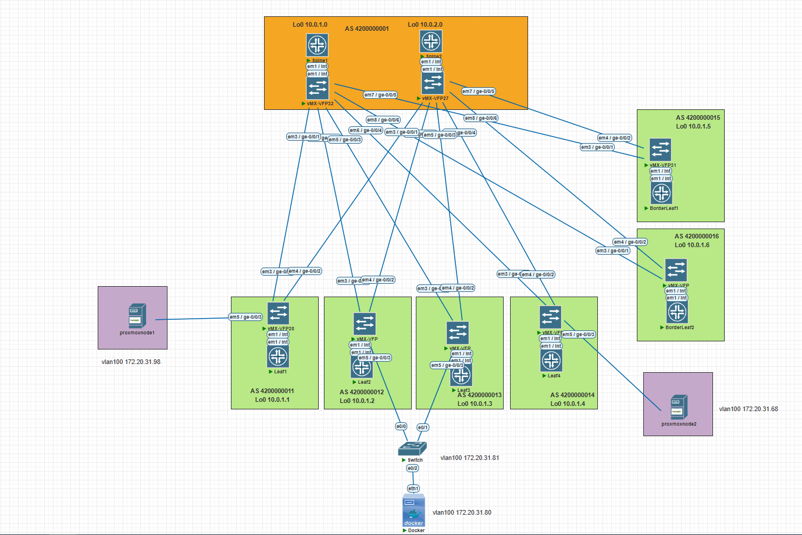

# Проектная работа.
# "Настройка и тестирование EVPN/VXLAN для обеспечения бесшовной миграции виртуальных машин на оборудовании Juniper"

### Цели:
* Реализация сетевой фабрики с использованием Overlay технологии VxLAN
* Сети Overlay и Underlay используется eBGP

### Описание/Пошаговая инструкция выполнения проектной работы:
Построения сетевой фабрики на основе протокола VxLAN:
#### 1) Необходимо настроить подключение нод Proxmox сразу к двум коммутаторам с использованием технологии ESI;
#### 2) Настроить маршрутизацию между сетями;
#### 3) Зафиксировать в документации - план работы, адресное пространство, схему сети, настройки сетевого оборудования.

# Выполнение:

## План выполнения проектной работы:

1) Зафиксировать параметры сети;
2) Привести схему сети;
3) Опубликовать список реализованных функций;
4) Провести проверку работы сети;
7) Опубликовать листинг команд для проверки корректной работы сети;
8) Привести конфигурации устройств.

## Параметры сети.

### Параметры сети:
IP адреса Loopack интерфейсов:
Loopack-s:

|             | Lo0 /32  |
|-------------|----------|
| Spine1      | 10.0.1.0 |
| Spine2      | 10.0.2.0 |

|             | Lo0 /32  |
|-------------|----------|
| Leaf1       | 10.0.1.1 |
| Leaf2       | 10.0.1.2 |
| Leaf3       | 10.0.1.3 |
| Leaf4       | 10.0.1.4 |
| BorderLeaf1 | 10.0.1.5 |
| BorderLeaf2 | 10.0.1.6 |

IP адреса P-t-P сетей

| **Connection**   	| **Spine Address** 	| **Leaf Address** 	| **Subnet**  	|
|------------------	|-------------------	|------------------	|-------------	|
| Spine 1 → Leaf 1 	| 10.2.1.0          	| 10.2.1.1         	| 10.2.1.0/31 	|
| Spine 1 → Leaf 2 	| 10.2.1.2              | 10.2.1.3          | 10.2.1.2/31  	|
| Spine 1 → Leaf 3 	| 10.2.1.4              | 10.2.1.5          | 10.2.1.4/31  	|
| Spine 1 → Leaf 4 	| 10.2.1.6          	| 10.2.1.7         	| 10.2.1.6/31 	|
| Spine 1 → BorderLeaf 1 | 10.2.1.8         | 10.2.1.9          | 10.2.1.8/31  	|
| Spine 1 → BorderLeaf 2 | 10.2.1.10        | 10.2.1.11        	| 10.2.1.10/31 	|
|------------------	|----------------------	|------------------	|-------------	|
| Spine 2 → Leaf 1 	| 10.2.2.0              | 10.2.2.1          | 10.2.2.0/31  	|
| Spine 2 → Leaf 2 	| 10.2.2.2              | 10.2.2.3          | 10.2.1.2/31  	|
| Spine 2 → Leaf 3 	| 10.2.2.4              | 10.2.2.5          | 10.2.1.4/31  	|
| Spine 2 → Leaf 4 	| 10.2.2.6              | 10.2.2.7          | 10.2.1.6/31  	|
| Spine 2 → BorderLeaf 1 | 10.2.2.8         | 10.2.2.9         | 10.2.1.8/31  	|
| Spine 2 → BorderLeaf 2 | 10.2.2.10        | 10.2.2.11          | 10.2.1.10/31 |

Таблица номеров автономных систем (AS)

| Switch      |     AS     |
|-------------|------------|
| Spine1      | 4200000001 |
| Spine2      | 4200000001 |
| Leaf1       | 4200000011 |
| Leaf2       | 4200000012 |
| Leaf3       | 4200000013 |
| Leaf4       | 4200000014 |
| BorderLeaf1 | 4200000015 |
| BorderLeaf2 | 4200000016 |

### Схема связи
Схема и адресное пространство взято из LAB-1

