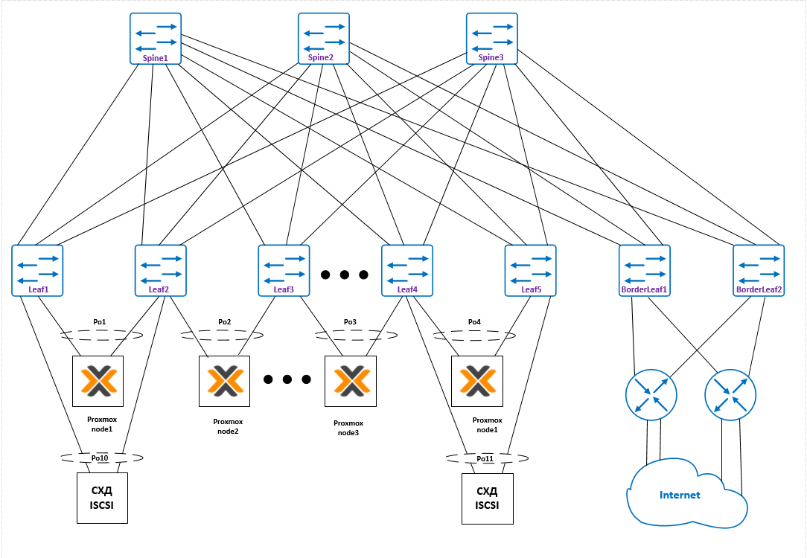

# Проектная работа.
# "Настройка и тестирование EVPN/VXLAN для обеспечения бесшовной миграции виртуальных машин на оборудовании Juniper"

### Цели:
* Реализация сетевой фабрики с использованием Overlay технологии VxLAN
* Сети Overlay и Underlay используется eBGP

### Описание/Пошаговая инструкция выполнения проектной работы:
Построения сетевой фабрики на основе протокола VxLAN:
#### 1) Необходимо настроить подключение нод Proxmox сразу к двум коммутаторам с использованием технологии ESI;
#### 2) Настроить маршрутизацию между сетями;
#### 3) Зафиксировать в документации - план работы, адресное пространство, схему сети, настройки сетевого оборудования.

# Выполнение:

## План выполнения проектной работы:

1) Зафиксировать параметры сети;
2) Привести схему сети;
3) Опубликовать список реализованных функций;
4) Провести проверку работы сети;
7) Опубликовать листинг команд для проверки корректной работы сети;
8) Привести конфигурации устройств.

### Схема связи
Схема и адресное пространство взято из LAB-1

