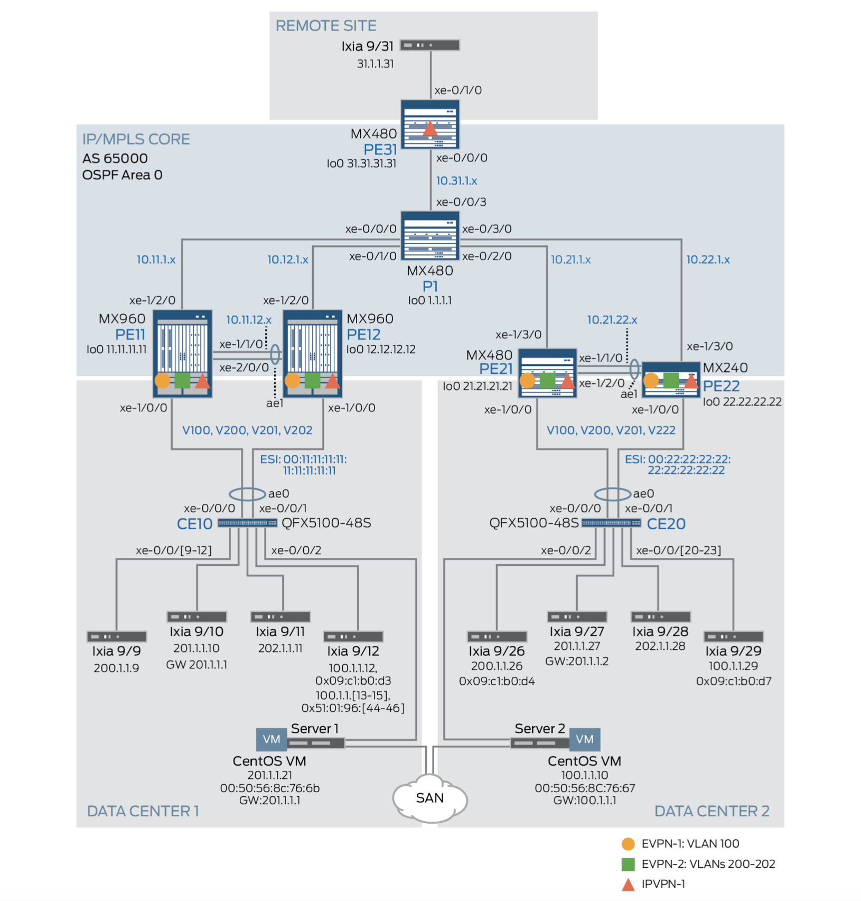

| **Connection**   	| **Spine Address** 	| **Leaf Address** 	| **Subnet**  	|
|------------------	|-------------------	|------------------	|-------------	|
| Spine 1 → Leaf 1 	| 10.2.1.0          	| 10.2.1.1         	| 10.2.1.0/31 	|
| Spine 1 → Leaf 2 	| 10.2.1.2              | 10.2.1.3          | 10.2.1.2/31  	|
| Spine 1 → Leaf 3 	| 10.2.1.4              | 10.2.1.5          | 10.2.1.4/31  	|
| Spine 1 → Leaf 4 	| 10.2.1.6          	| 10.2.1.7         	| 10.2.1.6/31 	|
| Spine 2 → Leaf 1 	| 10.2.2.0              | 10.2.2.1          | 10.2.2.0/31  	|
| Spine 2 → Leaf 2 	| 10.2.2.2              | 10.2.2.3          | 10.2.1.2/31  	|
| Spine 2 → Leaf 3 	| 10.2.2.4              | 10.2.2.5          | 10.2.1.4/31  	|
| Spine 2 → Leaf 4 	| 10.2.2.6              | 10.2.2.7          | 10.2.1.6/31  	|

### Реализовать схему

