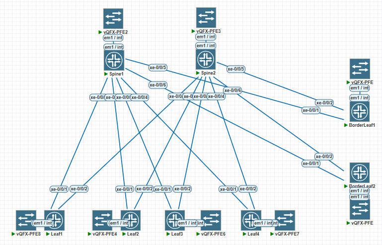

# LAB-1

### Схема связи



## Планирование адресного пространства для ЦОД(а)
Суммарный для Lo0 и Lo2 – 10.0.0.0/15

Loopack-s:
|             | Lo0 /32  | Lo2 /32 |
|-------------|----------|---------|
| Spine1      | 10.0.1.0 |10.1.1.0 |
| Spine2      | 10.0.2.0 |10.1.2.0 |

|             | Lo0 /32  | Lo2 /32  |
|-------------|----------|----------|
| Leaf1       | 10.0.1.1 | 10.1.0.1 |
| Leaf2       | 10.0.1.2 | 10.1.0.2 |
| Leaf3       | 10.0.1.3 | 10.1.0.3 |
| Leaf4       | 10.0.1.4 | 10.1.0.4 |
| BorderLeaf1 | 10.0.1.5 | 10.1.0.5 |
| BorderLeaf2 | 10.0.1.6 | 10.1.0.6 |
---
Суммарный для p2p и резерва – 10.2.0.0/15
| **Connection**   	| **Spine Address** 	| **Leaf Address** 	| **Subnet**  	|
|------------------	|-------------------	|------------------	|-------------	|
| Spine 1 → Leaf 1 	| 10.2.1.0          	| 10.2.1.1         	| 10.2.1.0/31 	|
| Spine 1 → Leaf 2 	| 10.2.1.2              | 10.2.1.3          | 10.2.1.2/31  	|
| Spine 1 → Leaf 3 	| 10.2.1.4              | 10.2.1.5          | 10.2.1.4/31  	|
| Spine 1 → Leaf 4 	| 10.2.1.6          	| 10.2.1.7         	| 10.2.1.6/31 	|
| Spine 1 → BorderLeaf 1 | 10.2.1.8         | 10.2.1.9          | 10.2.1.8/31  	|
| Spine 1 → BorderLeaf 2 | 10.2.1.10        | 10.2.1.11        	| 10.2.1.10/31 	|
|------------------	|----------------------	|------------------	|-------------	|
| Spine 2 → Leaf 1 	| 10.2.2.0              | 10.2.2.1          | 10.2.2.0/31  	|
| Spine 2 → Leaf 2 	| 10.2.2.2              | 10.2.2.3          | 10.2.1.2/31  	|
| Spine 2 → Leaf 3 	| 10.2.2.4              | 10.2.2.5          | 10.2.1.4/31  	|
| Spine 2 → Leaf 4 	| 10.2.2.6              | 10.2.2.7          | 10.2.1.6/31  	|
| Spine 2 → BorderLeaf 1 | 10.2.2.8         | 10.2.2.9         | 10.2.1.8/31  	|
| Spine 2 → BorderLeaf 2 | 10.2.2.10        | 10.2.2.11          | 10.2.1.10/31  |

---

### IP установлены следующим образом

root@Spine1> show interfaces terse | match "10.[0,1,2]"
```text
xe-0/0/1.0              up    up   inet     10.2.1.0/31     
xe-0/0/2.0              up    up   inet     10.2.1.2/31     
xe-0/0/3.0              up    up   inet     10.2.1.4/31     
xe-0/0/4.0              up    up   inet     10.2.1.6/31     
xe-0/0/5.0              up    up   inet     10.2.1.8/31     
xe-0/0/6.0              up    up   inet     10.2.1.10/31    
lo0.0                   up    up   inet     10.0.1.0            --> 0/0
lo0.2                   up    up   inet     10.1.1.0            --> 0/0
```
root@Spine2> show interfaces terse | match "10.[0,1,2]"
```text
xe-0/0/1.0              up    up   inet     10.2.2.0/31     
xe-0/0/2.0              up    up   inet     10.2.2.2/31     
xe-0/0/3.0              up    up   inet     10.2.2.4/31     
xe-0/0/4.0              up    up   inet     10.2.2.6/31     
xe-0/0/5.0              up    up   inet     10.2.2.8/31     
xe-0/0/6.0              up    up   inet     10.2.2.10/31      
lo0.0                   up    up   inet     10.0.2.0            --> 0/0
lo0.2                   up    up   inet     10.1.2.0            --> 0/0
```
root@Leaf1> show interfaces terse | match "10.[0,1,2]" 
```text
xe-0/0/1.0              up    up   inet     10.2.1.1/31     
xe-0/0/2.0              up    up   inet     10.2.2.1/31     
lo0.0                   up    up   inet     10.0.1.1            --> 0/0
lo0.2                   up    up   inet     10.1.0.1            --> 0/0
```
root@Leaf2> show interfaces terse | match "10.[0,1,2]" 
```text
xe-0/0/1.0              up    up   inet     10.2.1.3/31     
xe-0/0/2.0              up    up   inet     10.2.2.3/31     
lo0.0                   up    up   inet     10.0.1.2            --> 0/0
lo0.2                   up    up   inet     10.1.0.2            --> 0/0
```
root@Leaf3> show interfaces terse | match "10.[0,1,2]"  
  ```text
xe-0/0/1.0              up    up   inet     10.2.1.5/31     
xe-0/0/2.0              up    up   inet     10.2.2.5/31     
lo0.0                   up    up   inet     10.0.1.3            --> 0/0
lo0.2                   up    up   inet     10.1.0.3            --> 0/0
```
root@Leaf4> show interfaces terse | match "10.[0,1,2]"    
```text
xe-0/0/1.0              up    up   inet     10.2.1.7/31     
xe-0/0/2.0              up    up   inet     10.2.2.7/31     
lo0.0                   up    up   inet     10.0.1.4            --> 0/0
lo0.2                   up    up   inet     10.1.0.4            --> 0/0
```
root@BorderLeaf1> show interfaces terse | match "10.[0,1,2]" 
```text
xe-0/0/1.0              up    up   inet     10.2.1.9/31     
xe-0/0/2.0              up    up   inet     10.2.2.9/31     
lo0.0                   up    up   inet     10.0.1.5            --> 0/0
lo0.2                   up    up   inet     10.1.0.5            --> 0/0
```
root@BorderLeaf2> show interfaces terse | match "10.[0,1,2]" 
```text
xe-0/0/1.0              up    up   inet     10.2.1.11/31    
xe-0/0/2.0              up    up   inet     10.2.2.11/31    
lo0.0                   up    up   inet     10.0.1.6            --> 0/0
lo0.2                   up    up   inet     10.1.0.6            --> 0/0
```