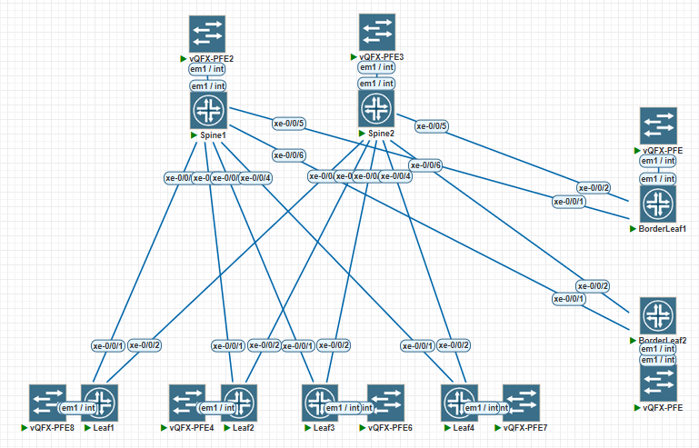

# LAB-2

## OSPF в UNDELAY сети

---
### Схема связи и адресное пространство
Схема и адресное пространство взято из LAB-1



<details>
<summary>План адресного пространства</summary>
Суммарный для Lo0 и Lo2 – 10.0.0.0/15

Loopack-s:
|             | Lo0 /32  |
|-------------|----------|
| Spine1      | 10.0.1.0 |
| Spine2      | 10.0.2.0 |

|             | Lo0 /32  |
|-------------|----------|
| Leaf1       | 10.0.1.1 |
| Leaf2       | 10.0.1.2 |
| Leaf3       | 10.0.1.3 |
| Leaf4       | 10.0.1.4 |
| BorderLeaf1 | 10.0.1.5 |
| BorderLeaf2 | 10.0.1.6 |
---
Суммарный для p2p и резерва – 10.2.0.0/15
| **Connection**   	| **Spine Address** 	| **Leaf Address** 	| **Subnet**  	|
|------------------	|-------------------	|------------------	|-------------	|
| Spine 1 → Leaf 1 	| 10.2.1.0          	| 10.2.1.1         	| 10.2.1.0/31 	|
| Spine 1 → Leaf 2 	| 10.2.1.2              | 10.2.1.3          | 10.2.1.2/31  	|
| Spine 1 → Leaf 3 	| 10.2.1.4              | 10.2.1.5          | 10.2.1.4/31  	|
| Spine 1 → Leaf 4 	| 10.2.1.6          	| 10.2.1.7         	| 10.2.1.6/31 	|
| Spine 1 → BorderLeaf 1 | 10.2.1.8         | 10.2.1.9          | 10.2.1.8/31  	|
| Spine 1 → BorderLeaf 2 | 10.2.1.10        | 10.2.1.11        	| 10.2.1.10/31 	|
|------------------	|----------------------	|------------------	|-------------	|
| Spine 2 → Leaf 1 	| 10.2.2.0              | 10.2.2.1          | 10.2.2.0/31  	|
| Spine 2 → Leaf 2 	| 10.2.2.2              | 10.2.2.3          | 10.2.1.2/31  	|
| Spine 2 → Leaf 3 	| 10.2.2.4              | 10.2.2.5          | 10.2.1.4/31  	|
| Spine 2 → Leaf 4 	| 10.2.2.6              | 10.2.2.7          | 10.2.1.6/31  	|
| Spine 2 → BorderLeaf 1 | 10.2.2.8         | 10.2.2.9         | 10.2.1.8/31  	|
| Spine 2 → BorderLeaf 2 | 10.2.2.10        | 10.2.2.11          | 10.2.1.10/31  |

---

### IP установлены следующим образом

root@Spine1> show interfaces terse | match "10.[0,1,2]"
```text
xe-0/0/1.0              up    up   inet     10.2.1.0/31     
xe-0/0/2.0              up    up   inet     10.2.1.2/31     
xe-0/0/3.0              up    up   inet     10.2.1.4/31     
xe-0/0/4.0              up    up   inet     10.2.1.6/31     
xe-0/0/5.0              up    up   inet     10.2.1.8/31     
xe-0/0/6.0              up    up   inet     10.2.1.10/31    
lo0.0                   up    up   inet     10.0.1.0            --> 0/0
```
root@Spine2> show interfaces terse | match "10.[0,1,2]"
```text
xe-0/0/1.0              up    up   inet     10.2.2.0/31     
xe-0/0/2.0              up    up   inet     10.2.2.2/31     
xe-0/0/3.0              up    up   inet     10.2.2.4/31     
xe-0/0/4.0              up    up   inet     10.2.2.6/31     
xe-0/0/5.0              up    up   inet     10.2.2.8/31     
xe-0/0/6.0              up    up   inet     10.2.2.10/31      
lo0.0                   up    up   inet     10.0.2.0            --> 0/0
```
root@Leaf1> show interfaces terse | match "10.[0,1,2]" 
```text
xe-0/0/1.0              up    up   inet     10.2.1.1/31     
xe-0/0/2.0              up    up   inet     10.2.2.1/31     
lo0.0                   up    up   inet     10.0.1.1            --> 0/0
```
root@Leaf2> show interfaces terse | match "10.[0,1,2]" 
```text
xe-0/0/1.0              up    up   inet     10.2.1.3/31     
xe-0/0/2.0              up    up   inet     10.2.2.3/31     
lo0.0                   up    up   inet     10.0.1.2            --> 0/0
```
root@Leaf3> show interfaces terse | match "10.[0,1,2]"  
  ```text
xe-0/0/1.0              up    up   inet     10.2.1.5/31     
xe-0/0/2.0              up    up   inet     10.2.2.5/31     
lo0.0                   up    up   inet     10.0.1.3            --> 0/0
```
root@Leaf4> show interfaces terse | match "10.[0,1,2]"    
```text
xe-0/0/1.0              up    up   inet     10.2.1.7/31     
xe-0/0/2.0              up    up   inet     10.2.2.7/31     
lo0.0                   up    up   inet     10.0.1.4            --> 0/0
```
root@BorderLeaf1> show interfaces terse | match "10.[0,1,2]" 
```text
xe-0/0/1.0              up    up   inet     10.2.1.9/31     
xe-0/0/2.0              up    up   inet     10.2.2.9/31     
lo0.0                   up    up   inet     10.0.1.5            --> 0/0
```
root@BorderLeaf2> show interfaces terse | match "10.[0,1,2]" 
```text
xe-0/0/1.0              up    up   inet     10.2.1.11/31    
xe-0/0/2.0              up    up   inet     10.2.2.11/31    
lo0.0                   up    up   inet     10.0.1.6            --> 0/0
```
</details>

Для настройки OSPF необходимо в секцию  protocols ospf указать зону и внести участвующие интерфейсы в процессе OSPF, а также указать router-id
<details>
<summary>Spine1</summary>

root@Spine1> show configuration protocols ospf
```text
area 0.0.0.0 {
    interface xe-0/0/1.0 {
        interface-type p2p;
    }
    interface xe-0/0/2.0 {
        interface-type p2p;
    }
    interface xe-0/0/3.0 {
        interface-type p2p;
    }
    interface xe-0/0/4.0 {
        interface-type p2p;
    }
    interface xe-0/0/5.0 {
        interface-type p2p;
    }
    interface xe-0/0/6.0 {
        interface-type p2p;
    }
    interface lo0.0;
}
reference-bandwidth 100g;

root@Spine1> show configuration routing-options 
router-id 10.0.1.0;
```
</details>

<details>
<summary>Spine2</summary>

root@Spine2> show configuration protocols ospf
```text
area 0.0.0.0 {
    interface xe-0/0/1.0 {
        interface-type p2p;
    }
    interface xe-0/0/2.0 {
        interface-type p2p;
    }
    interface xe-0/0/3.0 {
        interface-type p2p;
    }
    interface xe-0/0/4.0 {
        interface-type p2p;
    }
    interface xe-0/0/5.0 {
        interface-type p2p;
    }
    interface xe-0/0/6.0 {
        interface-type p2p;
    }
    interface lo0.0;
}
reference-bandwidth 100g;

{master:0}
root@Spine2> show configuration routing-options 
router-id 10.0.2.0;
```
</details>

<details>
<summary>Leaf1</summary>

root@Leaf1> show configuration protocols ospf 
```text
area 0.0.0.0 {
    interface xe-0/0/1.0 {
        interface-type p2p;
    }
    interface xe-0/0/2.0 {
        interface-type p2p;
    }
    interface lo0.0;
}
reference-bandwidth 100g;

{master:0}
root@Leaf1> show configuration routing-options 
router-id 10.0.1.1;
```
</details>

<details>
<summary>Leaf2</summary>

root@Leaf2> show configuration protocols ospf
```text
area 0.0.0.0 {
    interface xe-0/0/1.0 {
        interface-type p2p;
    }
    interface xe-0/0/2.0 {
        interface-type p2p;
    }
    interface lo0.0;
}
reference-bandwidth 100g;

{master:0}
root@Leaf2> show configuration routing-options 
router-id 10.0.1.2;
```
</details>
<details>

<summary>Leaf3</summary>

root@Leaf3> show configuration protocols ospf
```text
area 0.0.0.0 {
    interface xe-0/0/1.0 {
        interface-type p2p;
    }
    interface xe-0/0/2.0 {
        interface-type p2p;
    }
    interface lo0.0;
}
reference-bandwidth 100g;

{master:0}
root@Leaf3> show configuration routing-options 
router-id 10.0.1.3;
```
</details>

<details>
<summary>Leaf4</summary>

root@Leaf4> show configuration protocols ospf 
```text
area 0.0.0.0 {
    interface xe-0/0/1.0 {
        interface-type p2p;
    }
    interface xe-0/0/2.0 {
        interface-type p2p;
    }
    interface lo0.0;
}
reference-bandwidth 100g;

{master:0}
root@Leaf4> show configuration routing-options 
router-id 10.0.1.4;
```
</details>

<details>
<summary>BorderLeaf1</summary>

root@BorderLeaf1> show configuration protocols ospf
```text
area 0.0.0.0 {
    interface xe-0/0/1.0 {
        interface-type p2p;
    }
    interface xe-0/0/2.0 {
        interface-type p2p;
    }
    interface lo0.0;
}
reference-bandwidth 100g;

{master:0}
root@BorderLeaf1> show configuration routing-options 
router-id 10.0.1.5;
```
</details>

<details>
<summary>BorderLeaf2</summary>

root@BorderLeaf2> show configuration protocols ospf
```text
area 0.0.0.0 {
    interface xe-0/0/1.0 {
        interface-type p2p;
    }
    interface xe-0/0/2.0 {
        interface-type p2p;
    }
    interface lo0.0;
}
reference-bandwidth 100g
root@BorderLeaf2> show configuration routing-options 
router-id 10.0.1.6;
```
</details>

root@Spine1> show ospf database brief 
```text
    OSPF database, Area 0.0.0.0
 Type       ID               Adv Rtr           Seq      Age  Opt  Cksum  Len 
Router  *10.0.1.0         10.0.1.0         0x8000000c  2155  0x22 0x9619 180
Router   10.0.1.1         10.0.1.1         0x8000000f   803  0x22 0xdc72  84
Router   10.0.1.2         10.0.1.2         0x8000000e  1311  0x22 0x2a1b  84
Router   10.0.1.3         10.0.1.3         0x8000000b  1304  0x22 0x7bc1  84
Router   10.0.1.4         10.0.1.4         0x8000000b  1311  0x22 0xc66b  84
Router   10.0.1.5         10.0.1.5         0x8000000d  1299  0x22 0xdd67  72
Router   10.0.1.6         10.0.1.6         0x80000005  1299  0x22 0xce74  72
Router   10.0.2.0         10.0.2.0         0x80000019   804  0x22 0xa3ef 180
```
