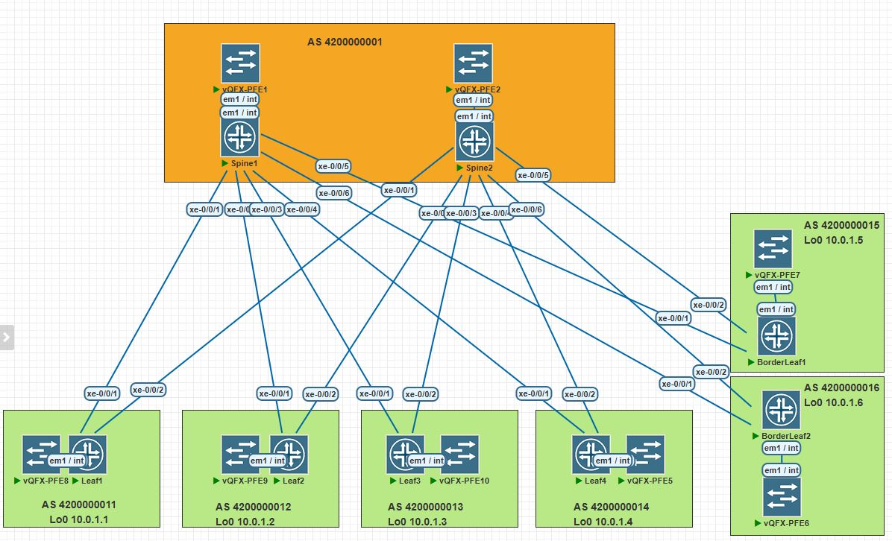

# LAB-4

## Построение Underlay сети(eBGP)
---
### Схема связи и адресное пространство
Схема и адресное пространство взято из LAB-1



---
Таблица соотвествия ip адреса Loopback интерфейса и AS
| Switch      | Lo0 /32  |     AS     |
|-------------|----------|------------|
| Spine1      | 10.0.1.0 | 4200000001 |
| Spine2      | 10.0.2.0 | 4200000001 |
| Leaf1       | 10.0.1.1 | 4200000011 |
| Leaf2       | 10.0.1.2 | 4200000012 |
| Leaf3       | 10.0.1.3 | 4200000013 |
| Leaf4       | 10.0.1.4 | 4200000014 |
| BorderLeaf1 | 10.0.1.5 | 4200000015 |
| BorderLeaf2 | 10.0.1.6 | 4200000016 |
---
Настройка eBGP на Spine и Leaf

Spine1
```text
root@Spine1# show protocols bgp | display set 
set protocols bgp group UNDERLAY type external
set protocols bgp group UNDERLAY family inet unicast
set protocols bgp group UNDERLAY export BGP_LOOPBACK0
set protocols bgp group UNDERLAY multipath
set protocols bgp group UNDERLAY neighbor 10.2.1.1 peer-as 4200000011
set protocols bgp group UNDERLAY neighbor 10.2.1.3 peer-as 4200000012
set protocols bgp group UNDERLAY neighbor 10.2.1.5 peer-as 4200000013
set protocols bgp group UNDERLAY neighbor 10.2.1.7 peer-as 4200000014
set protocols bgp group UNDERLAY neighbor 10.2.1.9 peer-as 4200000015
set protocols bgp group UNDERLAY neighbor 10.2.1.11 peer-as 4200000016

root@Spine1# show routing-options | display set 
set routing-options forwarding-table export PFE-ECMP
set routing-options router-id 10.0.1.0
set routing-options autonomous-system 4200000001
```
Spine2
```text
root@Spine2# show protocols bgp | display set 
set protocols bgp group UNDERLAY type external
set protocols bgp group UNDERLAY family inet unicast
set protocols bgp group UNDERLAY export BGP_LOOPBACK0
set protocols bgp group UNDERLAY multipath
set protocols bgp group UNDERLAY neighbor 10.2.2.1 peer-as 4200000011
set protocols bgp group UNDERLAY neighbor 10.2.2.3 peer-as 4200000012
set protocols bgp group UNDERLAY neighbor 10.2.2.5 peer-as 4200000013
set protocols bgp group UNDERLAY neighbor 10.2.2.7 peer-as 4200000014
set protocols bgp group UNDERLAY neighbor 10.2.2.9 peer-as 4200000015
set protocols bgp group UNDERLAY neighbor 10.2.2.11 peer-as 4200000016

root@Spine2# show routing-options | display set 
set routing-options forwarding-table export PFE-ECMP
set routing-options router-id 10.0.2.0
set routing-options autonomous-system 4200000001
```
Leaf1
```text
root@Leaf1# show protocols bgp | display set 
set protocols bgp group UNDERLAY type external
set protocols bgp group UNDERLAY family inet unicast
set protocols bgp group UNDERLAY export BGP_LOOPBACK0
set protocols bgp group UNDERLAY peer-as 4200000001
set protocols bgp group UNDERLAY multipath
set protocols bgp group UNDERLAY neighbor 10.2.1.0
set protocols bgp group UNDERLAY neighbor 10.2.2.0

root@Leaf1# show routing-options | display set 
set routing-options forwarding-table export PFE-ECMP
set routing-options router-id 10.0.1.1
set routing-options autonomous-system 4200000011
```
Leaf2
```text
root@Leaf2# show protocols bgp | display set 
set protocols bgp group UNDERLAY type external
set protocols bgp group UNDERLAY family inet unicast
set protocols bgp group UNDERLAY export BGP_LOOPBACK0
set protocols bgp group UNDERLAY peer-as 4200000001
set protocols bgp group UNDERLAY multipath
set protocols bgp group UNDERLAY neighbor 10.2.1.2
set protocols bgp group UNDERLAY neighbor 10.2.2.2

root@Leaf2# show routing-options | display set 
set routing-options forwarding-table export PFE-ECMP
set routing-options router-id 10.0.1.2
set routing-options autonomous-system 4200000012

```
leaf3
```text
root@Leaf3# show protocols bgp | display set 
set protocols bgp group UNDERLAY type external
set protocols bgp group UNDERLAY family inet unicast
set protocols bgp group UNDERLAY export BGP_LOOPBACK0
set protocols bgp group UNDERLAY peer-as 4200000001
set protocols bgp group UNDERLAY multipath
set protocols bgp group UNDERLAY neighbor 10.2.1.4
set protocols bgp group UNDERLAY neighbor 10.2.2.4

root@Leaf3# show routing-options | display set 
set routing-options forwarding-table export PFE-ECMP
set routing-options router-id 10.0.1.3
set routing-options autonomous-system 4200000013
```
leaf4
```text
root@Leaf4# show protocols bgp | display set 
set protocols bgp group UNDERLAY type external
set protocols bgp group UNDERLAY family inet unicast
set protocols bgp group UNDERLAY export BGP_LOOPBACK0
set protocols bgp group UNDERLAY peer-as 4200000001
set protocols bgp group UNDERLAY multipath multiple-as
set protocols bgp group UNDERLAY neighbor 10.2.1.6
set protocols bgp group UNDERLAY neighbor 10.2.2.6

root@Leaf4# show routing-options | display set 
set routing-options forwarding-table export PFE-ECMP
set routing-options router-id 10.0.1.4
set routing-options autonomous-system 4200000014
```
BorderLeaf1
```text
root@BorderLeaf1# show protocols bgp | display set 
set protocols bgp group UNDERLAY type external
set protocols bgp group UNDERLAY family inet unicast
set protocols bgp group UNDERLAY export BGP_LOOPBACK0
set protocols bgp group UNDERLAY peer-as 4200000001
set protocols bgp group UNDERLAY multipath multiple-as
set protocols bgp group UNDERLAY neighbor 10.2.1.8
set protocols bgp group UNDERLAY neighbor 10.2.2.8

root@BorderLeaf1# show routing-options | display set 
set routing-options forwarding-table export PFE-ECMP
set routing-options router-id 10.0.1.5
set routing-options autonomous-system 4200000015
```
BorderLeaf2
```text
root@BorderLeaf2# show protocols bgp | display set 
set protocols bgp group UNDERLAY type external
set protocols bgp group UNDERLAY export BGP_LOOPBACK0
set protocols bgp group UNDERLAY peer-as 4200000001
set protocols bgp group UNDERLAY multipath
set protocols bgp group UNDERLAY neighbor 10.2.1.10
set protocols bgp group UNDERLAY neighbor 10.2.2.10

root@BorderLeaf2# show routing-options | display set 
set routing-options forwarding-table export PFE-ECMP
set routing-options router-id 10.0.1.6
set routing-options autonomous-system 4200000016
```
Настройка политики балансировки ECMP и политики экспорта Lo0 адресов в BGP  
```text
show policy-options policy-statement PFE-ECMP | display set 
set policy-options policy-statement PFE-ECMP then load-balance per-packet

show policy-options policy-statement BGP_LOOPBACK0 | display s...
set policy-options policy-statement BGP_LOOPBACK0 term TERM1 from protocol direct
set policy-options policy-statement BGP_LOOPBACK0 term TERM1 from route-filter 10.0.1.0/32 exact
set policy-options policy-statement BGP_LOOPBACK0 term TERM1 then accept
```
---
**Проверка**
```text
root@Spine1> show bgp summary 
Threading mode: BGP I/O
Default eBGP mode: advertise - accept, receive - accept
Groups: 1 Peers: 6 Down peers: 0
Table          Tot Paths  Act Paths Suppressed    History Damp State    Pending
inet.0               
                       6          6          0          0          0          0
Peer                     AS      InPkt     OutPkt    OutQ   Flaps Last Up/Dwn State|#Active/Received/Accepted/Damped...
10.2.1.1         4200000011       2186       2160       0       0    16:24:26 Establ
  inet.0: 1/1/1/0
10.2.1.3         4200000012       2182       2158       0       0    16:24:21 Establ
  inet.0: 1/1/1/0
10.2.1.5         4200000013       2184       2159       0       0    16:24:26 Establ
  inet.0: 1/1/1/0
10.2.1.7         4200000014       2183       2159       0       0    16:24:26 Establ
  inet.0: 1/1/1/0
10.2.1.9         4200000015       2183       2158       0       0    16:24:26 Establ
  inet.0: 1/1/1/0
10.2.1.11        4200000016       2186       2159       0       0    16:24:25 Establ
  inet.0: 1/1/1/0
  ```
  ```text
  root@Spine2> show bgp summary 
Threading mode: BGP I/O
Default eBGP mode: advertise - accept, receive - accept
Groups: 1 Peers: 6 Down peers: 0
Table          Tot Paths  Act Paths Suppressed    History Damp State    Pending
inet.0               
                       6          6          0          0          0          0
Peer                     AS      InPkt     OutPkt    OutQ   Flaps Last Up/Dwn State|#Active/Received/Accepted/Damped...
10.2.2.1         4200000011       2206       2177       0       3    16:33:28 Establ
  inet.0: 1/1/1/0
10.2.2.3         4200000012       2202       2177       0       3    16:33:28 Establ
  inet.0: 1/1/1/0
10.2.2.5         4200000013       2203       2176       0       3    16:33:28 Establ
  inet.0: 1/1/1/0
10.2.2.7         4200000014       2203       2176       0       3    16:33:28 Establ
  inet.0: 1/1/1/0
10.2.2.9         4200000015       2203       2177       0       3    16:33:28 Establ
  inet.0: 1/1/1/0
10.2.2.11        4200000016       2207       2177       0       3    16:33:28 Establ
  inet.0: 1/1/1/0
```
 ```text
 root@Leaf1> show bgp summary 
Threading mode: BGP I/O
Default eBGP mode: advertise - accept, receive - accept
Groups: 1 Peers: 2 Down peers: 0
Table          Tot Paths  Act Paths Suppressed    History Damp State    Pending
inet.0               
                      12         12          0          0          0          0
Peer                     AS      InPkt     OutPkt    OutQ   Flaps Last Up/Dwn State|#Active/Received/Accepted/Damped...
10.2.1.0         4200000001       2166       2190       0       4    16:27:00 Establ
  inet.0: 6/6/6/0
10.2.2.0         4200000001       2181       2208       0       3    16:35:00 Establ
  inet.0: 6/6/6/0
 ```
 ```text
 root@Leaf2> show bgp summary 
Threading mode: BGP I/O
Default eBGP mode: advertise - accept, receive - accept
Groups: 1 Peers: 2 Down peers: 0
Table          Tot Paths  Act Paths Suppressed    History Damp State    Pending
inet.0               
                      12         12          0          0          0          0
Peer                     AS      InPkt     OutPkt    OutQ   Flaps Last Up/Dwn State|#Active/Received/Accepted/Damped...
10.2.1.2         4200000001       2166       2188       0       3    16:26:54 Establ
  inet.0: 6/6/6/0
10.2.2.2         4200000001       2182       2205       0       2    16:34:59 Establ
  inet.0: 6/6/6/0
 ```
 ```text
 root@Leaf3> show bgp summary 
Threading mode: BGP I/O
Default eBGP mode: advertise - accept, receive - accept
Groups: 1 Peers: 2 Down peers: 0
Table          Tot Paths  Act Paths Suppressed    History Damp State    Pending
inet.0               
                      12         12          0          0          0          0
Peer                     AS      InPkt     OutPkt    OutQ   Flaps Last Up/Dwn State|#Active/Received/Accepted/Damped...
10.2.1.4         4200000001       2165       2187       0       2    16:27:00 Establ
  inet.0: 6/6/6/0
10.2.2.4         4200000001       2180       2205       0       1    16:35:00 Establ
  inet.0: 6/6/6/0
 ```
 ```text
 root@Leaf4> show bgp summary 
Threading mode: BGP I/O
Default eBGP mode: advertise - accept, receive - accept
Groups: 1 Peers: 2 Down peers: 0
Table          Tot Paths  Act Paths Suppressed    History Damp State    Pending
inet.0               
                      12         12          0          0          0          0
Peer                     AS      InPkt     OutPkt    OutQ   Flaps Last Up/Dwn State|#Active/Received/Accepted/Damped...
10.2.1.6         4200000001       2166       2188       0       2    16:27:00 Establ
  inet.0: 6/6/6/0
10.2.2.6         4200000001       2180       2205       0       1    16:35:00 Establ
  inet.0: 6/6/6/0
  ```
  ```text
  root@BorderLeaf1> show bgp summary 
Threading mode: BGP I/O
Default eBGP mode: advertise - accept, receive - accept
Groups: 1 Peers: 2 Down peers: 0
Table          Tot Paths  Act Paths Suppressed    History Damp State    Pending
inet.0               
                      12         12          0          0          0          0
Peer                     AS      InPkt     OutPkt    OutQ   Flaps Last Up/Dwn State|#Active/Received/Accepted/Damped...
10.2.1.8         4200000001       2165       2188       0       2    16:26:59 Establ
  inet.0: 6/6/6/0
10.2.2.8         4200000001       2181       2205       0       1    16:34:59 Establ
  inet.0: 6/6/6/0
   ```
```text
root@BorderLeaf2> show bgp summary 
Threading mode: BGP I/O
Default eBGP mode: advertise - accept, receive - accept
Groups: 1 Peers: 2 Down peers: 0
Table          Tot Paths  Act Paths Suppressed    History Damp State    Pending
inet.0               
                      12         12          0          0          0          0
Peer                     AS      InPkt     OutPkt    OutQ   Flaps Last Up/Dwn State|#Active/Received/Accepted/Damped...
10.2.1.10        4200000001       2165       2190       0       2    16:26:58 Establ
  inet.0: 6/6/6/0
10.2.2.10        4200000001       2181       2209       0       1    16:35:00 Establ
  inet.0: 6/6/6/0
```

**Проверка связанности между leaf1 <-> BorderLeaf2**
```text
root@Leaf1> show route table inet.0 10.0.1.6/32 

inet.0: 14 destinations, 19 routes (14 active, 0 holddown, 0 hidden)
+ = Active Route, - = Last Active, * = Both

10.0.1.6/32        *[BGP/170] 21:02:14, localpref 100
                      AS path: 4200000001 4200000016 I, validation-state: unverified
                       to 10.2.1.0 via xe-0/0/1.0
                    >  to 10.2.2.0 via xe-0/0/2.0
                    [BGP/170] 21:02:14, localpref 100
                      AS path: 4200000001 4200000016 I, validation-state: unverified
                    >  to 10.2.1.0 via xe-0/0/1.0
```
```text
root@Leaf1> sh route forwarding-table destination 10.0.1.6/32 table default ..
Routing table: default.inet
Internet:
Destination        Type RtRef Next hop           Type Index    NhRef Netif
10.0.1.6/32        user     0                    ulst   131070     6
                              10.2.1.0           ucst     1735     5 xe-0/0/1.0
                              10.2.2.0           ucst     1734     5 xe-0/0/2.0
``` 
 ```text
root@Leaf1> ping 10.0.1.6 source 10.0.1.1 
PING 10.0.1.6 (10.0.1.6): 56 data bytes
64 bytes from 10.0.1.6: icmp_seq=0 ttl=63 time=126.196 ms
64 bytes from 10.0.1.6: icmp_seq=1 ttl=63 time=121.598 ms
64 bytes from 10.0.1.6: icmp_seq=2 ttl=63 time=134.900 ms
64 bytes from 10.0.1.6: icmp_seq=3 ttl=63 time=119.038 ms
64 bytes from 10.0.1.6: icmp_seq=4 ttl=63 time=120.645 ms
^C
--- 10.0.1.6 ping statistics ---
5 packets transmitted, 5 packets received, 0% packet loss
round-trip min/avg/max/stddev = 119.038/124.475/134.900/5.730 ms
```
 ```text
root@Leaf1> traceroute 10.0.1.6 source 10.0.1.1 
traceroute to 10.0.1.6 (10.0.1.6) from 10.0.1.1, 30 hops max, 40 byte packets
 1  10.2.1.0 (10.2.1.0)  112.562 ms  198.214 ms  205.761 ms
 2  10.0.1.6 (10.0.1.6)  219.353 ms  209.587 ms  214.161 ms
```
**Ping и traceroute с выключенным Spine1**
```text
root@Leaf1> ping 10.0.1.6 source 10.0.1.1    
PING 10.0.1.6 (10.0.1.6): 56 data bytes
64 bytes from 10.0.1.6: icmp_seq=0 ttl=63 time=126.627 ms
64 bytes from 10.0.1.6: icmp_seq=1 ttl=63 time=132.244 ms
64 bytes from 10.0.1.6: icmp_seq=2 ttl=63 time=121.266 ms
64 bytes from 10.0.1.6: icmp_seq=3 ttl=63 time=290.100 ms
64 bytes from 10.0.1.6: icmp_seq=4 ttl=63 time=122.629 ms
64 bytes from 10.0.1.6: icmp_seq=5 ttl=63 time=215.378 ms
^C
--- 10.0.1.6 ping statistics ---
6 packets transmitted, 6 packets received, 0% packet loss
round-trip min/avg/max/stddev = 121.266/168.041/290.100/63.752 ms

root@Leaf1> traceroute 10.0.1.6 source 10.0.1.1    
traceroute to 10.0.1.6 (10.0.1.6) from 10.0.1.1, 30 hops max, 40 byte packets
 1  10.2.2.0 (10.2.2.0)  123.728 ms  204.678 ms  205.348 ms
 2  10.0.1.6 (10.0.1.6)  220.287 ms  207.084 ms  211.663 ms
```
**Конфигурация оборудования**
<details>
<summary>Spine1</summary>
```text
root@Spine1> show configuration | display set 
set version 20.3R1.8
set system host-name Spine1
set system root-authentication encrypted-password "$6$iOHCqldH$4Bv5iM.SYPDCPExs15aDwLgKfad9fLWfdv53fovFYghTXlJ9rQVFxA9yoIUOf58hSJrXKANdZ.3L2ZWXBPs1T0"
set system root-authentication ssh-rsa "ssh-rsa AAAAB3NzaC1yc2EAAAABIwAAAQEA6NF8iallvQVp22WDkTkyrtvp9eWW6A8YVr+kz4TjGYe7gHzIw+niNltGEFHzD8+v1I2YJ6oXevct1YeS0o9HZyN1Q9qgCgzUFtdOKLv6IedplqoPkcmF0aYet2PkEDo3MlTBckFXPITAMzF8dJSIFo9D8HfdOV0IAdx4O7PtixWKn5y2hMNG0zQPyUecp4pzC6kivAIhyfHilFR61RGL+GPXQ2MWZWFYbAGjyiYJnAmCP3NOTd0jMZEnDkbUvxhMmBYSdETk1rRgm+R4LOzFUGaHqHDLKLX+FIPKcF96hrucXzcWyLbIbEgE98OHlnVYCzRdK8jlqm8tehUc9c9WhQ== vagrant insecure public key"
set system login user vagrant uid 2000
set system login user vagrant class super-user
set system login user vagrant authentication ssh-rsa "ssh-rsa AAAAB3NzaC1yc2EAAAABIwAAAQEA6NF8iallvQVp22WDkTkyrtvp9eWW6A8YVr+kz4TjGYe7gHzIw+niNltGEFHzD8+v1I2YJ6oXevct1YeS0o9HZyN1Q9qgCgzUFtdOKLv6IedplqoPkcmF0aYet2PkEDo3MlTBckFXPITAMzF8dJSIFo9D8HfdOV0IAdx4O7PtixWKn5y2hMNG0zQPyUecp4pzC6kivAIhyfHilFR61RGL+GPXQ2MWZWFYbAGjyiYJnAmCP3NOTd0jMZEnDkbUvxhMmBYSdETk1rRgm+R4LOzFUGaHqHDLKLX+FIPKcF96hrucXzcWyLbIbEgE98OHlnVYCzRdK8jlqm8tehUc9c9WhQ== vagrant insecure public key"
set system services ssh root-login allow
set system services netconf ssh
set system services rest http port 8080
set system services rest enable-explorer
set system syslog user * any emergency
set system syslog file messages any notice
set system syslog file messages authorization info
set system syslog file interactive-commands interactive-commands any
set system extensions providers juniper license-type juniper deployment-scope commercial
set system extensions providers chef license-type juniper deployment-scope commercial
set interfaces xe-0/0/1 unit 0 description "--- Spine1 - Leaf1 ---"
set interfaces xe-0/0/1 unit 0 family inet address 10.2.1.0/31
set interfaces xe-0/0/2 unit 0 description "--- Spine1 - Leaf2 ---"
set interfaces xe-0/0/2 unit 0 family inet address 10.2.1.2/31
set interfaces xe-0/0/3 unit 0 description "--- Spine1 - Leaf3 ---"
set interfaces xe-0/0/3 unit 0 family inet address 10.2.1.4/31
set interfaces xe-0/0/4 unit 0 description "--- Spine1 - Leaf4 ---"
set interfaces xe-0/0/4 unit 0 family inet address 10.2.1.6/31
set interfaces xe-0/0/5 unit 0 description "--- Spine1 - BorderLeaf1 ---"
set interfaces xe-0/0/5 unit 0 family inet address 10.2.1.8/31
set interfaces xe-0/0/6 unit 0 description "--- Spine1 - BorderLeaf2 ---"
set interfaces xe-0/0/6 unit 0 family inet address 10.2.1.10/31
set interfaces em0 unit 0 family inet dhcp
set interfaces em1 unit 0 family inet address 169.254.0.2/24
set interfaces lo0 unit 0 family inet address 10.0.1.0/32
set forwarding-options storm-control-profiles default all
set policy-options policy-statement BGP_LOOPBACK0 term TERM1 from protocol direct
set policy-options policy-statement BGP_LOOPBACK0 term TERM1 from route-filter 10.0.1.0/32 exact
set policy-options policy-statement BGP_LOOPBACK0 term TERM1 then accept
set policy-options policy-statement PFE-ECMP then load-balance per-packet
set policy-options policy-statement allow-loopback from interface lo0.0
set policy-options policy-statement allow-loopback then accept
set routing-options forwarding-table export PFE-ECMP
set routing-options router-id 10.0.1.0
set routing-options autonomous-system 4200000001
set protocols bgp group UNDERLAY type external
set protocols bgp group UNDERLAY family inet unicast
set protocols bgp group UNDERLAY export BGP_LOOPBACK0
set protocols bgp group UNDERLAY multipath
set protocols bgp group UNDERLAY neighbor 10.2.1.1 peer-as 4200000011
set protocols bgp group UNDERLAY neighbor 10.2.1.3 peer-as 4200000012
set protocols bgp group UNDERLAY neighbor 10.2.1.5 peer-as 4200000013
set protocols bgp group UNDERLAY neighbor 10.2.1.7 peer-as 4200000014
set protocols bgp group UNDERLAY neighbor 10.2.1.9 peer-as 4200000015
set protocols bgp group UNDERLAY neighbor 10.2.1.11 peer-as 4200000016
set protocols igmp-snooping vlan default
set vlans default vlan-id 1
```
</details>
<details>
<summary>Spine2</summary>
```text
root@Spine2> show configuration | display set 
set version 20.3R1.8
set system host-name Spine2
set system root-authentication encrypted-password "$6$iOHCqldH$4Bv5iM.SYPDCPExs15aDwLgKfad9fLWfdv53fovFYghTXlJ9rQVFxA9yoIUOf58hSJrXKANdZ.3L2ZWXBPs1T0"
set system root-authentication ssh-rsa "ssh-rsa AAAAB3NzaC1yc2EAAAABIwAAAQEA6NF8iallvQVp22WDkTkyrtvp9eWW6A8YVr+kz4TjGYe7gHzIw+niNltGEFHzD8+v1I2YJ6oXevct1YeS0o9HZyN1Q9qgCgzUFtdOKLv6IedplqoPkcmF0aYet2PkEDo3MlTBckFXPITAMzF8dJSIFo9D8HfdOV0IAdx4O7PtixWKn5y2hMNG0zQPyUecp4pzC6kivAIhyfHilFR61RGL+GPXQ2MWZWFYbAGjyiYJnAmCP3NOTd0jMZEnDkbUvxhMmBYSdETk1rRgm+R4LOzFUGaHqHDLKLX+FIPKcF96hrucXzcWyLbIbEgE98OHlnVYCzRdK8jlqm8tehUc9c9WhQ== vagrant insecure public key"
set system login user vagrant uid 2000
set system login user vagrant class super-user
set system login user vagrant authentication ssh-rsa "ssh-rsa AAAAB3NzaC1yc2EAAAABIwAAAQEA6NF8iallvQVp22WDkTkyrtvp9eWW6A8YVr+kz4TjGYe7gHzIw+niNltGEFHzD8+v1I2YJ6oXevct1YeS0o9HZyN1Q9qgCgzUFtdOKLv6IedplqoPkcmF0aYet2PkEDo3MlTBckFXPITAMzF8dJSIFo9D8HfdOV0IAdx4O7PtixWKn5y2hMNG0zQPyUecp4pzC6kivAIhyfHilFR61RGL+GPXQ2MWZWFYbAGjyiYJnAmCP3NOTd0jMZEnDkbUvxhMmBYSdETk1rRgm+R4LOzFUGaHqHDLKLX+FIPKcF96hrucXzcWyLbIbEgE98OHlnVYCzRdK8jlqm8tehUc9c9WhQ== vagrant insecure public key"
set system services ssh root-login allow
set system services netconf ssh
set system services rest http port 8080
set system services rest enable-explorer
set system syslog user * any emergency
set system syslog file messages any notice
set system syslog file messages authorization info
set system syslog file interactive-commands interactive-commands any
set system extensions providers juniper license-type juniper deployment-scope commercial
set system extensions providers chef license-type juniper deployment-scope commercial
set interfaces xe-0/0/1 unit 0 description "--- Spine2 - Leaf1 ---"
set interfaces xe-0/0/1 unit 0 family inet address 10.2.2.0/31
set interfaces xe-0/0/2 unit 0 description "--- Spine2 - Leaf2 ---"
set interfaces xe-0/0/2 unit 0 family inet address 10.2.2.2/31
set interfaces xe-0/0/3 unit 0 description "--- Spine2 - Leaf3 ---"
set interfaces xe-0/0/3 unit 0 family inet address 10.2.2.4/31
set interfaces xe-0/0/4 unit 0 description "--- Spine2 - Leaf4 ---"
set interfaces xe-0/0/4 unit 0 family inet address 10.2.2.6/31
set interfaces xe-0/0/5 unit 0 description "--- Spine2 - BorderLeaf1 ---"
set interfaces xe-0/0/5 unit 0 family inet address 10.2.2.8/31
set interfaces xe-0/0/6 unit 0 description "--- Spine2 - BorderLeaf2 ---"
set interfaces xe-0/0/6 unit 0 family inet address 10.2.2.10/31
set interfaces em0 unit 0 family inet dhcp
set interfaces em1 unit 0 family inet address 169.254.0.2/24
set interfaces lo0 unit 0 family inet address 10.0.2.0/32
set forwarding-options storm-control-profiles default all
set policy-options policy-statement BGP_LOOPBACK0 term TERM1 from protocol direct
set policy-options policy-statement BGP_LOOPBACK0 term TERM1 from route-filter 10.0.2.0/32 exact
set policy-options policy-statement BGP_LOOPBACK0 term TERM1 then accept
set policy-options policy-statement PFE-ECMP then load-balance per-packet
set policy-options policy-statement allow-loopback from interface lo0.0
set policy-options policy-statement allow-loopback then accept
set routing-options forwarding-table export PFE-ECMP
set routing-options router-id 10.0.2.0
set routing-options autonomous-system 4200000001
set protocols bgp group UNDERLAY type external
set protocols bgp group UNDERLAY family inet unicast
set protocols bgp group UNDERLAY export BGP_LOOPBACK0
set protocols bgp group UNDERLAY multipath
set protocols bgp group UNDERLAY neighbor 10.2.2.1 peer-as 4200000011
set protocols bgp group UNDERLAY neighbor 10.2.2.3 peer-as 4200000012
set protocols bgp group UNDERLAY neighbor 10.2.2.5 peer-as 4200000013
set protocols bgp group UNDERLAY neighbor 10.2.2.7 peer-as 4200000014
set protocols bgp group UNDERLAY neighbor 10.2.2.9 peer-as 4200000015
set protocols bgp group UNDERLAY neighbor 10.2.2.11 peer-as 4200000016
set protocols igmp-snooping vlan default
set vlans default vlan-id 1
```
</details>
<details>
<summary>Leaf1</summary>
```text
root@Leaf1> show configuration | display set 
set version 20.3R1.8
set system host-name Leaf1
set system root-authentication encrypted-password "$6$iOHCqldH$4Bv5iM.SYPDCPExs15aDwLgKfad9fLWfdv53fovFYghTXlJ9rQVFxA9yoIUOf58hSJrXKANdZ.3L2ZWXBPs1T0"
set system root-authentication ssh-rsa "ssh-rsa AAAAB3NzaC1yc2EAAAABIwAAAQEA6NF8iallvQVp22WDkTkyrtvp9eWW6A8YVr+kz4TjGYe7gHzIw+niNltGEFHzD8+v1I2YJ6oXevct1YeS0o9HZyN1Q9qgCgzUFtdOKLv6IedplqoPkcmF0aYet2PkEDo3MlTBckFXPITAMzF8dJSIFo9D8HfdOV0IAdx4O7PtixWKn5y2hMNG0zQPyUecp4pzC6kivAIhyfHilFR61RGL+GPXQ2MWZWFYbAGjyiYJnAmCP3NOTd0jMZEnDkbUvxhMmBYSdETk1rRgm+R4LOzFUGaHqHDLKLX+FIPKcF96hrucXzcWyLbIbEgE98OHlnVYCzRdK8jlqm8tehUc9c9WhQ== vagrant insecure public key"
set system login user vagrant uid 2000
set system login user vagrant class super-user
set system login user vagrant authentication ssh-rsa "ssh-rsa AAAAB3NzaC1yc2EAAAABIwAAAQEA6NF8iallvQVp22WDkTkyrtvp9eWW6A8YVr+kz4TjGYe7gHzIw+niNltGEFHzD8+v1I2YJ6oXevct1YeS0o9HZyN1Q9qgCgzUFtdOKLv6IedplqoPkcmF0aYet2PkEDo3MlTBckFXPITAMzF8dJSIFo9D8HfdOV0IAdx4O7PtixWKn5y2hMNG0zQPyUecp4pzC6kivAIhyfHilFR61RGL+GPXQ2MWZWFYbAGjyiYJnAmCP3NOTd0jMZEnDkbUvxhMmBYSdETk1rRgm+R4LOzFUGaHqHDLKLX+FIPKcF96hrucXzcWyLbIbEgE98OHlnVYCzRdK8jlqm8tehUc9c9WhQ== vagrant insecure public key"
set system services ssh root-login allow
set system services netconf ssh
set system services rest http port 8080
set system services rest enable-explorer
set system syslog user * any emergency
set system syslog file messages any notice
set system syslog file messages authorization info
set system syslog file interactive-commands interactive-commands any
set system extensions providers juniper license-type juniper deployment-scope commercial
set system extensions providers chef license-type juniper deployment-scope commercial
set interfaces xe-0/0/1 unit 0 description "--- Leaf1 - Spine1  ---"
set interfaces xe-0/0/1 unit 0 family inet address 10.2.1.1/31
set interfaces xe-0/0/2 unit 0 description "--- Leaf1 - Spine2  ---"
set interfaces xe-0/0/2 unit 0 family inet address 10.2.2.1/31
set interfaces em0 unit 0 family inet dhcp
set interfaces em1 unit 0 family inet address 169.254.0.2/24
set interfaces lo0 unit 0 family inet address 10.0.1.1/32
set forwarding-options storm-control-profiles default all
set policy-options policy-statement BGP_LOOPBACK0 term TERM1 from protocol direct
set policy-options policy-statement BGP_LOOPBACK0 term TERM1 from route-filter 10.0.1.1/32 exact
set policy-options policy-statement BGP_LOOPBACK0 term TERM1 then accept
set policy-options policy-statement PFE-ECMP then load-balance per-packet
set policy-options policy-statement allow-loopback from interface lo0.0
set policy-options policy-statement allow-loopback then accept
set routing-options forwarding-table export PFE-ECMP
set routing-options router-id 10.0.1.1
set routing-options autonomous-system 4200000011
set protocols bgp group UNDERLAY type external
set protocols bgp group UNDERLAY family inet unicast
set protocols bgp group UNDERLAY export BGP_LOOPBACK0
set protocols bgp group UNDERLAY peer-as 4200000001
set protocols bgp group UNDERLAY multipath
set protocols bgp group UNDERLAY neighbor 10.2.1.0
set protocols bgp group UNDERLAY neighbor 10.2.2.0
set protocols igmp-snooping vlan default
set vlans default vlan-id 1
```
</details>
<details>
<summary>Leaf2</summary>
```text
root@Leaf2> show configuration | display set 
set version 20.3R1.8
set system host-name Leaf2
set system root-authentication encrypted-password "$6$iOHCqldH$4Bv5iM.SYPDCPExs15aDwLgKfad9fLWfdv53fovFYghTXlJ9rQVFxA9yoIUOf58hSJrXKANdZ.3L2ZWXBPs1T0"
set system root-authentication ssh-rsa "ssh-rsa AAAAB3NzaC1yc2EAAAABIwAAAQEA6NF8iallvQVp22WDkTkyrtvp9eWW6A8YVr+kz4TjGYe7gHzIw+niNltGEFHzD8+v1I2YJ6oXevct1YeS0o9HZyN1Q9qgCgzUFtdOKLv6IedplqoPkcmF0aYet2PkEDo3MlTBckFXPITAMzF8dJSIFo9D8HfdOV0IAdx4O7PtixWKn5y2hMNG0zQPyUecp4pzC6kivAIhyfHilFR61RGL+GPXQ2MWZWFYbAGjyiYJnAmCP3NOTd0jMZEnDkbUvxhMmBYSdETk1rRgm+R4LOzFUGaHqHDLKLX+FIPKcF96hrucXzcWyLbIbEgE98OHlnVYCzRdK8jlqm8tehUc9c9WhQ== vagrant insecure public key"
set system login user vagrant uid 2000
set system login user vagrant class super-user
set system login user vagrant authentication ssh-rsa "ssh-rsa AAAAB3NzaC1yc2EAAAABIwAAAQEA6NF8iallvQVp22WDkTkyrtvp9eWW6A8YVr+kz4TjGYe7gHzIw+niNltGEFHzD8+v1I2YJ6oXevct1YeS0o9HZyN1Q9qgCgzUFtdOKLv6IedplqoPkcmF0aYet2PkEDo3MlTBckFXPITAMzF8dJSIFo9D8HfdOV0IAdx4O7PtixWKn5y2hMNG0zQPyUecp4pzC6kivAIhyfHilFR61RGL+GPXQ2MWZWFYbAGjyiYJnAmCP3NOTd0jMZEnDkbUvxhMmBYSdETk1rRgm+R4LOzFUGaHqHDLKLX+FIPKcF96hrucXzcWyLbIbEgE98OHlnVYCzRdK8jlqm8tehUc9c9WhQ== vagrant insecure public key"
set system services ssh root-login allow
set system services netconf ssh
set system services rest http port 8080
set system services rest enable-explorer
set system syslog user * any emergency
set system syslog file messages any notice
set system syslog file messages authorization info
set system syslog file interactive-commands interactive-commands any
set system extensions providers juniper license-type juniper deployment-scope commercial
set system extensions providers chef license-type juniper deployment-scope commercial
set interfaces xe-0/0/1 unit 0 description "--- Leaf2 - Spine1  ---"
set interfaces xe-0/0/1 unit 0 family inet address 10.2.1.3/31
set interfaces xe-0/0/2 unit 0 description "--- Leaf2 - Spine2  ---"
set interfaces xe-0/0/2 unit 0 family inet address 10.2.2.3/31
set interfaces em0 unit 0 family inet dhcp
set interfaces em1 unit 0 family inet address 169.254.0.2/24
set interfaces lo0 unit 0 family inet address 10.0.1.2/32
set forwarding-options storm-control-profiles default all
set policy-options policy-statement BGP_LOOPBACK0 term TERM1 from protocol direct
set policy-options policy-statement BGP_LOOPBACK0 term TERM1 from route-filter 10.0.1.2/32 exact
set policy-options policy-statement BGP_LOOPBACK0 term TERM1 then accept
set policy-options policy-statement PFE-ECMP then load-balance per-packet
set policy-options policy-statement allow-loopback from interface lo0.0
set policy-options policy-statement allow-loopback then accept
set routing-options forwarding-table export PFE-ECMP
set routing-options router-id 10.0.1.2
set routing-options autonomous-system 4200000012
set protocols bgp group UNDERLAY type external
set protocols bgp group UNDERLAY family inet unicast
set protocols bgp group UNDERLAY export BGP_LOOPBACK0
set protocols bgp group UNDERLAY peer-as 4200000001
set protocols bgp group UNDERLAY multipath
set protocols bgp group UNDERLAY neighbor 10.2.1.2
set protocols bgp group UNDERLAY neighbor 10.2.2.2
set protocols igmp-snooping vlan default
set vlans default vlan-id 1
```
</details>
<details>
<summary>Leaf3</summary>
```text
root@Leaf3> show configuration | display set 
set version 20.3R1.8
set system host-name Leaf3
set system root-authentication encrypted-password "$6$iOHCqldH$4Bv5iM.SYPDCPExs15aDwLgKfad9fLWfdv53fovFYghTXlJ9rQVFxA9yoIUOf58hSJrXKANdZ.3L2ZWXBPs1T0"
set system root-authentication ssh-rsa "ssh-rsa AAAAB3NzaC1yc2EAAAABIwAAAQEA6NF8iallvQVp22WDkTkyrtvp9eWW6A8YVr+kz4TjGYe7gHzIw+niNltGEFHzD8+v1I2YJ6oXevct1YeS0o9HZyN1Q9qgCgzUFtdOKLv6IedplqoPkcmF0aYet2PkEDo3MlTBckFXPITAMzF8dJSIFo9D8HfdOV0IAdx4O7PtixWKn5y2hMNG0zQPyUecp4pzC6kivAIhyfHilFR61RGL+GPXQ2MWZWFYbAGjyiYJnAmCP3NOTd0jMZEnDkbUvxhMmBYSdETk1rRgm+R4LOzFUGaHqHDLKLX+FIPKcF96hrucXzcWyLbIbEgE98OHlnVYCzRdK8jlqm8tehUc9c9WhQ== vagrant insecure public key"
set system login user vagrant uid 2000
set system login user vagrant class super-user
set system login user vagrant authentication ssh-rsa "ssh-rsa AAAAB3NzaC1yc2EAAAABIwAAAQEA6NF8iallvQVp22WDkTkyrtvp9eWW6A8YVr+kz4TjGYe7gHzIw+niNltGEFHzD8+v1I2YJ6oXevct1YeS0o9HZyN1Q9qgCgzUFtdOKLv6IedplqoPkcmF0aYet2PkEDo3MlTBckFXPITAMzF8dJSIFo9D8HfdOV0IAdx4O7PtixWKn5y2hMNG0zQPyUecp4pzC6kivAIhyfHilFR61RGL+GPXQ2MWZWFYbAGjyiYJnAmCP3NOTd0jMZEnDkbUvxhMmBYSdETk1rRgm+R4LOzFUGaHqHDLKLX+FIPKcF96hrucXzcWyLbIbEgE98OHlnVYCzRdK8jlqm8tehUc9c9WhQ== vagrant insecure public key"
set system services ssh root-login allow
set system services netconf ssh
set system services rest http port 8080
set system services rest enable-explorer
set system syslog user * any emergency
set system syslog file messages any notice
set system syslog file messages authorization info
set system syslog file interactive-commands interactive-commands any
set system extensions providers juniper license-type juniper deployment-scope commercial
set system extensions providers chef license-type juniper deployment-scope commercial
set interfaces xe-0/0/1 unit 0 description "--- Leaf3 - Spine1  ---"
set interfaces xe-0/0/1 unit 0 family inet address 10.2.1.5/31
set interfaces xe-0/0/2 unit 0 description "--- Leaf3 - Spine2  ---"
set interfaces xe-0/0/2 unit 0 family inet address 10.2.2.5/31
set interfaces em0 unit 0 family inet dhcp
set interfaces em1 unit 0 family inet address 169.254.0.2/24
set interfaces lo0 unit 0 family inet address 10.0.1.3/32
set forwarding-options storm-control-profiles default all
set policy-options policy-statement BGP_LOOPBACK0 term TERM1 from protocol direct
set policy-options policy-statement BGP_LOOPBACK0 term TERM1 from route-filter 10.0.1.3/32 exact
set policy-options policy-statement BGP_LOOPBACK0 term TERM1 then accept
set policy-options policy-statement PFE-ECMP then load-balance per-packet
set policy-options policy-statement allow-loopback from interface lo0.0
set policy-options policy-statement allow-loopback then accept
set routing-options forwarding-table export PFE-ECMP
set routing-options router-id 10.0.1.3
set routing-options autonomous-system 4200000013
set protocols bgp group UNDERLAY type external
set protocols bgp group UNDERLAY family inet unicast
set protocols bgp group UNDERLAY export BGP_LOOPBACK0
set protocols bgp group UNDERLAY peer-as 4200000001
set protocols bgp group UNDERLAY multipath
set protocols bgp group UNDERLAY neighbor 10.2.1.4
set protocols bgp group UNDERLAY neighbor 10.2.2.4
set protocols igmp-snooping vlan default
set vlans default vlan-id 1
```
</details>
<details>
<summary>Leaf4</summary>
```text
root@Leaf4> show configuration | display set 
set version 20.3R1.8
set system host-name Leaf4
set system root-authentication encrypted-password "$6$iOHCqldH$4Bv5iM.SYPDCPExs15aDwLgKfad9fLWfdv53fovFYghTXlJ9rQVFxA9yoIUOf58hSJrXKANdZ.3L2ZWXBPs1T0"
set system root-authentication ssh-rsa "ssh-rsa AAAAB3NzaC1yc2EAAAABIwAAAQEA6NF8iallvQVp22WDkTkyrtvp9eWW6A8YVr+kz4TjGYe7gHzIw+niNltGEFHzD8+v1I2YJ6oXevct1YeS0o9HZyN1Q9qgCgzUFtdOKLv6IedplqoPkcmF0aYet2PkEDo3MlTBckFXPITAMzF8dJSIFo9D8HfdOV0IAdx4O7PtixWKn5y2hMNG0zQPyUecp4pzC6kivAIhyfHilFR61RGL+GPXQ2MWZWFYbAGjyiYJnAmCP3NOTd0jMZEnDkbUvxhMmBYSdETk1rRgm+R4LOzFUGaHqHDLKLX+FIPKcF96hrucXzcWyLbIbEgE98OHlnVYCzRdK8jlqm8tehUc9c9WhQ== vagrant insecure public key"
set system login user vagrant uid 2000
set system login user vagrant class super-user
set system login user vagrant authentication ssh-rsa "ssh-rsa AAAAB3NzaC1yc2EAAAABIwAAAQEA6NF8iallvQVp22WDkTkyrtvp9eWW6A8YVr+kz4TjGYe7gHzIw+niNltGEFHzD8+v1I2YJ6oXevct1YeS0o9HZyN1Q9qgCgzUFtdOKLv6IedplqoPkcmF0aYet2PkEDo3MlTBckFXPITAMzF8dJSIFo9D8HfdOV0IAdx4O7PtixWKn5y2hMNG0zQPyUecp4pzC6kivAIhyfHilFR61RGL+GPXQ2MWZWFYbAGjyiYJnAmCP3NOTd0jMZEnDkbUvxhMmBYSdETk1rRgm+R4LOzFUGaHqHDLKLX+FIPKcF96hrucXzcWyLbIbEgE98OHlnVYCzRdK8jlqm8tehUc9c9WhQ== vagrant insecure public key"
set system services ssh root-login allow
set system services netconf ssh
set system services rest http port 8080
set system services rest enable-explorer
set system syslog user * any emergency
set system syslog file messages any notice
set system syslog file messages authorization info
set system syslog file interactive-commands interactive-commands any
set system extensions providers juniper license-type juniper deployment-scope commercial
set system extensions providers chef license-type juniper deployment-scope commercial
set interfaces xe-0/0/1 unit 0 description "--- Leaf4 - Spine1  ---"
set interfaces xe-0/0/1 unit 0 family inet address 10.2.1.7/31
set interfaces xe-0/0/2 unit 0 description "--- Leaf4 - Spine2  ---"
set interfaces xe-0/0/2 unit 0 family inet address 10.2.2.7/31
set interfaces em0 unit 0 family inet dhcp
set interfaces em1 unit 0 family inet address 169.254.0.2/24
set interfaces lo0 unit 0 family inet address 10.0.1.4/32
set forwarding-options storm-control-profiles default all
set policy-options policy-statement BGP_LOOPBACK0 term TERM1 from protocol direct
set policy-options policy-statement BGP_LOOPBACK0 term TERM1 from route-filter 10.0.1.4/32 exact
set policy-options policy-statement BGP_LOOPBACK0 term TERM1 then accept
set policy-options policy-statement PFE-ECMP then load-balance per-packet
set policy-options policy-statement allow-loopback from interface lo0.0
set policy-options policy-statement allow-loopback then accept
set routing-options forwarding-table export PFE-ECMP
set routing-options router-id 10.0.1.4
set routing-options autonomous-system 4200000014
set protocols bgp group UNDERLAY type external
set protocols bgp group UNDERLAY family inet unicast
set protocols bgp group UNDERLAY export BGP_LOOPBACK0
set protocols bgp group UNDERLAY peer-as 4200000001
set protocols bgp group UNDERLAY multipath multiple-as
set protocols bgp group UNDERLAY neighbor 10.2.1.6
set protocols bgp group UNDERLAY neighbor 10.2.2.6
set protocols igmp-snooping vlan default
set vlans default vlan-id 1
```
</details>
<details>
<summary>BorderLeaf1</summary>
```text
root@BorderLeaf1> show configuration | display set 
set version 20.3R1.8
set system host-name BorderLeaf1
set system root-authentication encrypted-password "$6$iOHCqldH$4Bv5iM.SYPDCPExs15aDwLgKfad9fLWfdv53fovFYghTXlJ9rQVFxA9yoIUOf58hSJrXKANdZ.3L2ZWXBPs1T0"
set system root-authentication ssh-rsa "ssh-rsa AAAAB3NzaC1yc2EAAAABIwAAAQEA6NF8iallvQVp22WDkTkyrtvp9eWW6A8YVr+kz4TjGYe7gHzIw+niNltGEFHzD8+v1I2YJ6oXevct1YeS0o9HZyN1Q9qgCgzUFtdOKLv6IedplqoPkcmF0aYet2PkEDo3MlTBckFXPITAMzF8dJSIFo9D8HfdOV0IAdx4O7PtixWKn5y2hMNG0zQPyUecp4pzC6kivAIhyfHilFR61RGL+GPXQ2MWZWFYbAGjyiYJnAmCP3NOTd0jMZEnDkbUvxhMmBYSdETk1rRgm+R4LOzFUGaHqHDLKLX+FIPKcF96hrucXzcWyLbIbEgE98OHlnVYCzRdK8jlqm8tehUc9c9WhQ== vagrant insecure public key"
set system login user vagrant uid 2000
set system login user vagrant class super-user
set system login user vagrant authentication ssh-rsa "ssh-rsa AAAAB3NzaC1yc2EAAAABIwAAAQEA6NF8iallvQVp22WDkTkyrtvp9eWW6A8YVr+kz4TjGYe7gHzIw+niNltGEFHzD8+v1I2YJ6oXevct1YeS0o9HZyN1Q9qgCgzUFtdOKLv6IedplqoPkcmF0aYet2PkEDo3MlTBckFXPITAMzF8dJSIFo9D8HfdOV0IAdx4O7PtixWKn5y2hMNG0zQPyUecp4pzC6kivAIhyfHilFR61RGL+GPXQ2MWZWFYbAGjyiYJnAmCP3NOTd0jMZEnDkbUvxhMmBYSdETk1rRgm+R4LOzFUGaHqHDLKLX+FIPKcF96hrucXzcWyLbIbEgE98OHlnVYCzRdK8jlqm8tehUc9c9WhQ== vagrant insecure public key"
set system services ssh root-login allow
set system services netconf ssh
set system services rest http port 8080
set system services rest enable-explorer
set system syslog user * any emergency
set system syslog file messages any notice
set system syslog file messages authorization info
set system syslog file interactive-commands interactive-commands any
set system extensions providers juniper license-type juniper deployment-scope commercial
set system extensions providers chef license-type juniper deployment-scope commercial
set interfaces xe-0/0/1 unit 0 description "--- BorderLeaf1 - Spine1  ---"
set interfaces xe-0/0/1 unit 0 family inet address 10.2.1.9/31
set interfaces xe-0/0/2 unit 0 description "--- BorderLeaf1 - Spine2  ---"
set interfaces xe-0/0/2 unit 0 family inet address 10.2.2.9/31
set interfaces em0 unit 0 family inet dhcp
set interfaces em1 unit 0 family inet address 169.254.0.2/24
set interfaces lo0 unit 0 family inet address 10.0.1.5/32
set forwarding-options storm-control-profiles default all
set policy-options policy-statement BGP_LOOPBACK0 term TERM1 from protocol direct
set policy-options policy-statement BGP_LOOPBACK0 term TERM1 from route-filter 10.0.1.5/32 exact
set policy-options policy-statement BGP_LOOPBACK0 term TERM1 then accept
set policy-options policy-statement PFE-ECMP then load-balance per-packet
set policy-options policy-statement allow-loopback from interface lo0.0
set policy-options policy-statement allow-loopback then accept
set routing-options forwarding-table export PFE-ECMP
set routing-options router-id 10.0.1.5
set routing-options autonomous-system 4200000015
set protocols bgp group UNDERLAY type external
set protocols bgp group UNDERLAY family inet unicast
set protocols bgp group UNDERLAY export BGP_LOOPBACK0
set protocols bgp group UNDERLAY peer-as 4200000001
set protocols bgp group UNDERLAY multipath multiple-as
set protocols bgp group UNDERLAY neighbor 10.2.1.8
set protocols bgp group UNDERLAY neighbor 10.2.2.8
set protocols igmp-snooping vlan default
set vlans default vlan-id 1
```
</details>
<details>
<summary>BorderLeaf2</summary>
```text
root@BorderLeaf2> show configuration | display set 
set version 20.3R1.8
set system host-name BorderLeaf2
set system root-authentication encrypted-password "$6$iOHCqldH$4Bv5iM.SYPDCPExs15aDwLgKfad9fLWfdv53fovFYghTXlJ9rQVFxA9yoIUOf58hSJrXKANdZ.3L2ZWXBPs1T0"
set system root-authentication ssh-rsa "ssh-rsa AAAAB3NzaC1yc2EAAAABIwAAAQEA6NF8iallvQVp22WDkTkyrtvp9eWW6A8YVr+kz4TjGYe7gHzIw+niNltGEFHzD8+v1I2YJ6oXevct1YeS0o9HZyN1Q9qgCgzUFtdOKLv6IedplqoPkcmF0aYet2PkEDo3MlTBckFXPITAMzF8dJSIFo9D8HfdOV0IAdx4O7PtixWKn5y2hMNG0zQPyUecp4pzC6kivAIhyfHilFR61RGL+GPXQ2MWZWFYbAGjyiYJnAmCP3NOTd0jMZEnDkbUvxhMmBYSdETk1rRgm+R4LOzFUGaHqHDLKLX+FIPKcF96hrucXzcWyLbIbEgE98OHlnVYCzRdK8jlqm8tehUc9c9WhQ== vagrant insecure public key"
set system login user vagrant uid 2000
set system login user vagrant class super-user
set system login user vagrant authentication ssh-rsa "ssh-rsa AAAAB3NzaC1yc2EAAAABIwAAAQEA6NF8iallvQVp22WDkTkyrtvp9eWW6A8YVr+kz4TjGYe7gHzIw+niNltGEFHzD8+v1I2YJ6oXevct1YeS0o9HZyN1Q9qgCgzUFtdOKLv6IedplqoPkcmF0aYet2PkEDo3MlTBckFXPITAMzF8dJSIFo9D8HfdOV0IAdx4O7PtixWKn5y2hMNG0zQPyUecp4pzC6kivAIhyfHilFR61RGL+GPXQ2MWZWFYbAGjyiYJnAmCP3NOTd0jMZEnDkbUvxhMmBYSdETk1rRgm+R4LOzFUGaHqHDLKLX+FIPKcF96hrucXzcWyLbIbEgE98OHlnVYCzRdK8jlqm8tehUc9c9WhQ== vagrant insecure public key"
set system services ssh root-login allow
set system services netconf ssh
set system services rest http port 8080
set system services rest enable-explorer
set system syslog user * any emergency
set system syslog file messages any notice
set system syslog file messages authorization info
set system syslog file interactive-commands interactive-commands any
set system extensions providers juniper license-type juniper deployment-scope commercial
set system extensions providers chef license-type juniper deployment-scope commercial
set interfaces xe-0/0/1 unit 0 family inet address 10.2.1.11/31
set interfaces xe-0/0/2 unit 0 family inet address 10.2.2.11/31
set interfaces em0 unit 0 family inet dhcp
set interfaces em1 unit 0 family inet address 169.254.0.2/24
set interfaces lo0 unit 0 family inet address 10.0.1.6/32
set forwarding-options storm-control-profiles default all
set policy-options policy-statement BGP_LOOPBACK0 term TERM1 from protocol direct
set policy-options policy-statement BGP_LOOPBACK0 term TERM1 from route-filter 10.0.1.6/32 exact
set policy-options policy-statement BGP_LOOPBACK0 term TERM1 then accept
set policy-options policy-statement PFE-ECMP then load-balance per-packet
set policy-options policy-statement allow-loopback from interface lo0.0
set policy-options policy-statement allow-loopback then accept
set routing-options forwarding-table export PFE-ECMP
set routing-options router-id 10.0.1.6
set routing-options autonomous-system 4200000016
set protocols bgp group UNDERLAY type external
set protocols bgp group UNDERLAY export BGP_LOOPBACK0
set protocols bgp group UNDERLAY peer-as 4200000001
set protocols bgp group UNDERLAY multipath
set protocols bgp group UNDERLAY neighbor 10.2.1.10
set protocols bgp group UNDERLAY neighbor 10.2.2.10
set protocols igmp-snooping vlan default
set vlans default vlan-id 1
```
</details>
---