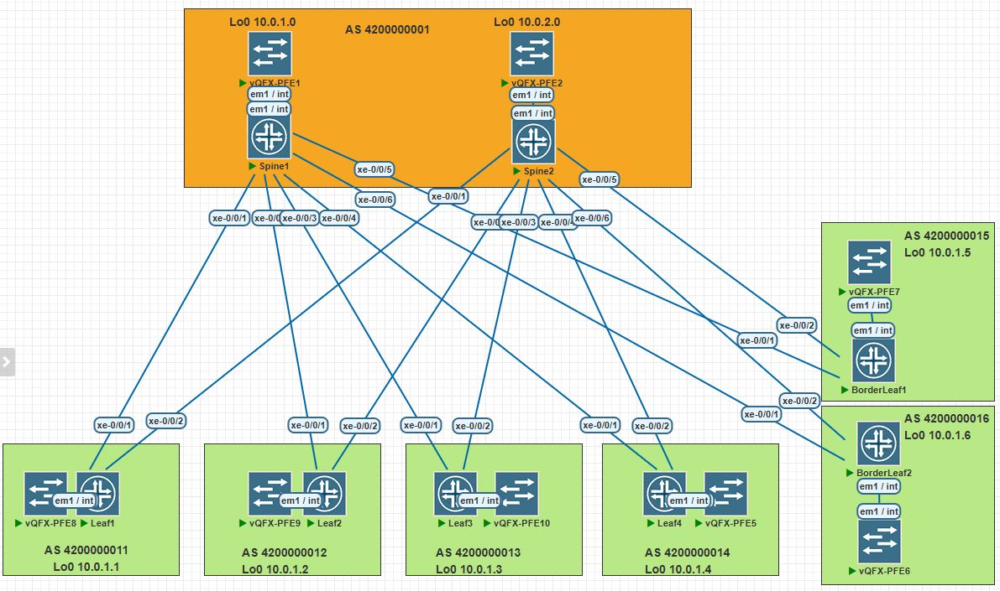

# LAB-4

## Построение Underlay сети(eBGP)
---
### Схема связи и адресное пространство
Схема и адресное пространство взято из LAB-1



---
Таблица соотвествия ip адреса Loopback интерфейса и AS
| Switch      | Lo0 /32  |     AS     |
|-------------|----------|------------|
| Spine1      | 10.0.1.0 | 4200000001 |
| Spine2      | 10.0.2.0 | 4200000001 |
| Leaf1       | 10.0.1.1 | 4200000011 |
| Leaf2       | 10.0.1.2 | 4200000012 |
| Leaf3       | 10.0.1.3 | 4200000013 |
| Leaf4       | 10.0.1.4 | 4200000014 |
| BorderLeaf1 | 10.0.1.5 | 4200000015 |
| BorderLeaf2 | 10.0.1.6 | 4200000016 |
---
Настройка eBGP
Spine1
```text
root@Spine1> show configuration protocols bgp | display set 
set protocols bgp group UNDERLAY type external
set protocols bgp group UNDERLAY export allow-loopback
set protocols bgp group UNDERLAY local-as 4200000001
set protocols bgp group UNDERLAY multipath
set protocols bgp group UNDERLAY neighbor 10.2.1.1 family inet unicast
set protocols bgp group UNDERLAY neighbor 10.2.1.1 peer-as 4200000011
set protocols bgp group UNDERLAY neighbor 10.2.1.3 family inet unicast
set protocols bgp group UNDERLAY neighbor 10.2.1.3 peer-as 4200000012
set protocols bgp group UNDERLAY neighbor 10.2.1.5 family inet unicast
set protocols bgp group UNDERLAY neighbor 10.2.1.5 peer-as 4200000013
set protocols bgp group UNDERLAY neighbor 10.2.1.7 family inet unicast
set protocols bgp group UNDERLAY neighbor 10.2.1.7 peer-as 4200000014
set protocols bgp group UNDERLAY neighbor 10.2.1.9 family inet unicast
set protocols bgp group UNDERLAY neighbor 10.2.1.9 peer-as 4200000015
set protocols bgp group UNDERLAY neighbor 10.2.1.11 family inet unicast
set protocols bgp group UNDERLAY neighbor 10.2.1.11 peer-as 4200000016
```
Spine2
```text
root@Spine2> show configuration protocols bgp | display set 
set protocols bgp group UNDERLAY type external
set protocols bgp group UNDERLAY export allow-loopback
set protocols bgp group UNDERLAY local-as 4200000001
set protocols bgp group UNDERLAY multipath
set protocols bgp group UNDERLAY neighbor 10.2.2.1 family inet unicast
set protocols bgp group UNDERLAY neighbor 10.2.2.1 peer-as 4200000011
set protocols bgp group UNDERLAY neighbor 10.2.2.3 family inet unicast
set protocols bgp group UNDERLAY neighbor 10.2.2.3 peer-as 4200000012
set protocols bgp group UNDERLAY neighbor 10.2.2.5 family inet unicast
set protocols bgp group UNDERLAY neighbor 10.2.2.5 peer-as 4200000013
set protocols bgp group UNDERLAY neighbor 10.2.2.7 family inet unicast
set protocols bgp group UNDERLAY neighbor 10.2.2.7 peer-as 4200000014
set protocols bgp group UNDERLAY neighbor 10.2.2.9 family inet unicast
set protocols bgp group UNDERLAY neighbor 10.2.2.9 peer-as 4200000015
set protocols bgp group UNDERLAY neighbor 10.2.2.11 family inet unicast
set protocols bgp group UNDERLAY neighbor 10.2.2.11 peer-as 4200000016
```
Leaf1
```text
root@Leaf1> show configuration protocols bgp | display set 
set protocols bgp group UNDERLAY type external
set protocols bgp group UNDERLAY export allow-loopback
set protocols bgp group UNDERLAY peer-as 4200000001
set protocols bgp group UNDERLAY local-as 4200000011
set protocols bgp group UNDERLAY multipath
set protocols bgp group UNDERLAY neighbor 10.2.1.0 family inet unicast
set protocols bgp group UNDERLAY neighbor 10.2.2.0 family inet unicast
```
Leaf2
```text
root@Leaf2> show configuration protocols bgp | display set 
set protocols bgp group UNDERLAY type external
set protocols bgp group UNDERLAY export allow-loopback
set protocols bgp group UNDERLAY peer-as 4200000001
set protocols bgp group UNDERLAY local-as 4200000012
set protocols bgp group UNDERLAY multipath
set protocols bgp group UNDERLAY neighbor 10.2.1.2 family inet unicast
set protocols bgp group UNDERLAY neighbor 10.2.2.2 family inet unicast
```
leaf3
```text
root@Leaf3> show configuration protocols bgp | display set 
set protocols bgp group UNDERLAY type external
set protocols bgp group UNDERLAY export allow-loopback
set protocols bgp group UNDERLAY peer-as 4200000001
set protocols bgp group UNDERLAY local-as 4200000013
set protocols bgp group UNDERLAY multipath
set protocols bgp group UNDERLAY neighbor 10.2.1.4 family inet unicast
set protocols bgp group UNDERLAY neighbor 10.2.2.4 family inet unicast
```
leaf4
```text
root@Leaf4> show configuration protocols bgp | display set 
set protocols bgp group UNDERLAY type external
set protocols bgp group UNDERLAY export allow-loopback
set protocols bgp group UNDERLAY peer-as 4200000001
set protocols bgp group UNDERLAY local-as 4200000014
set protocols bgp group UNDERLAY multipath
set protocols bgp group UNDERLAY neighbor 10.2.1.6 family inet unicast
set protocols bgp group UNDERLAY neighbor 10.2.2.6 family inet unicast
```
BorderLeaf1
```text
root@BorderLeaf1> show configuration protocols bgp | display set 
set protocols bgp group UNDERLAY type external
set protocols bgp group UNDERLAY export allow-loopback
set protocols bgp group UNDERLAY peer-as 4200000001
set protocols bgp group UNDERLAY local-as 4200000015
set protocols bgp group UNDERLAY multipath
set protocols bgp group UNDERLAY neighbor 10.2.1.8 family inet unicast
set protocols bgp group UNDERLAY neighbor 10.2.2.8 family inet unicast
```
BorderLeaf2
```text
root@BorderLeaf2> show configuration protocols bgp | display set 
set protocols bgp group UNDERLAY type external
set protocols bgp group UNDERLAY export allow-loopback
set protocols bgp group UNDERLAY peer-as 4200000001
set protocols bgp group UNDERLAY local-as 4200000016
set protocols bgp group UNDERLAY multipath
set protocols bgp group UNDERLAY neighbor 10.2.1.10 family inet unicast
set protocols bgp group UNDERLAY neighbor 10.2.2.10 family inet unicast
```
---
Проверка
```text
root@Spine1> show bgp summary 
Threading mode: BGP I/O
Default eBGP mode: advertise - accept, receive - accept
Groups: 1 Peers: 6 Down peers: 0
Table          Tot Paths  Act Paths Suppressed    History Damp State    Pending
inet.0               
                       6          6          0          0          0          0
Peer                     AS      InPkt     OutPkt    OutQ   Flaps Last Up/Dwn State|#Active/Received/Accepted/Damped...
10.2.1.1         4200000011        416        416       0       2     3:07:03 Establ
  inet.0: 1/1/1/0
10.2.1.3         4200000012        415        417       0       2     3:07:07 Establ
  inet.0: 1/1/1/0
10.2.1.5         4200000013        416        417       0       3     3:07:07 Establ
  inet.0: 1/1/1/0
10.2.1.7         4200000014        417        417       0       2     3:07:07 Establ
  inet.0: 1/1/1/0
10.2.1.9         4200000015        416        416       0       1     3:07:03 Establ
  inet.0: 1/1/1/0
10.2.1.11        4200000016        416        416       0       1     3:07:03 Establ
  inet.0: 1/1/1/0
  ```
  ```text
  root@Spine2> show bgp summary 
Threading mode: BGP I/O
Default eBGP mode: advertise - accept, receive - accept
Groups: 1 Peers: 6 Down peers: 0
Table          Tot Paths  Act Paths Suppressed    History Damp State    Pending
inet.0               
                       6          6          0          0          0          0
Peer                     AS      InPkt     OutPkt    OutQ   Flaps Last Up/Dwn State|#Active/Received/Accepted/Damped...
10.2.2.1         4200000011        421        422       0       2     3:09:10 Establ
  inet.0: 1/1/1/0
10.2.2.3         4200000012        420        421       0       2     3:09:11 Establ
  inet.0: 1/1/1/0
10.2.2.5         4200000013        420        421       0       2     3:09:07 Establ
  inet.0: 1/1/1/0
10.2.2.7         4200000014        420        420       0       2     3:09:06 Establ
  inet.0: 1/1/1/0
10.2.2.9         4200000015        421        422       0       1     3:09:11 Establ
  inet.0: 1/1/1/0
10.2.2.11        4200000016        421        421       0       1     3:09:11 Establ
  inet.0: 1/1/1/0
   ```