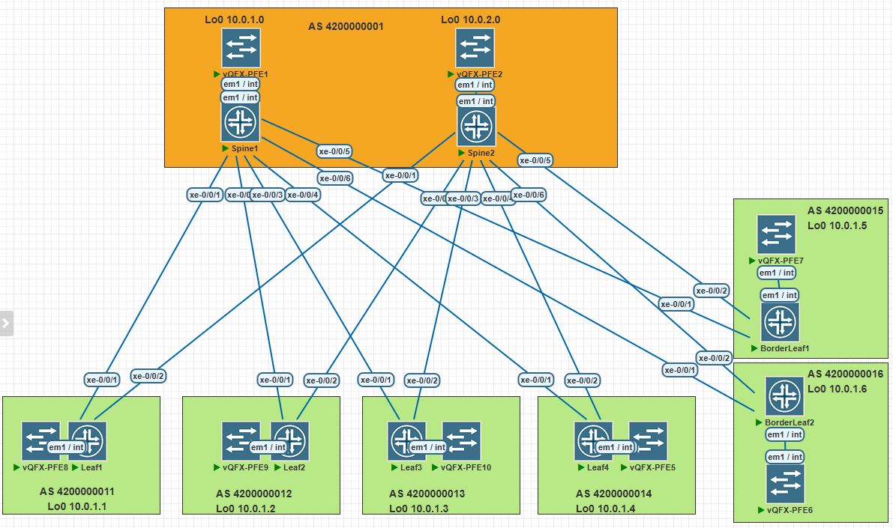

# LAB-5

## VxLAN. L2 VNI
---
### Схема связи и адресное пространство
Схема и адресное пространство взято из LAB-1



---
Для Overlay используем eBGP

Конфигурация на Leaf
```text
root@Leaf1# show protocols bgp group OVERLAY | display set 
set protocols bgp group OVERLAY type external
set protocols bgp group OVERLAY multihop
set protocols bgp group OVERLAY local-address 10.0.1.1
set protocols bgp group OVERLAY family evpn signaling
set protocols bgp group OVERLAY peer-as 4200000001
set protocols bgp group OVERLAY multipath
set protocols bgp group OVERLAY neighbor 10.0.1.0 description "Spine1 loopback"
set protocols bgp group OVERLAY neighbor 10.0.2.0 description "Spine2 loopback"
```
Конфигурация на Spine
```text
root@Spine1# show protocols bgp group OVERLAY | display set 
set protocols bgp group OVERLAY type external
set protocols bgp group OVERLAY multihop no-nexthop-change
set protocols bgp group OVERLAY local-address 10.0.1.0
set protocols bgp group OVERLAY family evpn signaling
set protocols bgp group OVERLAY multipath
set protocols bgp group OVERLAY neighbor 10.0.1.1 description "Leaf1 loopback"
set protocols bgp group OVERLAY neighbor 10.0.1.1 peer-as 4200000011
set protocols bgp group OVERLAY neighbor 10.0.1.2 description "Leaf2 loopback"
set protocols bgp group OVERLAY neighbor 10.0.1.2 peer-as 4200000012
set protocols bgp group OVERLAY neighbor 10.0.1.3 description "Leaf3 loopback"
set protocols bgp group OVERLAY neighbor 10.0.1.3 peer-as 4200000013
set protocols bgp group OVERLAY neighbor 10.0.1.4 description "Leaf4 loopback"
set protocols bgp group OVERLAY neighbor 10.0.1.4 peer-as 4200000014
set protocols bgp group OVERLAY neighbor 10.0.1.5 description "BorderLeaf1 loopback"
set protocols bgp group OVERLAY neighbor 10.0.1.5 peer-as 4200000015
set protocols bgp group OVERLAY neighbor 10.0.1.6 description "BorderLeaf2 loopback"
set protocols bgp group OVERLAY neighbor 10.0.1.6 peer-as 4200000016
```
Вывод BGP Overlay
```text
root@Spine1# run show bgp summary group OVERLAY                  
Threading mode: BGP I/O
Default eBGP mode: advertise - accept, receive - accept
Groups: 2 Peers: 12 Down peers: 0
Table          Tot Paths  Act Paths Suppressed    History Damp State    Pending
inet.0               
                       6          6          0          0          0          0
bgp.evpn.0           
                       6          6          0          0          0          0
Peer                     AS      InPkt     OutPkt    OutQ   Flaps Last Up/Dwn State|#Active/Received/Accepted/Damped...
10.0.1.1         4200000011       2566       2532       0       2    19:22:02 Establ
  bgp.evpn.0: 3/3/3/0
10.0.1.2         4200000012       2562       2533       0       0    19:21:23 Establ
  bgp.evpn.0: 0/0/0/0
10.0.1.3         4200000013        217        217       0       0     1:37:37 Establ
  bgp.evpn.0: 0/0/0/0
10.0.1.4         4200000014        216        216       0       0     1:37:33 Establ
  bgp.evpn.0: 0/0/0/0
10.0.1.5         4200000015        216        216       0       0     1:37:29 Establ
  bgp.evpn.0: 0/0/0/0
10.0.1.6         4200000016        219        214       0       0     1:37:36 Establ
```
```text
root@Spine2# run show bgp summary group OVERLAY 
Threading mode: BGP I/O
Default eBGP mode: advertise - accept, receive - accept
Groups: 2 Peers: 12 Down peers: 0
Table          Tot Paths  Act Paths Suppressed    History Damp State    Pending
inet.0               
                       6          6          0          0          0          0
bgp.evpn.0           
                       6          6          0          0          0          0
Peer                     AS      InPkt     OutPkt    OutQ   Flaps Last Up/Dwn State|#Active/Received/Accepted/Damped...
10.0.1.1         4200000011        210        207       0       0     1:34:00 Establ
  bgp.evpn.0: 3/3/3/0
10.0.1.2         4200000012        207        208       0       0     1:33:56 Establ
  bgp.evpn.0: 0/0/0/0
10.0.1.3         4200000013        208        208       0       0     1:33:52 Establ
  bgp.evpn.0: 0/0/0/0
10.0.1.4         4200000014        208        208       0       0     1:33:49 Establ
  bgp.evpn.0: 0/0/0/0
10.0.1.5         4200000015        208        208       0       0     1:33:44 Establ
  bgp.evpn.0: 0/0/0/0
10.0.1.6         4200000016        210        206       0       0     1:33:40 Establ
  bgp.evpn.0: 3/3/3/0
```