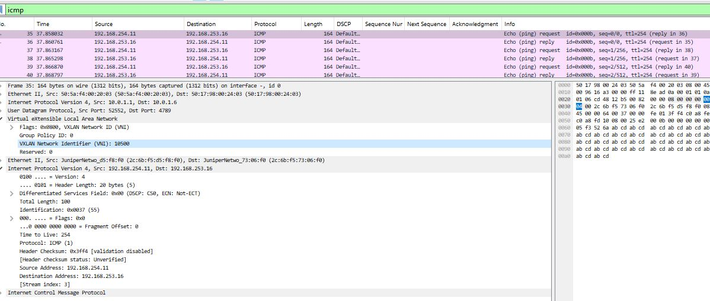

# LAB-6

## VxLAN. EVPN L3
---
### Схема связи и адресное пространство
Схема и адресное пространство взято из LAB-1


Конфигурация MAC-VRF на Leaf1 для symmetric IRB
```text
set routing-instances macvrf-1 instance-type mac-vrf
set routing-instances macvrf-1 protocols evpn encapsulation vxlan
set routing-instances macvrf-1 protocols evpn default-gateway do-not-advertise
set routing-instances macvrf-1 protocols evpn extended-vni-list all
set routing-instances macvrf-1 protocols evpn multicast-mode ingress-replication
set routing-instances macvrf-1 vtep-source-interface lo0.0
set routing-instances macvrf-1 bridge-domains bd-v100 domain-type bridge
set routing-instances macvrf-1 bridge-domains bd-v100 vlan-id 100
set routing-instances macvrf-1 bridge-domains bd-v100 interface ge-0/0/3.0
set routing-instances macvrf-1 bridge-domains bd-v100 routing-interface irb.100
set routing-instances macvrf-1 bridge-domains bd-v100 vxlan vni 10100
set routing-instances macvrf-1 bridge-domains bd-v200 domain-type bridge
set routing-instances macvrf-1 bridge-domains bd-v200 vlan-id 200
set routing-instances macvrf-1 bridge-domains bd-v200 interface ge-0/0/4.0
set routing-instances macvrf-1 bridge-domains bd-v200 routing-interface irb.200
set routing-instances macvrf-1 bridge-domains bd-v200 vxlan vni 10200
set routing-instances macvrf-1 service-type vlan-aware
set routing-instances macvrf-1 route-distinguisher 10.0.1.1:100
set routing-instances macvrf-1 vrf-target target:3:3
```
Конфигурация MAC-VRF на BorderLeaf1 для symmetric IRB
```text
set routing-instances macvrf-1 instance-type mac-vrf
set routing-instances macvrf-1 protocols evpn encapsulation vxlan
set routing-instances macvrf-1 protocols evpn default-gateway do-not-advertise
set routing-instances macvrf-1 protocols evpn extended-vni-list all
set routing-instances macvrf-1 protocols evpn multicast-mode ingress-replication
set routing-instances macvrf-1 vtep-source-interface lo0.0
set routing-instances macvrf-1 bridge-domains bd-v100 vlan-id 100
set routing-instances macvrf-1 bridge-domains bd-v100 interface ge-0/0/3.0
set routing-instances macvrf-1 bridge-domains bd-v100 routing-interface irb.100
set routing-instances macvrf-1 bridge-domains bd-v100 vxlan vni 10100
set routing-instances macvrf-1 bridge-domains bd-v200 vlan-id 200
set routing-instances macvrf-1 bridge-domains bd-v200 interface ge-0/0/4.0
set routing-instances macvrf-1 bridge-domains bd-v200 routing-interface irb.200
set routing-instances macvrf-1 bridge-domains bd-v200 vxlan vni 10200
set routing-instances macvrf-1 service-type vlan-aware
set routing-instances macvrf-1 route-distinguisher 10.0.1.6:100
set routing-instances macvrf-1 vrf-target target:3:3
```
Конфигурация IP VRF на Leaf1 для symmetric IRB
```text
set routing-instances Tenant1 instance-type vrf
set routing-instances Tenant1 protocols evpn irb-symmetric-routing vni 10500
set routing-instances Tenant1 protocols evpn ip-prefix-routes advertise direct-nexthop
set routing-instances Tenant1 protocols evpn ip-prefix-routes encapsulation vxlan
set routing-instances Tenant1 protocols evpn ip-prefix-routes vni 10500
set routing-instances Tenant1 interface irb.100
set routing-instances Tenant1 interface irb.200
set routing-instances Tenant1 interface lo0.10500
set routing-instances Tenant1 route-distinguisher 10.0.1.1:500
set routing-instances Tenant1 vrf-target target:500:500
```
Конфигурация IP VRF на BorderLeaf1 для symmetric IRB
```text
set routing-instances Tenant1 instance-type vrf
set routing-instances Tenant1 protocols evpn irb-symmetric-routing vni 10500
set routing-instances Tenant1 protocols evpn ip-prefix-routes advertise direct-nexthop
set routing-instances Tenant1 protocols evpn ip-prefix-routes encapsulation vxlan
set routing-instances Tenant1 protocols evpn ip-prefix-routes vni 10500
set routing-instances Tenant1 interface irb.100
set routing-instances Tenant1 interface irb.200
set routing-instances Tenant1 interface lo0.10500
set routing-instances Tenant1 route-distinguisher 10.0.1.6:500
set routing-instances Tenant1 vrf-target target:500:500
```
Проверка
```text
R37#ping 192.168.253.16      
Type escape sequence to abort.
Sending 5, 100-byte ICMP Echos to 192.168.253.16, timeout is 2 seconds:
!!!!!
Success rate is 100 percent (5/5), round-trip min/avg/max = 3/4/8 ms
```
```text
R38#ping 192.168.254.16
Type escape sequence to abort.
Sending 5, 100-byte ICMP Echos to 192.168.254.16, timeout is 2 seconds:
!!!!!
Success rate is 100 percent (5/5), round-trip min/avg/max = 3/4/5 ms
```
Дамп пинга


<details>
<summary>Leaf1</summary>

``` text
root@Leaf1> show route    

inet.0: 12 destinations, 17 routes (12 active, 0 holddown, 0 hidden)
+ = Active Route, - = Last Active, * = Both

10.0.1.0/32        *[BGP/170] 1w0d 03:16:57, localpref 100
                      AS path: 4200000001 I, validation-state: unverified
                    >  to 10.2.1.0 via ge-0/0/1.0
10.0.1.1/32        *[Direct/0] 1w1d 23:56:35
                    >  via lo0.0
10.0.1.2/32        *[BGP/170] 1w0d 03:16:57, localpref 100
                      AS path: 4200000001 4200000012 I, validation-state: unverified
                       to 10.2.1.0 via ge-0/0/1.0
                    >  to 10.2.2.0 via ge-0/0/2.0
                    [BGP/170] 1w0d 03:16:57, localpref 100
                      AS path: 4200000001 4200000012 I, validation-state: unverified
                    >  to 10.2.1.0 via ge-0/0/1.0
10.0.1.3/32        *[BGP/170] 1w0d 03:16:57, localpref 100
                      AS path: 4200000001 4200000013 I, validation-state: unverified
                       to 10.2.1.0 via ge-0/0/1.0
                    >  to 10.2.2.0 via ge-0/0/2.0
                    [BGP/170] 1w0d 03:16:57, localpref 100
                      AS path: 4200000001 4200000013 I, validation-state: unverified
                    >  to 10.2.1.0 via ge-0/0/1.0
10.0.1.4/32        *[BGP/170] 1w0d 03:16:57, localpref 100
                      AS path: 4200000001 4200000014 I, validation-state: unverified
                       to 10.2.1.0 via ge-0/0/1.0
                    >  to 10.2.2.0 via ge-0/0/2.0
                    [BGP/170] 1w0d 03:16:57, localpref 100
                      AS path: 4200000001 4200000014 I, validation-state: unverified
                    >  to 10.2.1.0 via ge-0/0/1.0
10.0.1.5/32        *[BGP/170] 1w0d 03:16:57, localpref 100
                      AS path: 4200000001 4200000015 I, validation-state: unverified
                       to 10.2.1.0 via ge-0/0/1.0
                    >  to 10.2.2.0 via ge-0/0/2.0
                    [BGP/170] 1w0d 03:16:57, localpref 100
                      AS path: 4200000001 4200000015 I, validation-state: unverified
                    >  to 10.2.1.0 via ge-0/0/1.0
10.0.1.6/32        *[BGP/170] 1w0d 03:16:57, localpref 100
                      AS path: 4200000001 4200000016 I, validation-state: unverified
                       to 10.2.1.0 via ge-0/0/1.0
                    >  to 10.2.2.0 via ge-0/0/2.0
                    [BGP/170] 1w0d 03:16:57, localpref 100
                      AS path: 4200000001 4200000016 I, validation-state: unverified
                    >  to 10.2.1.0 via ge-0/0/1.0
10.0.2.0/32        *[BGP/170] 1w0d 03:17:17, localpref 100
                      AS path: 4200000001 I, validation-state: unverified
                    >  to 10.2.2.0 via ge-0/0/2.0
10.2.1.0/31        *[Direct/0] 1w1d 23:56:35
                    >  via ge-0/0/1.0
10.2.1.1/32        *[Local/0] 1w1d 23:56:35
                       Local via ge-0/0/1.0
10.2.2.0/31        *[Direct/0] 1w1d 23:56:35
                    >  via ge-0/0/2.0
10.2.2.1/32        *[Local/0] 1w1d 23:56:35
                       Local via ge-0/0/2.0

Tenant1.inet.0: 8 destinations, 10 routes (8 active, 0 holddown, 0 hidden)
+ = Active Route, - = Last Active, * = Both

192.168.253.0/24   *[Direct/0] 1d 03:47:44
                    >  via irb.200
                    [EVPN/170] 1d 03:44:54
                    >  to 10.2.1.0 via ge-0/0/1.0
                       to 10.2.2.0 via ge-0/0/2.0
192.168.253.1/32   *[Local/0] 1d 03:47:44
                       Local via irb.200
192.168.253.11/32  *[EVPN/7] 1d 03:52:36
                    >  via irb.200
192.168.253.16/32  *[EVPN/7] 01:19:52
                    >  to 10.2.1.0 via ge-0/0/1.0
                       to 10.2.2.0 via ge-0/0/2.0
192.168.254.0/24   *[Direct/0] 1d 03:47:02
                    >  via irb.100
                    [EVPN/170] 1d 03:44:54
                    >  to 10.2.1.0 via ge-0/0/1.0
                       to 10.2.2.0 via ge-0/0/2.0
192.168.254.1/32   *[Local/0] 1d 03:47:02
                       Local via irb.100
192.168.254.11/32  *[EVPN/7] 1d 03:42:16
                    >  via irb.100
192.168.254.16/32  *[EVPN/7] 03:02:48
                    >  to 10.2.1.0 via ge-0/0/1.0
                       to 10.2.2.0 via ge-0/0/2.0

inet6.0: 2 destinations, 2 routes (2 active, 0 holddown, 0 hidden)
+ = Active Route, - = Last Active, * = Both

fe80::5284:e2ff:fe00:1800/128
                   *[Local/0] 1w2d 00:50:42
                       Reject
ff02::2/128        *[INET6/0] 1w2d 00:51:07
                       MultiRecv

Tenant1.inet6.0: 1 destinations, 1 routes (1 active, 0 holddown, 0 hidden)
+ = Active Route, - = Last Active, * = Both

ff02::2/128        *[INET6/0] 1d 23:55:40
                       MultiRecv

bgp.evpn.0: 32 destinations, 48 routes (32 active, 0 holddown, 0 hidden)
+ = Active Route, - = Last Active, * = Both

1:10.0.1.1:0::05fa56ea0b0000277400::FFFF:FFFF/192 AD/ESI        
                   *[EVPN/170] 22:54:26
                       Indirect
1:10.0.1.1:0::05fa56ea0b000027d800::FFFF:FFFF/192 AD/ESI        
                   *[EVPN/170] 22:54:26
                       Indirect
1:10.0.1.6:0::05fa56ea100000277400::FFFF:FFFF/192 AD/ESI        
                   *[BGP/170] 03:03:24, localpref 100, from 10.0.1.0
                      AS path: 4200000001 4200000016 I, validation-state: unverified
                    >  to 10.2.1.0 via ge-0/0/1.0
                       to 10.2.2.0 via ge-0/0/2.0
                    [BGP/170] 03:03:24, localpref 100, from 10.0.2.0
                      AS path: 4200000001 4200000016 I, validation-state: unverified
                    >  to 10.2.1.0 via ge-0/0/1.0
                       to 10.2.2.0 via ge-0/0/2.0
1:10.0.1.6:0::05fa56ea10000027d800::FFFF:FFFF/192 AD/ESI        
                   *[BGP/170] 03:03:24, localpref 100, from 10.0.2.0
                      AS path: 4200000001 4200000016 I, validation-state: unverified
                       to 10.2.1.0 via ge-0/0/1.0
                    >  to 10.2.2.0 via ge-0/0/2.0
                    [BGP/170] 03:03:24, localpref 100, from 10.0.1.0
                      AS path: 4200000001 4200000016 I, validation-state: unverified
                       to 10.2.1.0 via ge-0/0/1.0
                    >  to 10.2.2.0 via ge-0/0/2.0
2:10.0.1.1:100::10100::00:00:5e:00:01:01/304 MAC/IP        
                   *[EVPN/170] 22:54:26
                       Indirect
2:10.0.1.1:100::10100::aa:bb:cc:00:01:00/304 MAC/IP        
                   *[EVPN/170] 1d 03:53:15
                       Indirect
2:10.0.1.1:100::10100::aa:bb:cc:80:01:00/304 MAC/IP        
                   *[EVPN/170] 1d 03:42:16
                       Indirect
2:10.0.1.1:100::10200::00:00:5e:00:01:01/304 MAC/IP        
                   *[EVPN/170] 22:54:26
                       Indirect
2:10.0.1.1:100::10200::aa:bb:cc:00:02:00/304 MAC/IP        
                   *[EVPN/170] 1d 03:53:15
                       Indirect
2:10.0.1.1:100::10200::aa:bb:cc:80:02:00/304 MAC/IP        
                   *[EVPN/170] 1d 03:52:55
                       Indirect
2:10.0.1.6:100::10100::00:00:5e:00:01:01/304 MAC/IP        
                   *[BGP/170] 03:03:24, localpref 100, from 10.0.1.0
                      AS path: 4200000001 4200000016 I, validation-state: unverified
                    >  to 10.2.1.0 via ge-0/0/1.0, Push 631
                       to 10.2.2.0 via ge-0/0/2.0, Push 631
                    [BGP/170] 03:03:24, localpref 100, from 10.0.2.0
                      AS path: 4200000001 4200000016 I, validation-state: unverified
                    >  to 10.2.1.0 via ge-0/0/1.0, Push 631
                       to 10.2.2.0 via ge-0/0/2.0, Push 631
2:10.0.1.6:100::10100::aa:bb:cc:00:04:00/304 MAC/IP        
                   *[BGP/170] 1d 03:36:30, localpref 100, from 10.0.2.0
                      AS path: 4200000001 4200000016 I, validation-state: unverified
                    >  to 10.2.1.0 via ge-0/0/1.0, Push 631
                       to 10.2.2.0 via ge-0/0/2.0, Push 631
                    [BGP/170] 1d 03:36:30, localpref 100, from 10.0.1.0
                      AS path: 4200000001 4200000016 I, validation-state: unverified
                    >  to 10.2.1.0 via ge-0/0/1.0, Push 631
                       to 10.2.2.0 via ge-0/0/2.0, Push 631
2:10.0.1.6:100::10100::aa:bb:cc:80:04:00/304 MAC/IP        
                   *[BGP/170] 1d 03:34:35, localpref 100, from 10.0.1.0
                      AS path: 4200000001 4200000016 I, validation-state: unverified
                    >  to 10.2.1.0 via ge-0/0/1.0, Push 631
                       to 10.2.2.0 via ge-0/0/2.0, Push 631
                    [BGP/170] 1d 03:34:35, localpref 100, from 10.0.2.0
                      AS path: 4200000001 4200000016 I, validation-state: unverified
                    >  to 10.2.1.0 via ge-0/0/1.0, Push 631
                       to 10.2.2.0 via ge-0/0/2.0, Push 631
2:10.0.1.6:100::10200::00:00:5e:00:01:01/304 MAC/IP        
                   *[BGP/170] 03:03:24, localpref 100, from 10.0.2.0
                      AS path: 4200000001 4200000016 I, validation-state: unverified
                       to 10.2.1.0 via ge-0/0/1.0, Push 637
                    >  to 10.2.2.0 via ge-0/0/2.0, Push 637
                    [BGP/170] 03:03:24, localpref 100, from 10.0.1.0
                      AS path: 4200000001 4200000016 I, validation-state: unverified
                       to 10.2.1.0 via ge-0/0/1.0, Push 637
                    >  to 10.2.2.0 via ge-0/0/2.0, Push 637
2:10.0.1.6:100::10200::aa:bb:cc:00:03:00/304 MAC/IP        
                   *[BGP/170] 1d 03:36:31, localpref 100, from 10.0.1.0
                      AS path: 4200000001 4200000016 I, validation-state: unverified
                       to 10.2.1.0 via ge-0/0/1.0, Push 637
                    >  to 10.2.2.0 via ge-0/0/2.0, Push 637
                    [BGP/170] 1d 03:36:31, localpref 100, from 10.0.2.0
                      AS path: 4200000001 4200000016 I, validation-state: unverified
                       to 10.2.1.0 via ge-0/0/1.0, Push 637
                    >  to 10.2.2.0 via ge-0/0/2.0, Push 637
2:10.0.1.6:100::10200::aa:bb:cc:80:03:00/304 MAC/IP        
                   *[BGP/170] 01:19:52, localpref 100, from 10.0.1.0
                      AS path: 4200000001 4200000016 I, validation-state: unverified
                       to 10.2.1.0 via ge-0/0/1.0, Push 637
                    >  to 10.2.2.0 via ge-0/0/2.0, Push 637
                    [BGP/170] 01:19:52, localpref 100, from 10.0.2.0
                      AS path: 4200000001 4200000016 I, validation-state: unverified
                       to 10.2.1.0 via ge-0/0/1.0, Push 637
                    >  to 10.2.2.0 via ge-0/0/2.0, Push 637
2:10.0.1.1:100::10100::00:00:5e:00:01:01::192.168.254.254/304 MAC/IP        
                   *[EVPN/170] 22:54:26
                       Indirect
2:10.0.1.1:100::10100::aa:bb:cc:80:01:00::192.168.254.11/304 MAC/IP        
                   *[EVPN/170] 1d 03:42:16
                       Indirect
2:10.0.1.1:100::10200::00:00:5e:00:01:01::192.168.253.254/304 MAC/IP        
                   *[EVPN/170] 22:54:26
                       Indirect
2:10.0.1.1:100::10200::aa:bb:cc:80:02:00::192.168.253.11/304 MAC/IP        
                   *[EVPN/170] 1d 03:52:36
                       Indirect
2:10.0.1.6:100::10100::00:00:5e:00:01:01::192.168.254.254/304 MAC/IP        
                   *[BGP/170] 03:03:24, localpref 100, from 10.0.1.0
                      AS path: 4200000001 4200000016 I, validation-state: unverified
                    >  to 10.2.1.0 via ge-0/0/1.0, Push 631
                       to 10.2.2.0 via ge-0/0/2.0, Push 631
                    [BGP/170] 03:03:24, localpref 100, from 10.0.2.0
                      AS path: 4200000001 4200000016 I, validation-state: unverified
                    >  to 10.2.1.0 via ge-0/0/1.0, Push 631
                       to 10.2.2.0 via ge-0/0/2.0, Push 631
2:10.0.1.6:100::10100::aa:bb:cc:80:04:00::192.168.254.16/304 MAC/IP        
                   *[BGP/170] 03:02:48, localpref 100, from 10.0.2.0
                      AS path: 4200000001 4200000016 I, validation-state: unverified
                       to 10.2.1.0 via ge-0/0/1.0, Push 631
                    >  to 10.2.2.0 via ge-0/0/2.0, Push 631
                    [BGP/170] 03:02:48, localpref 100, from 10.0.1.0
                      AS path: 4200000001 4200000016 I, validation-state: unverified
                       to 10.2.1.0 via ge-0/0/1.0, Push 631
                    >  to 10.2.2.0 via ge-0/0/2.0, Push 631
2:10.0.1.6:100::10200::00:00:5e:00:01:01::192.168.253.254/304 MAC/IP        
                   *[BGP/170] 03:03:24, localpref 100, from 10.0.2.0
                      AS path: 4200000001 4200000016 I, validation-state: unverified
                       to 10.2.1.0 via ge-0/0/1.0, Push 637
                    >  to 10.2.2.0 via ge-0/0/2.0, Push 637
                    [BGP/170] 03:03:24, localpref 100, from 10.0.1.0
                      AS path: 4200000001 4200000016 I, validation-state: unverified
                       to 10.2.1.0 via ge-0/0/1.0, Push 637
                    >  to 10.2.2.0 via ge-0/0/2.0, Push 637
2:10.0.1.6:100::10200::aa:bb:cc:80:03:00::192.168.253.16/304 MAC/IP        
                   *[BGP/170] 01:19:52, localpref 100, from 10.0.1.0
                      AS path: 4200000001 4200000016 I, validation-state: unverified
                    >  to 10.2.1.0 via ge-0/0/1.0, Push 637
                       to 10.2.2.0 via ge-0/0/2.0, Push 637
                    [BGP/170] 01:19:52, localpref 100, from 10.0.2.0
                      AS path: 4200000001 4200000016 I, validation-state: unverified
                    >  to 10.2.1.0 via ge-0/0/1.0, Push 637
                       to 10.2.2.0 via ge-0/0/2.0, Push 637
3:10.0.1.1:100::10100::10.0.1.1/248 IM            
                   *[EVPN/170] 1d 04:29:53
                       Indirect
3:10.0.1.1:100::10200::10.0.1.1/248 IM            
                   *[EVPN/170] 1d 04:29:53
                       Indirect
3:10.0.1.6:100::10100::10.0.1.6/248 IM            
                   *[BGP/170] 1d 23:45:32, localpref 100, from 10.0.1.0
                      AS path: 4200000001 4200000016 I, validation-state: unverified
                    >  to 10.2.1.0 via ge-0/0/1.0
                       to 10.2.2.0 via ge-0/0/2.0
                    [BGP/170] 1d 23:45:32, localpref 100, from 10.0.2.0
                      AS path: 4200000001 4200000016 I, validation-state: unverified
                    >  to 10.2.1.0 via ge-0/0/1.0
                       to 10.2.2.0 via ge-0/0/2.0
3:10.0.1.6:100::10200::10.0.1.6/248 IM            
                   *[BGP/170] 1d 22:54:03, localpref 100, from 10.0.2.0
                      AS path: 4200000001 4200000016 I, validation-state: unverified
                       to 10.2.1.0 via ge-0/0/1.0
                    >  to 10.2.2.0 via ge-0/0/2.0
                    [BGP/170] 1d 22:54:03, localpref 100, from 10.0.1.0
                      AS path: 4200000001 4200000016 I, validation-state: unverified
                       to 10.2.1.0 via ge-0/0/1.0
                    >  to 10.2.2.0 via ge-0/0/2.0
5:10.0.1.1:500::0::192.168.253.0::24/248               
                   *[EVPN/170] 1d 03:47:44
                       Fictitious
5:10.0.1.1:500::0::192.168.254.0::24/248               
                   *[EVPN/170] 1d 03:47:02
                       Fictitious
5:10.0.1.6:500::0::192.168.253.0::24/248               
                   *[BGP/170] 1d 03:44:54, localpref 100, from 10.0.1.0
                      AS path: 4200000001 4200000016 I, validation-state: unverified
                    >  to 10.2.1.0 via ge-0/0/1.0, Push 656
                       to 10.2.2.0 via ge-0/0/2.0, Push 656
                    [BGP/170] 1d 03:44:54, localpref 100, from 10.0.2.0
                      AS path: 4200000001 4200000016 I, validation-state: unverified
                    >  to 10.2.1.0 via ge-0/0/1.0, Push 656
                       to 10.2.2.0 via ge-0/0/2.0, Push 656
5:10.0.1.6:500::0::192.168.254.0::24/248               
                   *[BGP/170] 1d 03:44:54, localpref 100, from 10.0.1.0
                      AS path: 4200000001 4200000016 I, validation-state: unverified
                    >  to 10.2.1.0 via ge-0/0/1.0, Push 656
                       to 10.2.2.0 via ge-0/0/2.0, Push 656
                    [BGP/170] 03:03:24, localpref 100, from 10.0.2.0
                      AS path: 4200000001 4200000016 I, validation-state: unverified
                    >  to 10.2.1.0 via ge-0/0/1.0, Push 656
                       to 10.2.2.0 via ge-0/0/2.0, Push 656

Tenant1.evpn.0: 6 destinations, 10 routes (6 active, 0 holddown, 0 hidden)
+ = Active Route, - = Last Active, * = Both
                                        
2:10.0.1.6:100::10100::aa:bb:cc:80:04:00::192.168.254.16/304 MAC/IP        
                   *[BGP/170] 03:02:48, localpref 100, from 10.0.2.0
                      AS path: 4200000001 4200000016 I, validation-state: unverified
                       to 10.2.1.0 via ge-0/0/1.0, Push 631
                    >  to 10.2.2.0 via ge-0/0/2.0, Push 631
                    [BGP/170] 03:02:48, localpref 100, from 10.0.1.0
                      AS path: 4200000001 4200000016 I, validation-state: unverified
                       to 10.2.1.0 via ge-0/0/1.0, Push 631
                    >  to 10.2.2.0 via ge-0/0/2.0, Push 631
2:10.0.1.6:100::10200::aa:bb:cc:80:03:00::192.168.253.16/304 MAC/IP        
                   *[BGP/170] 01:19:52, localpref 100, from 10.0.1.0
                      AS path: 4200000001 4200000016 I, validation-state: unverified
                    >  to 10.2.1.0 via ge-0/0/1.0, Push 637
                       to 10.2.2.0 via ge-0/0/2.0, Push 637
                    [BGP/170] 01:19:52, localpref 100, from 10.0.2.0
                      AS path: 4200000001 4200000016 I, validation-state: unverified
                    >  to 10.2.1.0 via ge-0/0/1.0, Push 637
                       to 10.2.2.0 via ge-0/0/2.0, Push 637
5:10.0.1.1:500::0::192.168.253.0::24/248               
                   *[EVPN/170] 1d 03:47:44
                       Fictitious
5:10.0.1.1:500::0::192.168.254.0::24/248               
                   *[EVPN/170] 1d 03:47:02
                       Fictitious
5:10.0.1.6:500::0::192.168.253.0::24/248               
                   *[BGP/170] 1d 03:44:54, localpref 100, from 10.0.1.0
                      AS path: 4200000001 4200000016 I, validation-state: unverified
                    >  to 10.2.1.0 via ge-0/0/1.0, Push 656
                       to 10.2.2.0 via ge-0/0/2.0, Push 656
                    [BGP/170] 1d 03:44:54, localpref 100, from 10.0.2.0
                      AS path: 4200000001 4200000016 I, validation-state: unverified
                    >  to 10.2.1.0 via ge-0/0/1.0, Push 656
                       to 10.2.2.0 via ge-0/0/2.0, Push 656
5:10.0.1.6:500::0::192.168.254.0::24/248               
                   *[BGP/170] 1d 03:44:54, localpref 100, from 10.0.1.0
                      AS path: 4200000001 4200000016 I, validation-state: unverified
                    >  to 10.2.1.0 via ge-0/0/1.0, Push 656
                       to 10.2.2.0 via ge-0/0/2.0, Push 656
                    [BGP/170] 03:03:24, localpref 100, from 10.0.2.0
                      AS path: 4200000001 4200000016 I, validation-state: unverified
                    >  to 10.2.1.0 via ge-0/0/1.0, Push 656
                       to 10.2.2.0 via ge-0/0/2.0, Push 656

__default_evpn__.evpn.0: 2 destinations, 2 routes (2 active, 0 holddown, 0 hidden)
+ = Active Route, - = Last Active, * = Both

1:10.0.1.1:0::05fa56ea0b0000277400::FFFF:FFFF/192 AD/ESI        
                   *[EVPN/170] 22:54:26
                       Indirect
1:10.0.1.1:0::05fa56ea0b000027d800::FFFF:FFFF/192 AD/ESI        
                   *[EVPN/170] 22:54:26
                       Indirect

macvrf-1.evpn.0: 26 destinations, 40 routes (26 active, 0 holddown, 0 hidden)
+ = Active Route, - = Last Active, * = Both

1:10.0.1.6:0::05fa56ea100000277400::FFFF:FFFF/192 AD/ESI        
                   *[BGP/170] 03:03:24, localpref 100, from 10.0.1.0
                      AS path: 4200000001 4200000016 I, validation-state: unverified
                    >  to 10.2.1.0 via ge-0/0/1.0
                       to 10.2.2.0 via ge-0/0/2.0
                    [BGP/170] 03:03:24, localpref 100, from 10.0.2.0
                      AS path: 4200000001 4200000016 I, validation-state: unverified
                    >  to 10.2.1.0 via ge-0/0/1.0
                       to 10.2.2.0 via ge-0/0/2.0
1:10.0.1.6:0::05fa56ea10000027d800::FFFF:FFFF/192 AD/ESI        
                   *[BGP/170] 03:03:24, localpref 100, from 10.0.2.0
                      AS path: 4200000001 4200000016 I, validation-state: unverified
                       to 10.2.1.0 via ge-0/0/1.0
                    >  to 10.2.2.0 via ge-0/0/2.0
                    [BGP/170] 03:03:24, localpref 100, from 10.0.1.0
                      AS path: 4200000001 4200000016 I, validation-state: unverified
                       to 10.2.1.0 via ge-0/0/1.0
                    >  to 10.2.2.0 via ge-0/0/2.0
2:10.0.1.1:100::10100::00:00:5e:00:01:01/304 MAC/IP        
                   *[EVPN/170] 22:54:26
                       Indirect
2:10.0.1.1:100::10100::aa:bb:cc:00:01:00/304 MAC/IP        
                   *[EVPN/170] 1d 03:53:15
                       Indirect
2:10.0.1.1:100::10100::aa:bb:cc:80:01:00/304 MAC/IP        
                   *[EVPN/170] 1d 03:42:16
                       Indirect
2:10.0.1.1:100::10200::00:00:5e:00:01:01/304 MAC/IP        
                   *[EVPN/170] 22:54:26
                       Indirect
2:10.0.1.1:100::10200::aa:bb:cc:00:02:00/304 MAC/IP        
                   *[EVPN/170] 1d 03:53:15
                       Indirect
2:10.0.1.1:100::10200::aa:bb:cc:80:02:00/304 MAC/IP        
                   *[EVPN/170] 1d 03:52:55
                       Indirect
2:10.0.1.6:100::10100::00:00:5e:00:01:01/304 MAC/IP        
                   *[BGP/170] 03:03:24, localpref 100, from 10.0.1.0
                      AS path: 4200000001 4200000016 I, validation-state: unverified
                    >  to 10.2.1.0 via ge-0/0/1.0, Push 631
                       to 10.2.2.0 via ge-0/0/2.0, Push 631
                    [BGP/170] 03:03:24, localpref 100, from 10.0.2.0
                      AS path: 4200000001 4200000016 I, validation-state: unverified
                    >  to 10.2.1.0 via ge-0/0/1.0, Push 631
                       to 10.2.2.0 via ge-0/0/2.0, Push 631
2:10.0.1.6:100::10100::aa:bb:cc:00:04:00/304 MAC/IP        
                   *[BGP/170] 1d 03:36:30, localpref 100, from 10.0.2.0
                      AS path: 4200000001 4200000016 I, validation-state: unverified
                    >  to 10.2.1.0 via ge-0/0/1.0, Push 631
                       to 10.2.2.0 via ge-0/0/2.0, Push 631
                    [BGP/170] 1d 03:36:30, localpref 100, from 10.0.1.0
                      AS path: 4200000001 4200000016 I, validation-state: unverified
                    >  to 10.2.1.0 via ge-0/0/1.0, Push 631
                       to 10.2.2.0 via ge-0/0/2.0, Push 631
2:10.0.1.6:100::10100::aa:bb:cc:80:04:00/304 MAC/IP        
                   *[BGP/170] 1d 03:34:35, localpref 100, from 10.0.1.0
                      AS path: 4200000001 4200000016 I, validation-state: unverified
                    >  to 10.2.1.0 via ge-0/0/1.0, Push 631
                       to 10.2.2.0 via ge-0/0/2.0, Push 631
                    [BGP/170] 1d 03:34:35, localpref 100, from 10.0.2.0
                      AS path: 4200000001 4200000016 I, validation-state: unverified
                    >  to 10.2.1.0 via ge-0/0/1.0, Push 631
                       to 10.2.2.0 via ge-0/0/2.0, Push 631
2:10.0.1.6:100::10200::00:00:5e:00:01:01/304 MAC/IP        
                   *[BGP/170] 03:03:24, localpref 100, from 10.0.2.0
                      AS path: 4200000001 4200000016 I, validation-state: unverified
                       to 10.2.1.0 via ge-0/0/1.0, Push 637
                    >  to 10.2.2.0 via ge-0/0/2.0, Push 637
                    [BGP/170] 03:03:24, localpref 100, from 10.0.1.0
                      AS path: 4200000001 4200000016 I, validation-state: unverified
                       to 10.2.1.0 via ge-0/0/1.0, Push 637
                    >  to 10.2.2.0 via ge-0/0/2.0, Push 637
2:10.0.1.6:100::10200::aa:bb:cc:00:03:00/304 MAC/IP        
                   *[BGP/170] 1d 03:36:31, localpref 100, from 10.0.1.0
                      AS path: 4200000001 4200000016 I, validation-state: unverified
                       to 10.2.1.0 via ge-0/0/1.0, Push 637
                    >  to 10.2.2.0 via ge-0/0/2.0, Push 637
                    [BGP/170] 1d 03:36:31, localpref 100, from 10.0.2.0
                      AS path: 4200000001 4200000016 I, validation-state: unverified
                       to 10.2.1.0 via ge-0/0/1.0, Push 637
                    >  to 10.2.2.0 via ge-0/0/2.0, Push 637
2:10.0.1.6:100::10200::aa:bb:cc:80:03:00/304 MAC/IP        
                   *[BGP/170] 01:19:52, localpref 100, from 10.0.1.0
                      AS path: 4200000001 4200000016 I, validation-state: unverified
                       to 10.2.1.0 via ge-0/0/1.0, Push 637
                    >  to 10.2.2.0 via ge-0/0/2.0, Push 637
                    [BGP/170] 01:19:52, localpref 100, from 10.0.2.0
                      AS path: 4200000001 4200000016 I, validation-state: unverified
                       to 10.2.1.0 via ge-0/0/1.0, Push 637
                    >  to 10.2.2.0 via ge-0/0/2.0, Push 637
2:10.0.1.1:100::10100::00:00:5e:00:01:01::192.168.254.254/304 MAC/IP        
                   *[EVPN/170] 22:54:26
                       Indirect
2:10.0.1.1:100::10100::aa:bb:cc:80:01:00::192.168.254.11/304 MAC/IP        
                   *[EVPN/170] 1d 03:42:16
                       Indirect
2:10.0.1.1:100::10200::00:00:5e:00:01:01::192.168.253.254/304 MAC/IP        
                   *[EVPN/170] 22:54:26
                       Indirect         
2:10.0.1.1:100::10200::aa:bb:cc:80:02:00::192.168.253.11/304 MAC/IP        
                   *[EVPN/170] 1d 03:52:36
                       Indirect
2:10.0.1.6:100::10100::00:00:5e:00:01:01::192.168.254.254/304 MAC/IP        
                   *[BGP/170] 03:03:24, localpref 100, from 10.0.1.0
                      AS path: 4200000001 4200000016 I, validation-state: unverified
                    >  to 10.2.1.0 via ge-0/0/1.0, Push 631
                       to 10.2.2.0 via ge-0/0/2.0, Push 631
                    [BGP/170] 03:03:24, localpref 100, from 10.0.2.0
                      AS path: 4200000001 4200000016 I, validation-state: unverified
                    >  to 10.2.1.0 via ge-0/0/1.0, Push 631
                       to 10.2.2.0 via ge-0/0/2.0, Push 631
2:10.0.1.6:100::10100::aa:bb:cc:80:04:00::192.168.254.16/304 MAC/IP        
                   *[BGP/170] 03:02:48, localpref 100, from 10.0.2.0
                      AS path: 4200000001 4200000016 I, validation-state: unverified
                       to 10.2.1.0 via ge-0/0/1.0, Push 631
                    >  to 10.2.2.0 via ge-0/0/2.0, Push 631
                    [BGP/170] 03:02:48, localpref 100, from 10.0.1.0
                      AS path: 4200000001 4200000016 I, validation-state: unverified
                       to 10.2.1.0 via ge-0/0/1.0, Push 631
                    >  to 10.2.2.0 via ge-0/0/2.0, Push 631
2:10.0.1.6:100::10200::00:00:5e:00:01:01::192.168.253.254/304 MAC/IP        
                   *[BGP/170] 03:03:24, localpref 100, from 10.0.2.0
                      AS path: 4200000001 4200000016 I, validation-state: unverified
                       to 10.2.1.0 via ge-0/0/1.0, Push 637
                    >  to 10.2.2.0 via ge-0/0/2.0, Push 637
                    [BGP/170] 03:03:24, localpref 100, from 10.0.1.0
                      AS path: 4200000001 4200000016 I, validation-state: unverified
                       to 10.2.1.0 via ge-0/0/1.0, Push 637
                    >  to 10.2.2.0 via ge-0/0/2.0, Push 637
2:10.0.1.6:100::10200::aa:bb:cc:80:03:00::192.168.253.16/304 MAC/IP        
                   *[BGP/170] 01:19:52, localpref 100, from 10.0.1.0
                      AS path: 4200000001 4200000016 I, validation-state: unverified
                    >  to 10.2.1.0 via ge-0/0/1.0, Push 637
                       to 10.2.2.0 via ge-0/0/2.0, Push 637
                    [BGP/170] 01:19:52, localpref 100, from 10.0.2.0
                      AS path: 4200000001 4200000016 I, validation-state: unverified
                    >  to 10.2.1.0 via ge-0/0/1.0, Push 637
                       to 10.2.2.0 via ge-0/0/2.0, Push 637
3:10.0.1.1:100::10100::10.0.1.1/248 IM            
                   *[EVPN/170] 1d 04:29:53
                       Indirect
3:10.0.1.1:100::10200::10.0.1.1/248 IM            
                   *[EVPN/170] 1d 04:29:53
                       Indirect
3:10.0.1.6:100::10100::10.0.1.6/248 IM            
                   *[BGP/170] 1d 23:45:32, localpref 100, from 10.0.1.0
                      AS path: 4200000001 4200000016 I, validation-state: unverified
                    >  to 10.2.1.0 via ge-0/0/1.0
                       to 10.2.2.0 via ge-0/0/2.0
                    [BGP/170] 1d 23:45:32, localpref 100, from 10.0.2.0
                      AS path: 4200000001 4200000016 I, validation-state: unverified
                    >  to 10.2.1.0 via ge-0/0/1.0
                       to 10.2.2.0 via ge-0/0/2.0
3:10.0.1.6:100::10200::10.0.1.6/248 IM            
                   *[BGP/170] 1d 22:54:03, localpref 100, from 10.0.2.0
                      AS path: 4200000001 4200000016 I, validation-state: unverified
                       to 10.2.1.0 via ge-0/0/1.0
                    >  to 10.2.2.0 via ge-0/0/2.0
                    [BGP/170] 1d 22:54:03, localpref 100, from 10.0.1.0
                      AS path: 4200000001 4200000016 I, validation-state: unverified
                       to 10.2.1.0 via ge-0/0/1.0
                    >  to 10.2.2.0 via ge-0/0/2.0
</details>
<details>
<summary>BorderLeaf2</summary>

``` text
root@BorderLeaf2> show route  

inet.0: 12 destinations, 17 routes (12 active, 0 holddown, 0 hidden)
+ = Active Route, - = Last Active, * = Both

10.0.1.0/32        *[BGP/170] 1w0d 03:17:14, localpref 100
                      AS path: 4200000001 I, validation-state: unverified
                    >  to 10.2.1.10 via ge-0/0/1.0
10.0.1.1/32        *[BGP/170] 1w0d 03:17:14, localpref 100
                      AS path: 4200000001 4200000011 I, validation-state: unverified
                       to 10.2.1.10 via ge-0/0/1.0
                    >  to 10.2.2.10 via ge-0/0/2.0
                    [BGP/170] 1w0d 03:17:14, localpref 100
                      AS path: 4200000001 4200000011 I, validation-state: unverified
                    >  to 10.2.1.10 via ge-0/0/1.0
10.0.1.2/32        *[BGP/170] 1w0d 03:17:14, localpref 100
                      AS path: 4200000001 4200000012 I, validation-state: unverified
                       to 10.2.1.10 via ge-0/0/1.0
                    >  to 10.2.2.10 via ge-0/0/2.0
                    [BGP/170] 1w0d 03:17:14, localpref 100
                      AS path: 4200000001 4200000012 I, validation-state: unverified
                    >  to 10.2.1.10 via ge-0/0/1.0
10.0.1.3/32        *[BGP/170] 1w0d 03:17:14, localpref 100
                      AS path: 4200000001 4200000013 I, validation-state: unverified
                       to 10.2.1.10 via ge-0/0/1.0
                    >  to 10.2.2.10 via ge-0/0/2.0
                    [BGP/170] 1w0d 03:17:14, localpref 100
                      AS path: 4200000001 4200000013 I, validation-state: unverified
                    >  to 10.2.1.10 via ge-0/0/1.0
10.0.1.4/32        *[BGP/170] 1w0d 03:17:14, localpref 100
                      AS path: 4200000001 4200000014 I, validation-state: unverified
                       to 10.2.1.10 via ge-0/0/1.0
                    >  to 10.2.2.10 via ge-0/0/2.0
                    [BGP/170] 1w0d 03:17:14, localpref 100
                      AS path: 4200000001 4200000014 I, validation-state: unverified
                    >  to 10.2.1.10 via ge-0/0/1.0
10.0.1.5/32        *[BGP/170] 1w0d 03:17:14, localpref 100
                      AS path: 4200000001 4200000015 I, validation-state: unverified
                       to 10.2.1.10 via ge-0/0/1.0
                    >  to 10.2.2.10 via ge-0/0/2.0
                    [BGP/170] 1w0d 03:17:14, localpref 100
                      AS path: 4200000001 4200000015 I, validation-state: unverified
                    >  to 10.2.1.10 via ge-0/0/1.0
10.0.1.6/32        *[Direct/0] 1w1d 02:20:06
                    >  via lo0.0
10.0.2.0/32        *[BGP/170] 1w0d 03:17:35, localpref 100
                      AS path: 4200000001 I, validation-state: unverified
                    >  to 10.2.2.10 via ge-0/0/2.0
10.2.1.10/31       *[Direct/0] 1w1d 02:17:05
                    >  via ge-0/0/1.0
10.2.1.11/32       *[Local/0] 1w1d 02:17:05
                       Local via ge-0/0/1.0
10.2.2.10/31       *[Direct/0] 1w1d 02:17:05
                    >  via ge-0/0/2.0
10.2.2.11/32       *[Local/0] 1w1d 02:17:05
                       Local via ge-0/0/2.0

Tenant1.inet.0: 8 destinations, 10 routes (8 active, 0 holddown, 0 hidden)
+ = Active Route, - = Last Active, * = Both

192.168.253.0/24   *[Direct/0] 00:08:40
                    >  via irb.200
                    [EVPN/170] 1d 03:48:01
                    >  to 10.2.1.10 via ge-0/0/1.0
                       to 10.2.2.10 via ge-0/0/2.0
192.168.253.1/32   *[Local/0] 00:08:40
                       Local via irb.200
192.168.253.11/32  *[EVPN/7] 1d 03:52:52
                       to 10.2.1.10 via ge-0/0/1.0
                    >  to 10.2.2.10 via ge-0/0/2.0
192.168.253.16/32  *[EVPN/7] 01:20:10
                    >  via irb.200
192.168.254.0/24   *[Direct/0] 00:08:40
                    >  via irb.100
                    [EVPN/170] 1d 03:47:19
                    >  to 10.2.1.10 via ge-0/0/1.0
                       to 10.2.2.10 via ge-0/0/2.0
192.168.254.1/32   *[Local/0] 00:08:40
                       Local via irb.100
192.168.254.11/32  *[EVPN/7] 1d 03:42:32
                       to 10.2.1.10 via ge-0/0/1.0
                    >  to 10.2.2.10 via ge-0/0/2.0
192.168.254.16/32  *[EVPN/7] 03:03:06
                    >  via irb.100

inet6.0: 2 destinations, 2 routes (2 active, 0 holddown, 0 hidden)
+ = Active Route, - = Last Active, * = Both

fe80::5245:85ff:fe00:1a00/128
                   *[Local/0] 1w1d 02:20:06
                       Reject
ff02::2/128        *[INET6/0] 1w1d 02:20:06
                       MultiRecv

Tenant1.inet6.0: 1 destinations, 1 routes (1 active, 0 holddown, 0 hidden)
+ = Active Route, - = Last Active, * = Both

ff02::2/128        *[INET6/0] 1d 23:45:51
                       MultiRecv

bgp.evpn.0: 32 destinations, 48 routes (32 active, 0 holddown, 0 hidden)
+ = Active Route, - = Last Active, * = Both

1:10.0.1.1:0::05fa56ea0b0000277400::FFFF:FFFF/192 AD/ESI        
                   *[BGP/170] 22:54:43, localpref 100, from 10.0.2.0
                      AS path: 4200000001 4200000011 I, validation-state: unverified
                       to 10.2.1.10 via ge-0/0/1.0
                    >  to 10.2.2.10 via ge-0/0/2.0
                    [BGP/170] 22:54:43, localpref 100, from 10.0.1.0
                      AS path: 4200000001 4200000011 I, validation-state: unverified
                       to 10.2.1.10 via ge-0/0/1.0
                    >  to 10.2.2.10 via ge-0/0/2.0
1:10.0.1.1:0::05fa56ea0b000027d800::FFFF:FFFF/192 AD/ESI        
                   *[BGP/170] 22:54:43, localpref 100, from 10.0.2.0
                      AS path: 4200000001 4200000011 I, validation-state: unverified
                    >  to 10.2.1.10 via ge-0/0/1.0
                       to 10.2.2.10 via ge-0/0/2.0
                    [BGP/170] 22:54:43, localpref 100, from 10.0.1.0
                      AS path: 4200000001 4200000011 I, validation-state: unverified
                    >  to 10.2.1.10 via ge-0/0/1.0
                       to 10.2.2.10 via ge-0/0/2.0
1:10.0.1.6:0::05fa56ea100000277400::FFFF:FFFF/192 AD/ESI        
                   *[EVPN/170] 00:08:40
                       Indirect         
1:10.0.1.6:0::05fa56ea10000027d800::FFFF:FFFF/192 AD/ESI        
                   *[EVPN/170] 00:08:40
                       Indirect
2:10.0.1.1:100::10100::00:00:5e:00:01:01/304 MAC/IP        
                   *[BGP/170] 22:54:43, localpref 100, from 10.0.2.0
                      AS path: 4200000001 4200000011 I, validation-state: unverified
                    >  to 10.2.1.10 via ge-0/0/1.0, Push 631
                       to 10.2.2.10 via ge-0/0/2.0, Push 631
                    [BGP/170] 22:54:43, localpref 100, from 10.0.1.0
                      AS path: 4200000001 4200000011 I, validation-state: unverified
                    >  to 10.2.1.10 via ge-0/0/1.0, Push 631
                       to 10.2.2.10 via ge-0/0/2.0, Push 631
2:10.0.1.1:100::10100::aa:bb:cc:00:01:00/304 MAC/IP        
                   *[BGP/170] 1d 03:53:32, localpref 100, from 10.0.2.0
                      AS path: 4200000001 4200000011 I, validation-state: unverified
                    >  to 10.2.1.10 via ge-0/0/1.0, Push 631
                       to 10.2.2.10 via ge-0/0/2.0, Push 631
                    [BGP/170] 1d 03:53:31, localpref 100, from 10.0.1.0
                      AS path: 4200000001 4200000011 I, validation-state: unverified
                    >  to 10.2.1.10 via ge-0/0/1.0, Push 631
                       to 10.2.2.10 via ge-0/0/2.0, Push 631
2:10.0.1.1:100::10100::aa:bb:cc:80:01:00/304 MAC/IP        
                   *[BGP/170] 1d 03:42:32, localpref 100, from 10.0.1.0
                      AS path: 4200000001 4200000011 I, validation-state: unverified
                    >  to 10.2.1.10 via ge-0/0/1.0, Push 631
                       to 10.2.2.10 via ge-0/0/2.0, Push 631
                    [BGP/170] 1d 03:42:32, localpref 100, from 10.0.2.0
                      AS path: 4200000001 4200000011 I, validation-state: unverified
                    >  to 10.2.1.10 via ge-0/0/1.0, Push 631
                       to 10.2.2.10 via ge-0/0/2.0, Push 631
2:10.0.1.1:100::10200::00:00:5e:00:01:01/304 MAC/IP        
                   *[BGP/170] 22:54:43, localpref 100, from 10.0.2.0
                      AS path: 4200000001 4200000011 I, validation-state: unverified
                       to 10.2.1.10 via ge-0/0/1.0, Push 637
                    >  to 10.2.2.10 via ge-0/0/2.0, Push 637
                    [BGP/170] 22:54:43, localpref 100, from 10.0.1.0
                      AS path: 4200000001 4200000011 I, validation-state: unverified
                       to 10.2.1.10 via ge-0/0/1.0, Push 637
                    >  to 10.2.2.10 via ge-0/0/2.0, Push 637
2:10.0.1.1:100::10200::aa:bb:cc:00:02:00/304 MAC/IP        
                   *[BGP/170] 1d 03:53:32, localpref 100, from 10.0.2.0
                      AS path: 4200000001 4200000011 I, validation-state: unverified
                       to 10.2.1.10 via ge-0/0/1.0, Push 637
                    >  to 10.2.2.10 via ge-0/0/2.0, Push 637
                    [BGP/170] 1d 03:53:31, localpref 100, from 10.0.1.0
                      AS path: 4200000001 4200000011 I, validation-state: unverified
                       to 10.2.1.10 via ge-0/0/1.0, Push 637
                    >  to 10.2.2.10 via ge-0/0/2.0, Push 637
2:10.0.1.1:100::10200::aa:bb:cc:80:02:00/304 MAC/IP        
                   *[BGP/170] 1d 03:53:12, localpref 100, from 10.0.2.0
                      AS path: 4200000001 4200000011 I, validation-state: unverified
                       to 10.2.1.10 via ge-0/0/1.0, Push 637
                    >  to 10.2.2.10 via ge-0/0/2.0, Push 637
                    [BGP/170] 1d 03:53:12, localpref 100, from 10.0.1.0
                      AS path: 4200000001 4200000011 I, validation-state: unverified
                       to 10.2.1.10 via ge-0/0/1.0, Push 637
                    >  to 10.2.2.10 via ge-0/0/2.0, Push 637
2:10.0.1.6:100::10100::00:00:5e:00:01:01/304 MAC/IP        
                   *[EVPN/170] 00:08:40
                       Indirect
2:10.0.1.6:100::10100::aa:bb:cc:00:04:00/304 MAC/IP        
                   *[EVPN/170] 1d 03:36:48
                       Indirect
2:10.0.1.6:100::10100::aa:bb:cc:80:04:00/304 MAC/IP        
                   *[EVPN/170] 1d 03:34:53
                       Indirect
2:10.0.1.6:100::10200::00:00:5e:00:01:01/304 MAC/IP        
                   *[EVPN/170] 00:08:40
                       Indirect
2:10.0.1.6:100::10200::aa:bb:cc:00:03:00/304 MAC/IP        
                   *[EVPN/170] 1d 03:36:48
                       Indirect
2:10.0.1.6:100::10200::aa:bb:cc:80:03:00/304 MAC/IP        
                   *[EVPN/170] 01:20:10
                       Indirect
2:10.0.1.1:100::10100::00:00:5e:00:01:01::192.168.254.254/304 MAC/IP        
                   *[BGP/170] 22:54:43, localpref 100, from 10.0.2.0
                      AS path: 4200000001 4200000011 I, validation-state: unverified
                    >  to 10.2.1.10 via ge-0/0/1.0, Push 631
                       to 10.2.2.10 via ge-0/0/2.0, Push 631
                    [BGP/170] 22:54:43, localpref 100, from 10.0.1.0
                      AS path: 4200000001 4200000011 I, validation-state: unverified
                    >  to 10.2.1.10 via ge-0/0/1.0, Push 631
                       to 10.2.2.10 via ge-0/0/2.0, Push 631
2:10.0.1.1:100::10100::aa:bb:cc:80:01:00::192.168.254.11/304 MAC/IP        
                   *[BGP/170] 1d 03:42:32, localpref 100, from 10.0.1.0
                      AS path: 4200000001 4200000011 I, validation-state: unverified
                    >  to 10.2.1.10 via ge-0/0/1.0, Push 631
                       to 10.2.2.10 via ge-0/0/2.0, Push 631
                    [BGP/170] 1d 03:42:32, localpref 100, from 10.0.2.0
                      AS path: 4200000001 4200000011 I, validation-state: unverified
                    >  to 10.2.1.10 via ge-0/0/1.0, Push 631
                       to 10.2.2.10 via ge-0/0/2.0, Push 631
2:10.0.1.1:100::10200::00:00:5e:00:01:01::192.168.253.254/304 MAC/IP        
                   *[BGP/170] 22:54:43, localpref 100, from 10.0.2.0
                      AS path: 4200000001 4200000011 I, validation-state: unverified
                       to 10.2.1.10 via ge-0/0/1.0, Push 637
                    >  to 10.2.2.10 via ge-0/0/2.0, Push 637
                    [BGP/170] 22:54:43, localpref 100, from 10.0.1.0
                      AS path: 4200000001 4200000011 I, validation-state: unverified
                       to 10.2.1.10 via ge-0/0/1.0, Push 637
                    >  to 10.2.2.10 via ge-0/0/2.0, Push 637
2:10.0.1.1:100::10200::aa:bb:cc:80:02:00::192.168.253.11/304 MAC/IP        
                   *[BGP/170] 1d 03:52:52, localpref 100, from 10.0.2.0
                      AS path: 4200000001 4200000011 I, validation-state: unverified
                       to 10.2.1.10 via ge-0/0/1.0, Push 637
                    >  to 10.2.2.10 via ge-0/0/2.0, Push 637
                    [BGP/170] 1d 03:52:52, localpref 100, from 10.0.1.0
                      AS path: 4200000001 4200000011 I, validation-state: unverified
                       to 10.2.1.10 via ge-0/0/1.0, Push 637
                    >  to 10.2.2.10 via ge-0/0/2.0, Push 637
2:10.0.1.6:100::10100::00:00:5e:00:01:01::192.168.254.254/304 MAC/IP        
                   *[EVPN/170] 00:08:40
                       Indirect
2:10.0.1.6:100::10100::aa:bb:cc:80:04:00::192.168.254.16/304 MAC/IP        
                   *[EVPN/170] 03:03:06
                       Indirect
2:10.0.1.6:100::10200::00:00:5e:00:01:01::192.168.253.254/304 MAC/IP        
                   *[EVPN/170] 00:08:40
                       Indirect
2:10.0.1.6:100::10200::aa:bb:cc:80:03:00::192.168.253.16/304 MAC/IP        
                   *[EVPN/170] 01:20:10
                       Indirect
3:10.0.1.1:100::10100::10.0.1.1/248 IM            
                   *[BGP/170] 2d 00:01:48, localpref 100, from 10.0.1.0
                      AS path: 4200000001 4200000011 I, validation-state: unverified
                    >  to 10.2.1.10 via ge-0/0/1.0
                       to 10.2.2.10 via ge-0/0/2.0
                    [BGP/170] 2d 00:01:48, localpref 100, from 10.0.2.0
                      AS path: 4200000001 4200000011 I, validation-state: unverified
                    >  to 10.2.1.10 via ge-0/0/1.0
                       to 10.2.2.10 via ge-0/0/2.0
3:10.0.1.1:100::10200::10.0.1.1/248 IM            
                   *[BGP/170] 1d 23:09:13, localpref 100, from 10.0.1.0
                      AS path: 4200000001 4200000011 I, validation-state: unverified
                       to 10.2.1.10 via ge-0/0/1.0
                    >  to 10.2.2.10 via ge-0/0/2.0
                    [BGP/170] 1d 23:09:13, localpref 100, from 10.0.2.0
                      AS path: 4200000001 4200000011 I, validation-state: unverified
                       to 10.2.1.10 via ge-0/0/1.0
                    >  to 10.2.2.10 via ge-0/0/2.0
3:10.0.1.6:100::10100::10.0.1.6/248 IM            
                   *[EVPN/170] 03:03:42
                       Indirect
3:10.0.1.6:100::10200::10.0.1.6/248 IM            
                   *[EVPN/170] 1d 03:44:26
                       Indirect
5:10.0.1.1:500::0::192.168.253.0::24/248               
                   *[BGP/170] 1d 03:48:01, localpref 100, from 10.0.1.0
                      AS path: 4200000001 4200000011 I, validation-state: unverified
                    >  to 10.2.1.10 via ge-0/0/1.0, Push 656
                       to 10.2.2.10 via ge-0/0/2.0, Push 656
                    [BGP/170] 1d 03:48:01, localpref 100, from 10.0.2.0
                      AS path: 4200000001 4200000011 I, validation-state: unverified
                    >  to 10.2.1.10 via ge-0/0/1.0, Push 656
                       to 10.2.2.10 via ge-0/0/2.0, Push 656
5:10.0.1.1:500::0::192.168.254.0::24/248               
                   *[BGP/170] 1d 03:47:19, localpref 100, from 10.0.2.0
                      AS path: 4200000001 4200000011 I, validation-state: unverified
                    >  to 10.2.1.10 via ge-0/0/1.0, Push 656
                       to 10.2.2.10 via ge-0/0/2.0, Push 656
                    [BGP/170] 1d 03:47:19, localpref 100, from 10.0.1.0
                      AS path: 4200000001 4200000011 I, validation-state: unverified
                    >  to 10.2.1.10 via ge-0/0/1.0, Push 656
                       to 10.2.2.10 via ge-0/0/2.0, Push 656
5:10.0.1.6:500::0::192.168.253.0::24/248               
                   *[EVPN/170] 1d 03:44:26
                       Fictitious
5:10.0.1.6:500::0::192.168.254.0::24/248               
                   *[EVPN/170] 02:56:34
                       Fictitious

__default_evpn__.evpn.0: 2 destinations, 2 routes (2 active, 0 holddown, 0 hidden)
+ = Active Route, - = Last Active, * = Both

1:10.0.1.6:0::05fa56ea100000277400::FFFF:FFFF/192 AD/ESI        
                   *[EVPN/170] 00:08:40
                       Indirect
1:10.0.1.6:0::05fa56ea10000027d800::FFFF:FFFF/192 AD/ESI        
                   *[EVPN/170] 00:08:40
                       Indirect

Tenant1.evpn.0: 6 destinations, 10 routes (6 active, 0 holddown, 0 hidden)
+ = Active Route, - = Last Active, * = Both

2:10.0.1.1:100::10100::aa:bb:cc:80:01:00::192.168.254.11/304 MAC/IP        
                   *[BGP/170] 1d 03:42:32, localpref 100, from 10.0.1.0
                      AS path: 4200000001 4200000011 I, validation-state: unverified
                    >  to 10.2.1.10 via ge-0/0/1.0, Push 631
                       to 10.2.2.10 via ge-0/0/2.0, Push 631
                    [BGP/170] 1d 03:42:32, localpref 100, from 10.0.2.0
                      AS path: 4200000001 4200000011 I, validation-state: unverified
                    >  to 10.2.1.10 via ge-0/0/1.0, Push 631
                       to 10.2.2.10 via ge-0/0/2.0, Push 631
2:10.0.1.1:100::10200::aa:bb:cc:80:02:00::192.168.253.11/304 MAC/IP        
                   *[BGP/170] 1d 03:52:52, localpref 100, from 10.0.2.0
                      AS path: 4200000001 4200000011 I, validation-state: unverified
                       to 10.2.1.10 via ge-0/0/1.0, Push 637
                    >  to 10.2.2.10 via ge-0/0/2.0, Push 637
                    [BGP/170] 1d 03:52:52, localpref 100, from 10.0.1.0
                      AS path: 4200000001 4200000011 I, validation-state: unverified
                       to 10.2.1.10 via ge-0/0/1.0, Push 637
                    >  to 10.2.2.10 via ge-0/0/2.0, Push 637
5:10.0.1.1:500::0::192.168.253.0::24/248               
                   *[BGP/170] 1d 03:48:01, localpref 100, from 10.0.1.0
                      AS path: 4200000001 4200000011 I, validation-state: unverified
                    >  to 10.2.1.10 via ge-0/0/1.0, Push 656
                       to 10.2.2.10 via ge-0/0/2.0, Push 656
                    [BGP/170] 1d 03:48:01, localpref 100, from 10.0.2.0
                      AS path: 4200000001 4200000011 I, validation-state: unverified
                    >  to 10.2.1.10 via ge-0/0/1.0, Push 656
                       to 10.2.2.10 via ge-0/0/2.0, Push 656
5:10.0.1.1:500::0::192.168.254.0::24/248               
                   *[BGP/170] 1d 03:47:19, localpref 100, from 10.0.2.0
                      AS path: 4200000001 4200000011 I, validation-state: unverified
                    >  to 10.2.1.10 via ge-0/0/1.0, Push 656
                       to 10.2.2.10 via ge-0/0/2.0, Push 656
                    [BGP/170] 1d 03:47:19, localpref 100, from 10.0.1.0
                      AS path: 4200000001 4200000011 I, validation-state: unverified
                    >  to 10.2.1.10 via ge-0/0/1.0, Push 656
                       to 10.2.2.10 via ge-0/0/2.0, Push 656
5:10.0.1.6:500::0::192.168.253.0::24/248               
                   *[EVPN/170] 1d 03:44:26
                       Fictitious
5:10.0.1.6:500::0::192.168.254.0::24/248               
                   *[EVPN/170] 02:56:34
                       Fictitious

macvrf-1.evpn.0: 26 destinations, 40 routes (26 active, 0 holddown, 0 hidden)
+ = Active Route, - = Last Active, * = Both

1:10.0.1.1:0::05fa56ea0b0000277400::FFFF:FFFF/192 AD/ESI        
                   *[BGP/170] 22:54:43, localpref 100, from 10.0.2.0
                      AS path: 4200000001 4200000011 I, validation-state: unverified
                       to 10.2.1.10 via ge-0/0/1.0
                    >  to 10.2.2.10 via ge-0/0/2.0
                    [BGP/170] 22:54:43, localpref 100, from 10.0.1.0
                      AS path: 4200000001 4200000011 I, validation-state: unverified
                       to 10.2.1.10 via ge-0/0/1.0
                    >  to 10.2.2.10 via ge-0/0/2.0
1:10.0.1.1:0::05fa56ea0b000027d800::FFFF:FFFF/192 AD/ESI        
                   *[BGP/170] 22:54:43, localpref 100, from 10.0.2.0
                      AS path: 4200000001 4200000011 I, validation-state: unverified
                    >  to 10.2.1.10 via ge-0/0/1.0
                       to 10.2.2.10 via ge-0/0/2.0
                    [BGP/170] 22:54:43, localpref 100, from 10.0.1.0
                      AS path: 4200000001 4200000011 I, validation-state: unverified
                    >  to 10.2.1.10 via ge-0/0/1.0
                       to 10.2.2.10 via ge-0/0/2.0
2:10.0.1.1:100::10100::00:00:5e:00:01:01/304 MAC/IP        
                   *[BGP/170] 22:54:43, localpref 100, from 10.0.2.0
                      AS path: 4200000001 4200000011 I, validation-state: unverified
                    >  to 10.2.1.10 via ge-0/0/1.0, Push 631
                       to 10.2.2.10 via ge-0/0/2.0, Push 631
                    [BGP/170] 22:54:43, localpref 100, from 10.0.1.0
                      AS path: 4200000001 4200000011 I, validation-state: unverified
                    >  to 10.2.1.10 via ge-0/0/1.0, Push 631
                       to 10.2.2.10 via ge-0/0/2.0, Push 631
2:10.0.1.1:100::10100::aa:bb:cc:00:01:00/304 MAC/IP        
                   *[BGP/170] 1d 03:53:32, localpref 100, from 10.0.2.0
                      AS path: 4200000001 4200000011 I, validation-state: unverified
                    >  to 10.2.1.10 via ge-0/0/1.0, Push 631
                       to 10.2.2.10 via ge-0/0/2.0, Push 631
                    [BGP/170] 1d 03:53:31, localpref 100, from 10.0.1.0
                      AS path: 4200000001 4200000011 I, validation-state: unverified
                    >  to 10.2.1.10 via ge-0/0/1.0, Push 631
                       to 10.2.2.10 via ge-0/0/2.0, Push 631
2:10.0.1.1:100::10100::aa:bb:cc:80:01:00/304 MAC/IP        
                   *[BGP/170] 1d 03:42:32, localpref 100, from 10.0.1.0
                      AS path: 4200000001 4200000011 I, validation-state: unverified
                    >  to 10.2.1.10 via ge-0/0/1.0, Push 631
                       to 10.2.2.10 via ge-0/0/2.0, Push 631
                    [BGP/170] 1d 03:42:32, localpref 100, from 10.0.2.0
                      AS path: 4200000001 4200000011 I, validation-state: unverified
                    >  to 10.2.1.10 via ge-0/0/1.0, Push 631
                       to 10.2.2.10 via ge-0/0/2.0, Push 631
2:10.0.1.1:100::10200::00:00:5e:00:01:01/304 MAC/IP        
                   *[BGP/170] 22:54:43, localpref 100, from 10.0.2.0
                      AS path: 4200000001 4200000011 I, validation-state: unverified
                       to 10.2.1.10 via ge-0/0/1.0, Push 637
                    >  to 10.2.2.10 via ge-0/0/2.0, Push 637
                    [BGP/170] 22:54:43, localpref 100, from 10.0.1.0
                      AS path: 4200000001 4200000011 I, validation-state: unverified
                       to 10.2.1.10 via ge-0/0/1.0, Push 637
                    >  to 10.2.2.10 via ge-0/0/2.0, Push 637
2:10.0.1.1:100::10200::aa:bb:cc:00:02:00/304 MAC/IP        
                   *[BGP/170] 1d 03:53:32, localpref 100, from 10.0.2.0
                      AS path: 4200000001 4200000011 I, validation-state: unverified
                       to 10.2.1.10 via ge-0/0/1.0, Push 637
                    >  to 10.2.2.10 via ge-0/0/2.0, Push 637
                    [BGP/170] 1d 03:53:31, localpref 100, from 10.0.1.0
                      AS path: 4200000001 4200000011 I, validation-state: unverified
                       to 10.2.1.10 via ge-0/0/1.0, Push 637
                    >  to 10.2.2.10 via ge-0/0/2.0, Push 637
2:10.0.1.1:100::10200::aa:bb:cc:80:02:00/304 MAC/IP        
                   *[BGP/170] 1d 03:53:12, localpref 100, from 10.0.2.0
                      AS path: 4200000001 4200000011 I, validation-state: unverified
                       to 10.2.1.10 via ge-0/0/1.0, Push 637
                    >  to 10.2.2.10 via ge-0/0/2.0, Push 637
                    [BGP/170] 1d 03:53:12, localpref 100, from 10.0.1.0
                      AS path: 4200000001 4200000011 I, validation-state: unverified
                       to 10.2.1.10 via ge-0/0/1.0, Push 637
                    >  to 10.2.2.10 via ge-0/0/2.0, Push 637
2:10.0.1.6:100::10100::00:00:5e:00:01:01/304 MAC/IP        
                   *[EVPN/170] 00:08:40
                       Indirect
2:10.0.1.6:100::10100::aa:bb:cc:00:04:00/304 MAC/IP        
                   *[EVPN/170] 1d 03:36:48
                       Indirect
2:10.0.1.6:100::10100::aa:bb:cc:80:04:00/304 MAC/IP        
                   *[EVPN/170] 1d 03:34:53
                       Indirect
2:10.0.1.6:100::10200::00:00:5e:00:01:01/304 MAC/IP        
                   *[EVPN/170] 00:08:40
                       Indirect
2:10.0.1.6:100::10200::aa:bb:cc:00:03:00/304 MAC/IP        
                   *[EVPN/170] 1d 03:36:48
                       Indirect
2:10.0.1.6:100::10200::aa:bb:cc:80:03:00/304 MAC/IP        
                   *[EVPN/170] 01:20:10
                       Indirect
2:10.0.1.1:100::10100::00:00:5e:00:01:01::192.168.254.254/304 MAC/IP        
                   *[BGP/170] 22:54:43, localpref 100, from 10.0.2.0
                      AS path: 4200000001 4200000011 I, validation-state: unverified
                    >  to 10.2.1.10 via ge-0/0/1.0, Push 631
                       to 10.2.2.10 via ge-0/0/2.0, Push 631
                    [BGP/170] 22:54:43, localpref 100, from 10.0.1.0
                      AS path: 4200000001 4200000011 I, validation-state: unverified
                    >  to 10.2.1.10 via ge-0/0/1.0, Push 631
                       to 10.2.2.10 via ge-0/0/2.0, Push 631
2:10.0.1.1:100::10100::aa:bb:cc:80:01:00::192.168.254.11/304 MAC/IP        
                   *[BGP/170] 1d 03:42:32, localpref 100, from 10.0.1.0
                      AS path: 4200000001 4200000011 I, validation-state: unverified
                    >  to 10.2.1.10 via ge-0/0/1.0, Push 631
                       to 10.2.2.10 via ge-0/0/2.0, Push 631
                    [BGP/170] 1d 03:42:32, localpref 100, from 10.0.2.0
                      AS path: 4200000001 4200000011 I, validation-state: unverified
                    >  to 10.2.1.10 via ge-0/0/1.0, Push 631
                       to 10.2.2.10 via ge-0/0/2.0, Push 631
2:10.0.1.1:100::10200::00:00:5e:00:01:01::192.168.253.254/304 MAC/IP        
                   *[BGP/170] 22:54:43, localpref 100, from 10.0.2.0
                      AS path: 4200000001 4200000011 I, validation-state: unverified
                       to 10.2.1.10 via ge-0/0/1.0, Push 637
                    >  to 10.2.2.10 via ge-0/0/2.0, Push 637
                    [BGP/170] 22:54:43, localpref 100, from 10.0.1.0
                      AS path: 4200000001 4200000011 I, validation-state: unverified
                       to 10.2.1.10 via ge-0/0/1.0, Push 637
                    >  to 10.2.2.10 via ge-0/0/2.0, Push 637
2:10.0.1.1:100::10200::aa:bb:cc:80:02:00::192.168.253.11/304 MAC/IP        
                   *[BGP/170] 1d 03:52:52, localpref 100, from 10.0.2.0
                      AS path: 4200000001 4200000011 I, validation-state: unverified
                       to 10.2.1.10 via ge-0/0/1.0, Push 637
                    >  to 10.2.2.10 via ge-0/0/2.0, Push 637
                    [BGP/170] 1d 03:52:52, localpref 100, from 10.0.1.0
                      AS path: 4200000001 4200000011 I, validation-state: unverified
                       to 10.2.1.10 via ge-0/0/1.0, Push 637
                    >  to 10.2.2.10 via ge-0/0/2.0, Push 637
2:10.0.1.6:100::10100::00:00:5e:00:01:01::192.168.254.254/304 MAC/IP        
                   *[EVPN/170] 00:08:40
                       Indirect
2:10.0.1.6:100::10100::aa:bb:cc:80:04:00::192.168.254.16/304 MAC/IP        
                   *[EVPN/170] 03:03:06
                       Indirect
2:10.0.1.6:100::10200::00:00:5e:00:01:01::192.168.253.254/304 MAC/IP        
                   *[EVPN/170] 00:08:40
                       Indirect         
2:10.0.1.6:100::10200::aa:bb:cc:80:03:00::192.168.253.16/304 MAC/IP        
                   *[EVPN/170] 01:20:10
                       Indirect
3:10.0.1.1:100::10100::10.0.1.1/248 IM            
                   *[BGP/170] 1d 23:45:51, localpref 100, from 10.0.1.0
                      AS path: 4200000001 4200000011 I, validation-state: unverified
                    >  to 10.2.1.10 via ge-0/0/1.0
                       to 10.2.2.10 via ge-0/0/2.0
                    [BGP/170] 1d 23:45:51, localpref 100, from 10.0.2.0
                      AS path: 4200000001 4200000011 I, validation-state: unverified
                    >  to 10.2.1.10 via ge-0/0/1.0
                       to 10.2.2.10 via ge-0/0/2.0
3:10.0.1.1:100::10200::10.0.1.1/248 IM            
                   *[BGP/170] 1d 23:09:13, localpref 100, from 10.0.1.0
                      AS path: 4200000001 4200000011 I, validation-state: unverified
                       to 10.2.1.10 via ge-0/0/1.0
                    >  to 10.2.2.10 via ge-0/0/2.0
                    [BGP/170] 1d 23:09:13, localpref 100, from 10.0.2.0
                      AS path: 4200000001 4200000011 I, validation-state: unverified
                       to 10.2.1.10 via ge-0/0/1.0
                    >  to 10.2.2.10 via ge-0/0/2.0
3:10.0.1.6:100::10100::10.0.1.6/248 IM            
                   *[EVPN/170] 03:03:42
                       Indirect
3:10.0.1.6:100::10200::10.0.1.6/248 IM            
                   *[EVPN/170] 1d 03:44:26
                       Indirect
```
</details>
