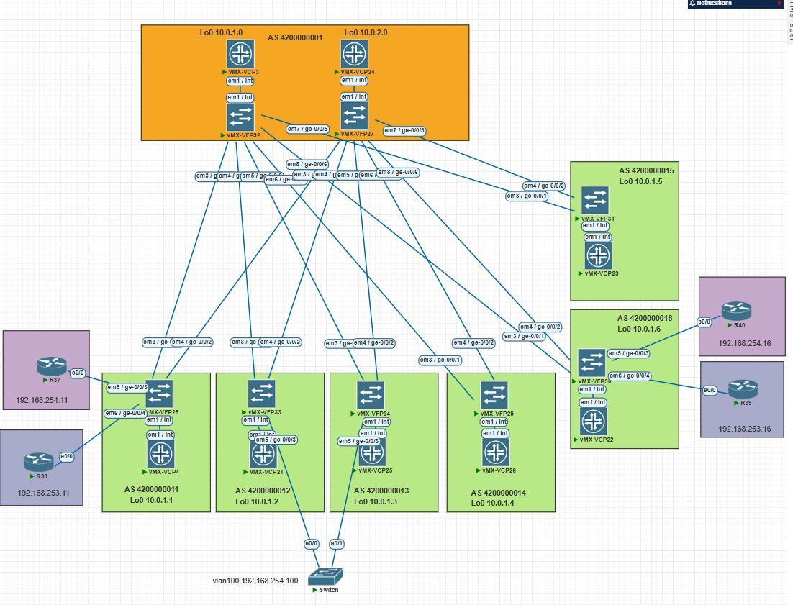
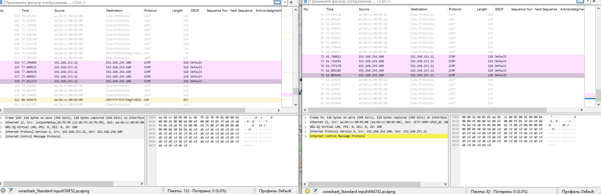

# LAB-7

## Построение EVPN active/active multihoming
---
### Схема связи и адресное пространство
Схема и адресное пространство взято из LAB-1.


Подключаем коммутатор к Leaf2 и Leaf3 и поднимаем агрегированный канал.

Конфигурация агрегированного канала на коммутаторе
```text
Switch#sh run int po1
interface Port-channel1
 switchport trunk allowed vlan 100,200
 switchport trunk encapsulation dot1q
 switchport mode trunk
end

Switch#sh run int e0/0 
interface Ethernet0/0
 switchport trunk allowed vlan 100,200
 switchport trunk encapsulation dot1q
 switchport mode trunk
 channel-protocol lacp
 channel-group 1 mode active
end

Switch#sh run int e0/1
interface Ethernet0/1
 switchport trunk allowed vlan 100,200
 switchport trunk encapsulation dot1q
 switchport mode trunk
 channel-protocol lacp
 channel-group 1 mode active
end

Switch#sh run int vl100
interface Vlan100
 ip address 192.168.254.100 255.255.255.0
end

Switch#sh run int vl200
interface Vlan200
 ip address 192.168.253.200 255.255.255.0
 shutdown
end
```
Настройка EVPN active/active multihoming на Leaf2, Leaf3 
```text
root@Leaf2> show configuration | display set 
set chassis aggregated-devices ethernet device-count 1

set interfaces ge-0/0/3 gigether-options 802.3ad ae0

set interfaces ae0 vlan-tagging
set interfaces ae0 encapsulation flexible-ethernet-services
set interfaces ae0 esi 00:12:12:12:12:12:12:12:12:12
set interfaces ae0 esi all-active
set interfaces ae0 aggregated-ether-options lacp active
set interfaces ae0 aggregated-ether-options lacp system-id 12:12:12:12:12:12
set interfaces ae0 unit 100 encapsulation vlan-bridge
set interfaces ae0 unit 100 vlan-id 100
set interfaces ae0 unit 200 encapsulation vlan-bridge
set interfaces ae0 unit 200 vlan-id 200

root@Leaf3> show configuration | display set
set chassis aggregated-devices ethernet device-count 1

set interfaces ge-0/0/3 gigether-options 802.3ad ae0
set interfaces ae0 vlan-tagging
set interfaces ae0 encapsulation flexible-ethernet-services
set interfaces ae0 esi 00:12:12:12:12:12:12:12:12:12
set interfaces ae0 esi all-active
set interfaces ae0 aggregated-ether-options lacp active
set interfaces ae0 aggregated-ether-options lacp system-id 12:12:12:12:12:12
set interfaces ae0 unit 100 encapsulation vlan-bridge
set interfaces ae0 unit 100 vlan-id 100
set interfaces ae0 unit 200 encapsulation vlan-bridge
set interfaces ae0 unit 200 vlan-id 200
```
Проверка агрегации
```text

На коммутаторе

Switch#sh etherchannel 1 summary 
Number of channel-groups in use: 1
Number of aggregators:           1

Group  Port-channel  Protocol    Ports
------+-------------+-----------+-----------------------------------------------
1      Po1(SU)         LACP      Et0/0(P)    Et0/1(P)    


На Leaf2 и Leaf3

root@Leaf2> show lacp interfaces extensive 
Aggregated interface: ae0
    LACP state:       Role   Exp   Def  Dist  Col  Syn  Aggr  Timeout  Activity
      ge-0/0/3       Actor    No    No   Yes  Yes  Yes   Yes     Fast    Active
      ge-0/0/3     Partner    No    No   Yes  Yes  Yes   Yes     Slow    Active
    LACP protocol:        Receive State  Transmit State          Mux State 
      ge-0/0/3                  Current   Slow periodic Collecting distributing
    LACP info:        Role     System             System       Port     Port    Port 
                             priority         identifier   priority   number     key 
      ge-0/0/3       Actor        127  12:12:12:12:12:12        127        1       1
      ge-0/0/3     Partner      32768  aa:bb:cc:80:05:00      32768        1       1

root@Leaf3> show lacp interfaces extensive 
Aggregated interface: ae0
    LACP state:       Role   Exp   Def  Dist  Col  Syn  Aggr  Timeout  Activity
      ge-0/0/3       Actor    No    No   Yes  Yes  Yes   Yes     Fast    Active
      ge-0/0/3     Partner    No    No   Yes  Yes  Yes   Yes     Slow    Active
    LACP protocol:        Receive State  Transmit State          Mux State 
      ge-0/0/3                  Current   Slow periodic Collecting distributing
    LACP info:        Role     System             System       Port     Port    Port 
                             priority         identifier   priority   number     key 
      ge-0/0/3       Actor        127  12:12:12:12:12:12        127        1       1
      ge-0/0/3     Partner      32768  aa:bb:cc:80:05:00      32768        2       1

root@Leaf2> show evpn instance macvrf-1 esi 00:12:12:12:12:12:12:12:12:12 extensive
Instance: macvrf-1
  Route Distinguisher: 10.0.1.2:100
  Encapsulation type: VXLAN
  Control word enabled
  Duplicate MAC detection threshold: 5
  Duplicate MAC detection window: 180
  MAC database status                     Local  Remote
    MAC advertisements:                       3      15
    MAC+IP advertisements:                    5      11
    Default gateway MAC advertisements:       4       0
  Number of local interfaces: 3 (3 up)
    Interface name  ESI                            Mode             Status     AC-Role
    .local..6       00:00:00:00:00:00:00:00:00:00  single-homed     Up         Root 
    ae0.100         00:12:12:12:12:12:12:12:12:12  all-active       Up         Root 
    ae0.200         00:12:12:12:12:12:12:12:12:12  all-active       Up         Root 
  Number of IRB interfaces: 2 (2 up)
    Interface name  VLAN   VNI    Status  L3 context
    irb.100                10100   Up     Tenant1                          
    irb.200                10200   Up     Tenant1                          
  Number of protect interfaces: 0       
  Number of bridge domains: 2
    VLAN  Domain-ID Intfs/up   IRB-intf  Mode            MAC-sync v4-SG-sync v6-SG-sync
    100   10100        1  1    irb.100   Extended        Enabled  Disabled   Disabled  
    200   10200        1  1    irb.200   Extended        Enabled  Disabled   Disabled  
  Number of neighbors: 3
    Address               MAC    MAC+IP        AD        IM        ES Leaf-label Remote-DCI-Peer Flow-label
    10.0.1.1                6         4         2         2         0                            NO  
    10.0.1.3                3         3         4         2         0                            NO  
    10.0.1.6                6         4         2         2         0                            NO  
  Number of ethernet segments: 9
    ESI: 00:12:12:12:12:12:12:12:12:12
      Status: Resolved by IFL ae0.200
      Local interface: ae0.100, Status: Up/Forwarding
      Number of remote PEs connected: 1
        Remote-PE        MAC-label  Aliasing-label  Mode
        10.0.1.3         10200      0               all-active   
      DF Election Algorithm: MOD based
      Designated forwarder: 10.0.1.2
      Backup forwarder: 10.0.1.3
      Last designated forwarder update: Apr 22 12:15:39
  Router-ID: 10.0.1.2
  Source VTEP interface IP: 10.0.1.2
  SMET Forwarding: Disabled

root@Leaf3> show evpn instance macvrf-1 esi 00:12:12:12:12:12:12:12:12:12 extensive
Instance: macvrf-1
  Route Distinguisher: 10.0.1.3:100
  Encapsulation type: VXLAN
  Control word enabled
  Duplicate MAC detection threshold: 5
  Duplicate MAC detection window: 180
  MAC database status                     Local  Remote
    MAC advertisements:                       3      15
    MAC+IP advertisements:                    5      11
    Default gateway MAC advertisements:       4       0
  Number of local interfaces: 3 (3 up)
    Interface name  ESI                            Mode             Status     AC-Role
    .local..9       00:00:00:00:00:00:00:00:00:00  single-homed     Up         Root 
    ae0.100         00:12:12:12:12:12:12:12:12:12  all-active       Up         Root 
    ae0.200         00:12:12:12:12:12:12:12:12:12  all-active       Up         Root 
  Number of IRB interfaces: 2 (2 up)
    Interface name  VLAN   VNI    Status  L3 context
    irb.100                10100   Up     Tenant1                          
    irb.200                10200   Up     Tenant1                          
  Number of protect interfaces: 0       
  Number of bridge domains: 2
    VLAN  Domain-ID Intfs/up   IRB-intf  Mode            MAC-sync v4-SG-sync v6-SG-sync
    100   10100        1  1    irb.100   Extended        Enabled  Disabled   Disabled  
    200   10200        1  1    irb.200   Extended        Enabled  Disabled   Disabled  
  Number of neighbors: 3
    Address               MAC    MAC+IP        AD        IM        ES Leaf-label Remote-DCI-Peer Flow-label
    10.0.1.1                6         4         2         2         0                            NO  
    10.0.1.2                3         3         4         2         0                            NO  
    10.0.1.6                6         4         2         2         0                            NO  
  Number of ethernet segments: 9
    ESI: 00:12:12:12:12:12:12:12:12:12
      Status: Resolved by IFL ae0.100
      Local interface: ae0.200, Status: Up/Forwarding
      Number of remote PEs connected: 1
        Remote-PE        MAC-label  Aliasing-label  Mode
        10.0.1.2         10100      0               all-active   
      DF Election Algorithm: MOD based
      Designated forwarder: 10.0.1.2
      Backup forwarder: 10.0.1.3
      Last designated forwarder update: Apr 22 12:15:40
  Router-ID: 10.0.1.3
  Source VTEP interface IP: 10.0.1.3
  SMET Forwarding: Disabled
  ```
```text
Выполним пинг до другого коммутатора подключенного к Leaf1
Switch#ping 192.168.253.11       
Type escape sequence to abort.
Sending 5, 100-byte ICMP Echos to 192.168.253.11, timeout is 2 seconds:
!!!!!
Success rate is 100 percent (5/5), round-trip min/avg/max = 3/4/5 ms
```
Снятие дампов с портов коммутатора в сторону Leaf2 и Leaf3 


Выполним проверку, с помощью выключения одного из линка на Po1 в сторону Leaf2 
```text
Switch#conf t
Enter configuration commands, one per line.  End with CNTL/Z.
Switch(config)#int e0/0
Switch(config-if)#shutdown 
Switch(config-if)#^Z

Switch#ping 192.168.253.11
*Apr 22 11:58:06.326: %SYS-5-CONFIG_I: Configured from console by console
*Apr 22 11:58:07.326: %LINK-5-CHANGED: Interface Ethernet0/0, changed state to administratively down
*Apr 22 11:58:08.326: %LINEPROTO-5-UPDOWN: Line protocol on Interface Ethernet0/0, changed state to down

Switch#sh etherchannel 1 summary 
Number of channel-groups in use: 1
Number of aggregators:           1

Group  Port-channel  Protocol    Ports
------+-------------+-----------+-----------------------------------------------
1      Po1(SU)         LACP      Et0/0(D)    Et0/1(P) 
```

Выполним пинг до другого коммутатора подключенного к Leaf1
```text
Switch#ping 192.168.253.11
Type escape sequence to abort.
Sending 5, 100-byte ICMP Echos to 192.168.253.11, timeout is 2 seconds:
!!!!!
Success rate is 100 percent (5/5), round-trip min/avg/max = 3/3/4 ms
```
Конфигурация оборудования Leaf2 и Leaf3

<details>
<summary>Leaf2</summary>

``` text
root@Leaf2> show configuration | display set | no-more                        
set version 23.2R1-S1.6
set system host-name Leaf2
set system root-authentication encrypted-password "$6$R5kBkC6K$R.98.psAqNVNeXOux5AtokzXHaJVKCHZ8XG9h9QrQxrKhlZoFqiwIZRnkDG9IXCOarK5tRSpKi7EcU.dI.OM5/"
set system syslog file interactive-commands interactive-commands any
set system syslog file messages any notice
set system syslog file messages authorization info
set system processes dhcp-service traceoptions file dhcp_logfile
set system processes dhcp-service traceoptions file size 10m
set system processes dhcp-service traceoptions level all
set system processes dhcp-service traceoptions flag packet
set chassis aggregated-devices ethernet device-count 1
set interfaces ge-0/0/1 unit 0 description "--- Leaf2 - Spine1  ---"
set interfaces ge-0/0/1 unit 0 family inet address 10.2.1.3/31
set interfaces ge-0/0/2 unit 0 description "--- Leaf2 - Spine2  ---"
set interfaces ge-0/0/2 unit 0 family inet address 10.2.2.3/31
set interfaces ge-0/0/3 gigether-options 802.3ad ae0
set interfaces ae0 vlan-tagging
set interfaces ae0 encapsulation flexible-ethernet-services
set interfaces ae0 esi 00:12:12:12:12:12:12:12:12:12
set interfaces ae0 esi all-active
set interfaces ae0 aggregated-ether-options lacp active
set interfaces ae0 aggregated-ether-options lacp system-id 12:12:12:12:12:12
set interfaces ae0 unit 100 encapsulation vlan-bridge
set interfaces ae0 unit 100 vlan-id 100
set interfaces ae0 unit 200 encapsulation vlan-bridge
set interfaces ae0 unit 200 vlan-id 200
set interfaces fxp0 unit 0 family inet dhcp vendor-id Juniper-vmx-VM67F66EAD66
set interfaces fxp0 unit 0 family inet6 dhcpv6-client client-type stateful
set interfaces fxp0 unit 0 family inet6 dhcpv6-client client-ia-type ia-na
set interfaces fxp0 unit 0 family inet6 dhcpv6-client client-identifier duid-type duid-ll
set interfaces fxp0 unit 0 family inet6 dhcpv6-client vendor-id Juniper:vmx:VM67F66EAD66
set interfaces irb unit 100 proxy-macip-advertisement
set interfaces irb unit 100 virtual-gateway-accept-data
set interfaces irb unit 100 family inet address 192.168.254.22/24 virtual-gateway-address 192.168.254.254
set interfaces irb unit 200 proxy-macip-advertisement
set interfaces irb unit 200 virtual-gateway-accept-data
set interfaces irb unit 200 family inet address 192.168.253.22/24 virtual-gateway-address 192.168.253.254
set interfaces lo0 unit 0 family inet address 10.0.1.2/32
set interfaces lo0 unit 10500 family inet
set policy-options policy-statement BGP_LOOPBACK0 term TERM1 from protocol direct
set policy-options policy-statement BGP_LOOPBACK0 term TERM1 from route-filter 10.0.1.2/32 exact
set policy-options policy-statement BGP_LOOPBACK0 term TERM1 then accept
set policy-options policy-statement PFE-ECMP then load-balance per-packet
set policy-options policy-statement allow-loopback from interface lo0.0
set policy-options policy-statement allow-loopback then accept
set routing-instances Tenant1 instance-type vrf
set routing-instances Tenant1 protocols evpn irb-symmetric-routing vni 10500
set routing-instances Tenant1 protocols evpn ip-prefix-routes advertise direct-nexthop
set routing-instances Tenant1 protocols evpn ip-prefix-routes encapsulation vxlan
set routing-instances Tenant1 protocols evpn ip-prefix-routes vni 10500
set routing-instances Tenant1 interface irb.100
set routing-instances Tenant1 interface irb.200
set routing-instances Tenant1 interface lo0.10500
set routing-instances Tenant1 route-distinguisher 10.0.1.2:500
set routing-instances Tenant1 vrf-target target:500:500
set routing-instances macvrf-1 instance-type mac-vrf
set routing-instances macvrf-1 protocols evpn encapsulation vxlan
set routing-instances macvrf-1 protocols evpn default-gateway do-not-advertise
set routing-instances macvrf-1 protocols evpn extended-vni-list all
set routing-instances macvrf-1 protocols evpn multicast-mode ingress-replication
set routing-instances macvrf-1 vtep-source-interface lo0.0
set routing-instances macvrf-1 bridge-domains bd-v100 domain-type bridge
set routing-instances macvrf-1 bridge-domains bd-v100 vlan-id 100
set routing-instances macvrf-1 bridge-domains bd-v100 interface ae0.100
set routing-instances macvrf-1 bridge-domains bd-v100 routing-interface irb.100
set routing-instances macvrf-1 bridge-domains bd-v100 vxlan vni 10100
set routing-instances macvrf-1 bridge-domains bd-v200 domain-type bridge
set routing-instances macvrf-1 bridge-domains bd-v200 vlan-id 200
set routing-instances macvrf-1 bridge-domains bd-v200 interface ae0.200
set routing-instances macvrf-1 bridge-domains bd-v200 routing-interface irb.200
set routing-instances macvrf-1 bridge-domains bd-v200 vxlan vni 10200
set routing-instances macvrf-1 service-type vlan-aware
set routing-instances macvrf-1 route-distinguisher 10.0.1.2:100
set routing-instances macvrf-1 vrf-target target:3:3
set routing-options router-id 10.0.1.2
set routing-options autonomous-system 4200000012
set routing-options forwarding-table export PFE-ECMP
set routing-options forwarding-table ecmp-fast-reroute
set protocols router-advertisement interface fxp0.0 managed-configuration
set protocols bgp group UNDERLAY type external
set protocols bgp group UNDERLAY family inet unicast
set protocols bgp group UNDERLAY export BGP_LOOPBACK0
set protocols bgp group UNDERLAY peer-as 4200000001
set protocols bgp group UNDERLAY multipath
set protocols bgp group UNDERLAY neighbor 10.2.1.2
set protocols bgp group UNDERLAY neighbor 10.2.2.2
set protocols bgp group OVERLAY type external
set protocols bgp group OVERLAY multihop
set protocols bgp group OVERLAY local-address 10.0.1.2
set protocols bgp group OVERLAY family evpn signaling
set protocols bgp group OVERLAY peer-as 4200000001
set protocols bgp group OVERLAY multipath
set protocols bgp group OVERLAY neighbor 10.0.1.0 description "Spine1 loopback"
set protocols bgp group OVERLAY neighbor 10.0.2.0 description "Spine2 loopback"
```
</details>

<details>
<summary>Leaf3</summary>

``` text
root@Leaf3> show configuration | display set | no-more 
set version 23.2R1-S1.6
set system host-name Leaf3
set system root-authentication encrypted-password "$6$cefIjkT0$VBSD1X.oSdg/vnYrz36TPCNvXI5T9WZjOtO1jYYfxo/u4cSeX.nSuoC/07IWzlDBQXq.xs4EpmEE5QxW0uqY81"
set system syslog file interactive-commands interactive-commands any
set system syslog file messages any notice
set system syslog file messages authorization info
set system processes dhcp-service traceoptions file dhcp_logfile
set system processes dhcp-service traceoptions file size 10m
set system processes dhcp-service traceoptions level all
set system processes dhcp-service traceoptions flag packet
set chassis aggregated-devices ethernet device-count 1
set interfaces ge-0/0/1 unit 0 description "--- Leaf3 - Spine1  ---"
set interfaces ge-0/0/1 unit 0 family inet address 10.2.1.5/31
set interfaces ge-0/0/2 unit 0 description "--- Leaf3 - Spine2  ---"
set interfaces ge-0/0/2 unit 0 family inet address 10.2.2.5/31
set interfaces ge-0/0/3 gigether-options 802.3ad ae0
set interfaces ae0 vlan-tagging
set interfaces ae0 encapsulation flexible-ethernet-services
set interfaces ae0 esi 00:12:12:12:12:12:12:12:12:12
set interfaces ae0 esi all-active
set interfaces ae0 aggregated-ether-options lacp active
set interfaces ae0 aggregated-ether-options lacp system-id 12:12:12:12:12:12
set interfaces ae0 unit 100 encapsulation vlan-bridge
set interfaces ae0 unit 100 vlan-id 100
set interfaces ae0 unit 200 encapsulation vlan-bridge
set interfaces ae0 unit 200 vlan-id 200
set interfaces fxp0 unit 0 family inet dhcp vendor-id Juniper-vmx-VM67F67B13C2
set interfaces fxp0 unit 0 family inet6 dhcpv6-client client-type stateful
set interfaces fxp0 unit 0 family inet6 dhcpv6-client client-ia-type ia-na
set interfaces fxp0 unit 0 family inet6 dhcpv6-client client-identifier duid-type duid-ll
set interfaces fxp0 unit 0 family inet6 dhcpv6-client vendor-id Juniper:vmx:VM67F67B13C2
set interfaces irb unit 100 proxy-macip-advertisement
set interfaces irb unit 100 virtual-gateway-accept-data
set interfaces irb unit 100 family inet address 192.168.254.23/24 virtual-gateway-address 192.168.254.254
set interfaces irb unit 200 proxy-macip-advertisement
set interfaces irb unit 200 virtual-gateway-accept-data
set interfaces irb unit 200 family inet address 192.168.253.23/24 virtual-gateway-address 192.168.253.254
set interfaces lo0 unit 0 family inet address 10.0.1.3/32
set interfaces lo0 unit 10500 family inet
set policy-options policy-statement BGP_LOOPBACK0 term TERM1 from protocol direct
set policy-options policy-statement BGP_LOOPBACK0 term TERM1 from route-filter 10.0.1.3/32 exact
set policy-options policy-statement BGP_LOOPBACK0 term TERM1 then accept
set policy-options policy-statement PFE-ECMP then load-balance per-packet
set policy-options policy-statement allow-loopback from interface lo0.0
set policy-options policy-statement allow-loopback then accept
set routing-instances Tenant1 instance-type vrf
set routing-instances Tenant1 protocols evpn irb-symmetric-routing vni 10500
set routing-instances Tenant1 protocols evpn ip-prefix-routes advertise direct-nexthop
set routing-instances Tenant1 protocols evpn ip-prefix-routes encapsulation vxlan
set routing-instances Tenant1 protocols evpn ip-prefix-routes vni 10500
set routing-instances Tenant1 interface irb.100
set routing-instances Tenant1 interface irb.200
set routing-instances Tenant1 interface lo0.10500
set routing-instances Tenant1 route-distinguisher 10.0.1.3:500
set routing-instances Tenant1 vrf-target target:500:500
set routing-instances macvrf-1 instance-type mac-vrf
set routing-instances macvrf-1 protocols evpn encapsulation vxlan
set routing-instances macvrf-1 protocols evpn default-gateway do-not-advertise
set routing-instances macvrf-1 protocols evpn extended-vni-list all
set routing-instances macvrf-1 protocols evpn multicast-mode ingress-replication
set routing-instances macvrf-1 vtep-source-interface lo0.0
set routing-instances macvrf-1 bridge-domains bd-v100 domain-type bridge
set routing-instances macvrf-1 bridge-domains bd-v100 vlan-id 100
set routing-instances macvrf-1 bridge-domains bd-v100 interface ae0.100
set routing-instances macvrf-1 bridge-domains bd-v100 routing-interface irb.100
set routing-instances macvrf-1 bridge-domains bd-v100 vxlan vni 10100
set routing-instances macvrf-1 bridge-domains bd-v200 domain-type bridge
set routing-instances macvrf-1 bridge-domains bd-v200 vlan-id 200
set routing-instances macvrf-1 bridge-domains bd-v200 interface ae0.200
set routing-instances macvrf-1 bridge-domains bd-v200 routing-interface irb.200
set routing-instances macvrf-1 bridge-domains bd-v200 vxlan vni 10200
set routing-instances macvrf-1 service-type vlan-aware
set routing-instances macvrf-1 route-distinguisher 10.0.1.3:100
set routing-instances macvrf-1 vrf-target target:3:3
set routing-options router-id 10.0.1.3
set routing-options autonomous-system 4200000013
set routing-options forwarding-table export PFE-ECMP
set routing-options forwarding-table ecmp-fast-reroute
set protocols router-advertisement interface fxp0.0 managed-configuration
set protocols bgp group UNDERLAY type external
set protocols bgp group UNDERLAY family inet unicast
set protocols bgp group UNDERLAY export BGP_LOOPBACK0
set protocols bgp group UNDERLAY peer-as 4200000001
set protocols bgp group UNDERLAY multipath
set protocols bgp group UNDERLAY neighbor 10.2.1.4
set protocols bgp group UNDERLAY neighbor 10.2.2.4
set protocols bgp group OVERLAY type external
set protocols bgp group OVERLAY multihop
set protocols bgp group OVERLAY local-address 10.0.1.3
set protocols bgp group OVERLAY family evpn signaling
set protocols bgp group OVERLAY peer-as 4200000001
set protocols bgp group OVERLAY multipath
set protocols bgp group OVERLAY neighbor 10.0.1.0 description "Spine1 loopback"
set protocols bgp group OVERLAY neighbor 10.0.2.0 description "Spine2 loopback"
```
</details>