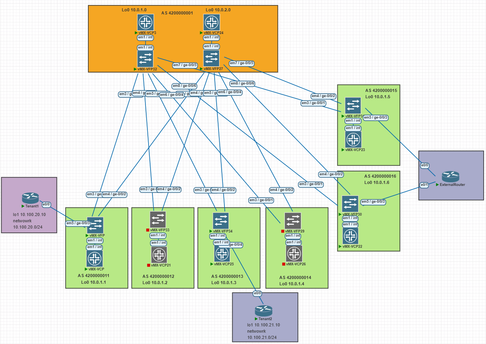

# LAB-8

## Выход из фабрики и связи двух VRF, через внешниее устройство

---
### Схема связи и адресное пространство
Схема и адресное пространство взято из LAB-1.

Фабрика будет построена на EVPN Pure Type-5 (IP Prefix Routes) без использования Type-2 (MAC/IP) для полного отказа от L2-анонсов.

Tenant1 подключен к Leaf1 с настройками
```text
interface Loopback1
 ip address 10.100.20.10 255.255.255.255
!
interface Ethernet0/0
 ip address 198.51.100.21 255.255.255.254
!
router bgp 65001
 bgp log-neighbor-changes
 network 10.100.20.0 mask 255.255.255.0
 redistribute connected
 redistribute static
 neighbor 198.51.100.20 remote-as 4200000011
 neighbor 198.51.100.20 route-map EXPORT-TO-Tenant1 out
!
ip route 10.100.20.0 255.255.255.0 Null0
!
ip prefix-list EVPN-PREFIXES seq 5 permit 0.0.0.0/0 le 32
!
ip prefix-list Tenant1-PREFIXES seq 5 permit 10.100.20.0/24 le 32
!
route-map EXPORT-TO-Tenant1 permit 10
 match ip address prefix-list EVPN-PREFIXES
!
route-map EXPORT-TO-Tenant1 deny 20
!
route-map Tenant1 permit 10
 match ip address prefix-list Tenant1-PREFIXES
```
Tenant2 подключен к Leaf3 с настройками
```text
interface Loopback1
 ip address 10.100.21.10 255.255.255.255
!
interface Ethernet0/0
 ip address 198.52.100.21 255.255.255.254
!
router bgp 65002
 bgp log-neighbor-changes
 network 10.100.21.0 mask 255.255.255.0
 redistribute connected
 redistribute static
 neighbor 198.52.100.20 remote-as 4200000013
 neighbor 198.52.100.20 route-map EXPORT-TO-Tenant2 out
 !
 ip route 10.100.21.0 255.255.255.0 Null0
!
!
ip prefix-list EVPN-PREFIXES seq 5 permit 0.0.0.0/0 le 32
!
ip prefix-list Tenant2-PREFIXES seq 5 permit 10.100.21.0/24 le 32
!
route-map EXPORT-TO-Tenant2 permit 10
 match ip address prefix-list EVPN-PREFIXES
!
route-map EXPORT-TO-Tenant2 deny 20
!
route-map Tenant2 permit 10
 match ip address prefix-list Tenant2-PREFIXES
```
Роутер ExternalRouter
```text
interface Ethernet0/0
 ip address 198.51.200.21 255.255.255.254
!
interface Ethernet0/1
 ip address 198.51.10.21 255.255.255.254
!
router bgp 65003
 bgp router-id 198.51.200.0
 bgp log-neighbor-changes
 neighbor 198.51.10.20 remote-as 4200000016
 neighbor 198.51.200.20 remote-as 4200000015
 !
 address-family ipv4
  redistribute connected
  neighbor 198.51.10.20 activate
  neighbor 198.51.200.20 activate
 exit-address-family
 ```
 ### Настройка Pure Type-5
 ```text
 root@Leaf1> show configuration routing-instances Tenant1 | display set 
set routing-instances Tenant1 instance-type vrf
set routing-instances Tenant1 protocols bgp group Tenant1 type external
set routing-instances Tenant1 protocols bgp group Tenant1 family inet unicast
set routing-instances Tenant1 protocols bgp group Tenant1 export export-to-Tenant1
set routing-instances Tenant1 protocols bgp group Tenant1 peer-as 65001
set routing-instances Tenant1 protocols bgp group Tenant1 neighbor 198.51.100.21
set routing-instances Tenant1 protocols evpn ip-prefix-routes advertise direct-nexthop
set routing-instances Tenant1 protocols evpn ip-prefix-routes encapsulation vxlan
set routing-instances Tenant1 protocols evpn ip-prefix-routes vni 10500
set routing-instances Tenant1 protocols evpn ip-prefix-routes export Tenant1
set routing-instances Tenant1 interface ge-0/0/3.0
set routing-instances Tenant1 route-distinguisher 10.0.1.1:500
set routing-instances Tenant1 vrf-target target:500:500

root@Leaf1> ...atement export-to-Tenant1 | display set                        
set policy-options policy-statement export-to-Tenant1 term 1 from protocol evpn
set policy-options policy-statement export-to-Tenant1 term 1 then accept
set policy-options policy-statement export-to-Tenant1 term 2 then reject

root@Leaf1> ...-options policy-statement Tenant1 | display set              
set policy-options policy-statement Tenant1 term 2 from route-filter 198.51.0.0/16 orlonger
set policy-options policy-statement Tenant1 term 2 then accept
set policy-options policy-statement Tenant1 term 1 from route-filter 10.100.0.0/16 orlonger
set policy-options policy-statement Tenant1 term 1 then accept
set policy-options policy-statement Tenant1 term 3 from route-filter 198.52.0.0/16 orlonger
set policy-options policy-statement Tenant1 term 3 then accept
 ```
 ```text
 root@Leaf3> show configuration routing-instances Tenant2 | display set 
set routing-instances Tenant2 instance-type vrf
set routing-instances Tenant2 protocols bgp group Tenant2 type external
set routing-instances Tenant2 protocols bgp group Tenant2 family inet unicast
set routing-instances Tenant2 protocols bgp group Tenant2 export export-to-Tenant2
set routing-instances Tenant2 protocols bgp group Tenant2 peer-as 65002
set routing-instances Tenant2 protocols bgp group Tenant2 neighbor 198.52.100.21
set routing-instances Tenant2 protocols evpn irb-symmetric-routing vni 10600
set routing-instances Tenant2 protocols evpn ip-prefix-routes advertise direct-nexthop
set routing-instances Tenant2 protocols evpn ip-prefix-routes encapsulation vxlan
set routing-instances Tenant2 protocols evpn ip-prefix-routes vni 10600
set routing-instances Tenant2 protocols evpn ip-prefix-routes export Tenant2
set routing-instances Tenant2 interface ge-0/0/4.0
set routing-instances Tenant2 route-distinguisher 10.0.1.3:600
set routing-instances Tenant2 vrf-target target:600:600

root@Leaf3> ...atement export-to-Tenant2 | display set                        
set policy-options policy-statement export-to-Tenant2 term 1 from protocol evpn
set policy-options policy-statement export-to-Tenant2 term 1 then accept
set policy-options policy-statement export-to-Tenant2 term 2 then reject

root@Leaf3> ...-options policy-statement Tenant2 | display set              
set policy-options policy-statement Tenant2 term 2 from route-filter 198.51.0.0/16 orlonger
set policy-options policy-statement Tenant2 term 2 then accept
set policy-options policy-statement Tenant2 term 1 from route-filter 10.100.0.0/16 orlonger
set policy-options policy-statement Tenant2 term 1 then accept
set policy-options policy-statement Tenant2 term 3 from route-filter 198.52.0.0/16 orlonger
set policy-options policy-statement Tenant2 term 3 then accept
 ```
 ### Проверка пинга между Tenant1 - Tenant2
 ```text
 Tenant1#ping 10.100.21.10
Type escape sequence to abort.
Sending 5, 100-byte ICMP Echos to 10.100.21.10, timeout is 2 seconds:
!!!!!
Success rate is 100 percent (5/5), round-trip min/avg/max = 6/7/11 ms
```
```text
Tenant1#traceroute 10.100.21.10
Type escape sequence to abort.
Tracing the route to 10.100.21.10
VRF info: (vrf in name/id, vrf out name/id)
  1 198.51.100.20 1 msec 1 msec 1 msec
  2 198.51.200.20 [AS 4200000015] 4 msec 2 msec 4 msec
  3 198.51.200.21 [AS 4200000015] 3 msec 3 msec 4 msec
  4 198.51.10.20 [AS 65003] 5 msec 5 msec 4 msec
  5 198.52.100.20 [AS 4200000013] 7 msec 7 msec 7 msec
  6 198.52.100.21 [AS 4200000013] 6 msec 10 msec 10 msec
  ```
  ```text
  Tenant2#ping 10.100.20.10
Type escape sequence to abort.
Sending 5, 100-byte ICMP Echos to 10.100.20.10, timeout is 2 seconds:
!!!!!
Success rate is 100 percent (5/5), round-trip min/avg/max = 6/7/10 ms
  ```
  ```text
  Tenant2#traceroute 10.100.20.10
Type escape sequence to abort.
Tracing the route to 10.100.20.10
VRF info: (vrf in name/id, vrf out name/id)
  1 198.52.100.20 1 msec 1 msec 0 msec
  2 198.51.10.20 [AS 4200000016] 4 msec 3 msec 4 msec
  3 198.51.10.21 [AS 4200000016] 3 msec 4 msec 3 msec
  4 198.51.200.20 [AS 65003] 5 msec 4 msec 5 msec
  5 198.51.100.20 [AS 4200000011] 6 msec 6 msec 6 msec
  6 198.51.100.21 [AS 4200000011] 7 msec 7 msec 6 msec
  ```
  #### Проверка Type-5 маршрутов на Leaf1
  ```text
  root@Leaf1> show route | match 5:10 
5:10.0.1.1:500::0::10.100.20.0::24/248               
5:10.0.1.1:500::0::198.51.100.20::31/248               
5:10.0.1.1:500::0::10.100.20.10::32/248               
5:10.0.1.1:500::0::198.51.100.20::32/248               
5:10.0.1.3:600::0::10.100.21.0::24/248               
5:10.0.1.3:600::0::198.52.100.20::31/248               
5:10.0.1.3:600::0::10.100.21.10::32/248               
5:10.0.1.3:600::0::198.52.100.20::32/248               
5:10.0.1.5:500::0::10.100.21.0::24/248               
5:10.0.1.5:500::0::198.51.10.20::31/248               
5:10.0.1.5:500::0::198.51.200.20::31/248               
5:10.0.1.5:500::0::198.52.100.20::31/248               
5:10.0.1.5:500::0::10.100.21.10::32/248               
5:10.0.1.5:500::0::198.51.200.20::32/248               
5:10.0.1.5:500::0::198.52.100.20::32/248               
5:10.0.1.6:600::0::10.100.20.0::24/248               
5:10.0.1.6:600::0::198.51.10.20::31/248               
5:10.0.1.6:600::0::198.51.100.20::31/248               
5:10.0.1.6:600::0::198.51.200.20::31/248               
5:10.0.1.6:600::0::10.100.20.10::32/248               
5:10.0.1.6:600::0::198.51.10.20::32/248               
5:10.0.1.6:600::0::198.51.100.20::32/248               
5:10.0.1.1:500::0::10.100.20.0::24/248               
5:10.0.1.1:500::0::198.51.100.20::31/248               
5:10.0.1.1:500::0::10.100.20.10::32/248               
5:10.0.1.1:500::0::198.51.100.20::32/248               
5:10.0.1.5:500::0::10.100.21.0::24/248               
5:10.0.1.5:500::0::198.51.10.20::31/248               
5:10.0.1.5:500::0::198.51.200.20::31/248               
5:10.0.1.5:500::0::198.52.100.20::31/248               
5:10.0.1.5:500::0::10.100.21.10::32/248               
5:10.0.1.5:500::0::198.51.200.20::32/248               
5:10.0.1.5:500::0::198.52.100.20::32/248 
```
#### Проверка Type-5 маршрутов на Leaf3
```text
root@Leaf3> show route | match 5:10 
5:10.0.1.1:500::0::10.100.20.0::24/248               
5:10.0.1.1:500::0::198.51.100.20::31/248               
5:10.0.1.1:500::0::10.100.20.10::32/248               
5:10.0.1.1:500::0::198.51.100.20::32/248               
5:10.0.1.3:600::0::10.100.21.0::24/248               
5:10.0.1.3:600::0::198.52.100.20::31/248               
5:10.0.1.3:600::0::10.100.21.10::32/248               
5:10.0.1.3:600::0::198.52.100.20::32/248               
5:10.0.1.5:500::0::10.100.21.0::24/248               
5:10.0.1.5:500::0::198.51.10.20::31/248               
5:10.0.1.5:500::0::198.51.200.20::31/248               
5:10.0.1.5:500::0::198.52.100.20::31/248               
5:10.0.1.5:500::0::10.100.21.10::32/248               
5:10.0.1.5:500::0::198.51.200.20::32/248               
5:10.0.1.5:500::0::198.52.100.20::32/248               
5:10.0.1.6:600::0::10.100.20.0::24/248               
5:10.0.1.6:600::0::198.51.10.20::31/248               
5:10.0.1.6:600::0::198.51.100.20::31/248               
5:10.0.1.6:600::0::198.51.200.20::31/248               
5:10.0.1.6:600::0::10.100.20.10::32/248               
5:10.0.1.6:600::0::198.51.10.20::32/248               
5:10.0.1.6:600::0::198.51.100.20::32/248               
5:10.0.1.3:600::0::10.100.21.0::24/248               
5:10.0.1.3:600::0::198.52.100.20::31/248               
5:10.0.1.3:600::0::10.100.21.10::32/248               
5:10.0.1.3:600::0::198.52.100.20::32/248               
5:10.0.1.6:600::0::10.100.20.0::24/248               
5:10.0.1.6:600::0::198.51.10.20::31/248               
5:10.0.1.6:600::0::198.51.100.20::31/248               
5:10.0.1.6:600::0::198.51.200.20::31/248               
5:10.0.1.6:600::0::10.100.20.10::32/248               
5:10.0.1.6:600::0::198.51.10.20::32/248               
5:10.0.1.6:600::0::198.51.100.20::32/248 
```
### Конфигурация оборудования Leaf1 и Leaf3

<details>
<summary>Leaf1</summary>

``` text
root@Leaf1> show configuration | display set 
set version 23.2R1-S1.6
set system host-name Leaf1
set system root-authentication encrypted-password "$6$sN3Ysqi/$YgsihrTjGtjJG3P8/Vhy.1tyCZ7dirYiHx1RR4Zt4ClNjfcmZdyS24ilQgfC6fulygvMCNTN.FcC5Rwa.iQEp0"
set system syslog file interactive-commands interactive-commands any
set system syslog file messages any notice
set system syslog file messages authorization info
set system processes dhcp-service traceoptions file dhcp_logfile
set system processes dhcp-service traceoptions file size 10m
set system processes dhcp-service traceoptions level all
set system processes dhcp-service traceoptions flag packet
set interfaces ge-0/0/1 mtu 9000
set interfaces ge-0/0/1 unit 0 description "--- Leaf1 - Spine1  ---"
set interfaces ge-0/0/1 unit 0 family inet address 10.2.1.1/31
set interfaces ge-0/0/2 mtu 9000
set interfaces ge-0/0/2 unit 0 description "--- Leaf1 - Spine2  ---"
set interfaces ge-0/0/2 unit 0 family inet address 10.2.2.1/31
set interfaces ge-0/0/3 mtu 9000
set interfaces ge-0/0/3 unit 0 family inet address 198.51.100.20/31
set interfaces fxp0 unit 0 family inet dhcp vendor-id Juniper-vmx-VM67F66E9C21
set interfaces fxp0 unit 0 family inet6 dhcpv6-client client-type stateful
set interfaces fxp0 unit 0 family inet6 dhcpv6-client client-ia-type ia-na
set interfaces fxp0 unit 0 family inet6 dhcpv6-client client-identifier duid-type duid-ll
set interfaces fxp0 unit 0 family inet6 dhcpv6-client vendor-id Juniper:vmx:VM67F66E9C21
set interfaces lo0 unit 0 family inet address 10.0.1.1/32
set policy-options policy-statement BGP_LOOPBACK0 term TERM1 from protocol direct
set policy-options policy-statement BGP_LOOPBACK0 term TERM1 from route-filter 10.0.1.1/32 exact
set policy-options policy-statement BGP_LOOPBACK0 term TERM1 then accept
set policy-options policy-statement PFE-ECMP then load-balance per-packet
set policy-options policy-statement Tenant1 term 2 from route-filter 198.51.0.0/16 orlonger
set policy-options policy-statement Tenant1 term 2 then accept
set policy-options policy-statement Tenant1 term 1 from route-filter 10.100.0.0/16 orlonger
set policy-options policy-statement Tenant1 term 1 then accept
set policy-options policy-statement Tenant1 term 3 from route-filter 198.52.0.0/16 orlonger
set policy-options policy-statement Tenant1 term 3 then accept
set policy-options policy-statement allow-loopback from interface lo0.0
set policy-options policy-statement allow-loopback then accept
set policy-options policy-statement export-to-Tenant1 term 1 from protocol evpn
set policy-options policy-statement export-to-Tenant1 term 1 then accept
set policy-options policy-statement export-to-Tenant1 term 2 then reject
set routing-instances Tenant1 instance-type vrf
set routing-instances Tenant1 protocols bgp group Tenant1 type external
set routing-instances Tenant1 protocols bgp group Tenant1 family inet unicast
set routing-instances Tenant1 protocols bgp group Tenant1 export export-to-Tenant1
set routing-instances Tenant1 protocols bgp group Tenant1 peer-as 65001
set routing-instances Tenant1 protocols bgp group Tenant1 neighbor 198.51.100.21
set routing-instances Tenant1 protocols evpn ip-prefix-routes advertise direct-nexthop
set routing-instances Tenant1 protocols evpn ip-prefix-routes encapsulation vxlan
set routing-instances Tenant1 protocols evpn ip-prefix-routes vni 10500
set routing-instances Tenant1 protocols evpn ip-prefix-routes export Tenant1
set routing-instances Tenant1 interface ge-0/0/3.0
set routing-instances Tenant1 route-distinguisher 10.0.1.1:500
set routing-instances Tenant1 vrf-target target:500:500
set routing-options router-id 10.0.1.1
set routing-options autonomous-system 4200000011
set routing-options autonomous-system loops 2
set routing-options forwarding-table export PFE-ECMP
set routing-options forwarding-table ecmp-fast-reroute
set protocols router-advertisement interface fxp0.0 managed-configuration
set protocols bgp group UNDERLAY type external
set protocols bgp group UNDERLAY family inet unicast
set protocols bgp group UNDERLAY export BGP_LOOPBACK0
set protocols bgp group UNDERLAY peer-as 4200000001
set protocols bgp group UNDERLAY multipath
set protocols bgp group UNDERLAY neighbor 10.2.1.0
set protocols bgp group UNDERLAY neighbor 10.2.2.0
set protocols bgp group OVERLAY type external
set protocols bgp group OVERLAY multihop
set protocols bgp group OVERLAY local-address 10.0.1.1
set protocols bgp group OVERLAY family evpn signaling
set protocols bgp group OVERLAY peer-as 4200000001
set protocols bgp group OVERLAY multipath
set protocols bgp group OVERLAY neighbor 10.0.1.0 description "Spine1 loopback"
set protocols bgp group OVERLAY neighbor 10.0.2.0 description "Spine2 loopback"

```
</details>

<details>
<summary>Leaf3</summary>

``` text
root@Leaf3> show configuration | display set 
set version 23.2R1-S1.6
set system host-name Leaf3
set system root-authentication encrypted-password "$6$cefIjkT0$VBSD1X.oSdg/vnYrz36TPCNvXI5T9WZjOtO1jYYfxo/u4cSeX.nSuoC/07IWzlDBQXq.xs4EpmEE5QxW0uqY81"
set system syslog file interactive-commands interactive-commands any
set system syslog file messages any notice
set system syslog file messages authorization info
set system processes dhcp-service traceoptions file dhcp_logfile
set system processes dhcp-service traceoptions file size 10m
set system processes dhcp-service traceoptions level all
set system processes dhcp-service traceoptions flag packet
set chassis aggregated-devices ethernet device-count 1
set interfaces ge-0/0/1 unit 0 description "--- Leaf3 - Spine1  ---"
set interfaces ge-0/0/1 unit 0 family inet address 10.2.1.5/31
set interfaces ge-0/0/2 unit 0 description "--- Leaf3 - Spine2  ---"
set interfaces ge-0/0/2 unit 0 family inet address 10.2.2.5/31
set interfaces ge-0/0/4 unit 0 family inet address 198.52.100.20/31
set interfaces fxp0 unit 0 family inet dhcp vendor-id Juniper-vmx-VM67F67B13C2
set interfaces fxp0 unit 0 family inet6 dhcpv6-client client-type stateful
set interfaces fxp0 unit 0 family inet6 dhcpv6-client client-ia-type ia-na
set interfaces fxp0 unit 0 family inet6 dhcpv6-client client-identifier duid-type duid-ll
set interfaces fxp0 unit 0 family inet6 dhcpv6-client vendor-id Juniper:vmx:VM67F67B13C2
set interfaces lo0 unit 0 family inet address 10.0.1.3/32
set policy-options policy-statement BGP_LOOPBACK0 term TERM1 from protocol direct
set policy-options policy-statement BGP_LOOPBACK0 term TERM1 from route-filter 10.0.1.3/32 exact
set policy-options policy-statement BGP_LOOPBACK0 term TERM1 then accept
set policy-options policy-statement PFE-ECMP then load-balance per-packet
set policy-options policy-statement Tenant2 term 2 from route-filter 198.51.0.0/16 orlonger
set policy-options policy-statement Tenant2 term 2 then accept
set policy-options policy-statement Tenant2 term 1 from route-filter 10.100.0.0/16 orlonger
set policy-options policy-statement Tenant2 term 1 then accept
set policy-options policy-statement Tenant2 term 3 from route-filter 198.52.0.0/16 orlonger
set policy-options policy-statement Tenant2 term 3 then accept
set policy-options policy-statement allow-loopback from interface lo0.0
set policy-options policy-statement allow-loopback then accept
set policy-options policy-statement export-to-Tenant2 term 1 from protocol evpn
set policy-options policy-statement export-to-Tenant2 term 1 then accept
set policy-options policy-statement export-to-Tenant2 term 2 then reject
set routing-instances Tenant2 instance-type vrf
set routing-instances Tenant2 protocols bgp group Tenant2 type external
set routing-instances Tenant2 protocols bgp group Tenant2 family inet unicast
set routing-instances Tenant2 protocols bgp group Tenant2 export export-to-Tenant2
set routing-instances Tenant2 protocols bgp group Tenant2 peer-as 65002
set routing-instances Tenant2 protocols bgp group Tenant2 neighbor 198.52.100.21
set routing-instances Tenant2 protocols evpn irb-symmetric-routing vni 10600
set routing-instances Tenant2 protocols evpn ip-prefix-routes advertise direct-nexthop
set routing-instances Tenant2 protocols evpn ip-prefix-routes encapsulation vxlan
set routing-instances Tenant2 protocols evpn ip-prefix-routes vni 10600
set routing-instances Tenant2 protocols evpn ip-prefix-routes export Tenant2
set routing-instances Tenant2 interface ge-0/0/4.0
set routing-instances Tenant2 route-distinguisher 10.0.1.3:600
set routing-instances Tenant2 vrf-target target:600:600
set routing-options router-id 10.0.1.3
set routing-options autonomous-system 4200000013
set routing-options autonomous-system loops 2
set routing-options forwarding-table export PFE-ECMP
set routing-options forwarding-table ecmp-fast-reroute
set protocols router-advertisement interface fxp0.0 managed-configuration
set protocols bgp group UNDERLAY type external
set protocols bgp group UNDERLAY family inet unicast
set protocols bgp group UNDERLAY export BGP_LOOPBACK0
set protocols bgp group UNDERLAY peer-as 4200000001
set protocols bgp group UNDERLAY multipath
set protocols bgp group UNDERLAY neighbor 10.2.1.4
set protocols bgp group UNDERLAY neighbor 10.2.2.4
set protocols bgp group OVERLAY type external
set protocols bgp group OVERLAY multihop
set protocols bgp group OVERLAY local-address 10.0.1.3
set protocols bgp group OVERLAY family evpn signaling
set protocols bgp group OVERLAY peer-as 4200000001
set protocols bgp group OVERLAY multipath
set protocols bgp group OVERLAY neighbor 10.0.1.0 description "Spine1 loopback"
set protocols bgp group OVERLAY neighbor 10.0.2.0 description "Spine2 loopback"

```
</details>

<details>
<summary>BorderLeaf1</summary>

``` text
root@BorderLeaf1> show configuration | display set 
set version 23.2R1-S1.6
set system host-name BorderLeaf1
set system root-authentication encrypted-password "$6$76Ij4f.4$S6Xch11NPUEJnSvcLUN13s/AK0Eshx2xEVq02D5OpjTi25Tm2Nua0EA1ILOBlYZFAPaNx4xcCqdvMvJOUDCT40"
set system syslog file interactive-commands interactive-commands any
set system syslog file messages any notice
set system syslog file messages authorization info
set system processes dhcp-service traceoptions file dhcp_logfile
set system processes dhcp-service traceoptions file size 10m
set system processes dhcp-service traceoptions level all
set system processes dhcp-service traceoptions flag packet
set interfaces ge-0/0/1 mtu 9000
set interfaces ge-0/0/1 unit 0 description "--- BorderLeaf1 - Spine1  ---"
set interfaces ge-0/0/1 unit 0 family inet address 10.2.1.9/31
set interfaces ge-0/0/2 mtu 9000
set interfaces ge-0/0/2 unit 0 description "--- BorderLeaf1 - Spine2  ---"
set interfaces ge-0/0/2 unit 0 family inet address 10.2.2.9/31
set interfaces ge-0/0/3 mtu 9000
set interfaces ge-0/0/3 unit 0 family inet address 198.51.200.20/31
set interfaces fxp0 unit 0 family inet dhcp vendor-id Juniper-vmx-VM67F66ECA04
set interfaces fxp0 unit 0 family inet6 dhcpv6-client client-type stateful
set interfaces fxp0 unit 0 family inet6 dhcpv6-client client-ia-type ia-na
set interfaces fxp0 unit 0 family inet6 dhcpv6-client client-identifier duid-type duid-ll
set interfaces fxp0 unit 0 family inet6 dhcpv6-client vendor-id Juniper:vmx:VM67F66ECA04
set interfaces lo0 unit 0 family inet address 10.0.1.5/32
set policy-options policy-statement BGP_LOOPBACK0 term TERM1 from protocol direct
set policy-options policy-statement BGP_LOOPBACK0 term TERM1 from route-filter 10.0.1.5/32 exact
set policy-options policy-statement BGP_LOOPBACK0 term TERM1 then accept
set policy-options policy-statement PFE-ECMP then load-balance per-packet
set policy-options policy-statement Tenant1 term 1 from route-filter 198.51.0.0/16 orlonger
set policy-options policy-statement Tenant1 term 1 then accept
set policy-options policy-statement Tenant1 term 2 from route-filter 10.100.0.0/16 orlonger
set policy-options policy-statement Tenant1 term 2 then accept
set policy-options policy-statement Tenant1 term 3 from route-filter 198.52.0.0/16 orlonger
set policy-options policy-statement Tenant1 term 3 then accept
set policy-options policy-statement allow-loopback from interface lo0.0
set policy-options policy-statement allow-loopback then accept
set policy-options policy-statement export-to-Tenant1 term 1 from protocol evpn
set policy-options policy-statement export-to-Tenant1 term 1 then accept
set policy-options policy-statement export-to-Tenant1 term 2 then reject
set routing-instances Tenant1 instance-type vrf
set routing-instances Tenant1 protocols bgp group Tenant1 type external
set routing-instances Tenant1 protocols bgp group Tenant1 family inet unicast
set routing-instances Tenant1 protocols bgp group Tenant1 export export-to-Tenant1
set routing-instances Tenant1 protocols bgp group Tenant1 peer-as 65003
set routing-instances Tenant1 protocols bgp group Tenant1 neighbor 198.51.200.21
set routing-instances Tenant1 protocols evpn ip-prefix-routes advertise direct-nexthop
set routing-instances Tenant1 protocols evpn ip-prefix-routes encapsulation vxlan
set routing-instances Tenant1 protocols evpn ip-prefix-routes vni 10500
set routing-instances Tenant1 protocols evpn ip-prefix-routes export Tenant1
set routing-instances Tenant1 interface ge-0/0/3.0
set routing-instances Tenant1 route-distinguisher 10.0.1.5:500
set routing-instances Tenant1 vrf-target target:500:500
set routing-options router-id 10.0.1.5
set routing-options autonomous-system 4200000015
set routing-options autonomous-system loops 2
set routing-options forwarding-table export PFE-ECMP
set routing-options forwarding-table ecmp-fast-reroute
set protocols router-advertisement interface fxp0.0 managed-configuration
set protocols bgp group UNDERLAY type external
set protocols bgp group UNDERLAY family inet unicast
set protocols bgp group UNDERLAY export BGP_LOOPBACK0
set protocols bgp group UNDERLAY peer-as 4200000001
set protocols bgp group UNDERLAY multipath multiple-as
set protocols bgp group UNDERLAY neighbor 10.2.1.8
set protocols bgp group UNDERLAY neighbor 10.2.2.8
set protocols bgp group OVERLAY type external
set protocols bgp group OVERLAY multihop
set protocols bgp group OVERLAY local-address 10.0.1.5
set protocols bgp group OVERLAY family evpn signaling
set protocols bgp group OVERLAY peer-as 4200000001
set protocols bgp group OVERLAY multipath
set protocols bgp group OVERLAY neighbor 10.0.1.0 description "Spine1 loopback"
set protocols bgp group OVERLAY neighbor 10.0.2.0 description "Spine2 loopback"


```
</details>

<details>
<summary>BorderLeaf2</summary>

``` text
root@BorderLeaf2> show configuration | display set 
set version 23.2R1-S1.6
set system host-name BorderLeaf2
set system root-authentication encrypted-password "$6$aS73LIyb$YrQXokgqZ9q33HaPYBYnbhqqo7pn30uEPoZ/w/9j5k4hTMiRBAUtuRpxV5u.aOv3QTM8aKyJq8yhpuHbd3S5n0"
set system syslog file interactive-commands interactive-commands any
set system syslog file messages any notice
set system syslog file messages authorization info
set system processes dhcp-service traceoptions file dhcp_logfile
set system processes dhcp-service traceoptions file size 10m
set system processes dhcp-service traceoptions level all
set system processes dhcp-service traceoptions flag packet
set interfaces ge-0/0/1 mtu 9000
set interfaces ge-0/0/1 unit 0 family inet address 10.2.1.11/31
set interfaces ge-0/0/2 mtu 9000
set interfaces ge-0/0/2 unit 0 family inet address 10.2.2.11/31
set interfaces ge-0/0/3 unit 0 family inet address 198.51.10.20/31
set interfaces lo0 unit 0 family inet address 10.0.1.6/32
set policy-options policy-statement BGP_LOOPBACK0 term TERM1 from protocol direct
set policy-options policy-statement BGP_LOOPBACK0 term TERM1 from route-filter 10.0.1.6/32 exact
set policy-options policy-statement BGP_LOOPBACK0 term TERM1 then accept
set policy-options policy-statement PFE-ECMP then load-balance per-packet
set policy-options policy-statement Tenant2 term 2 from route-filter 198.51.0.0/16 orlonger
set policy-options policy-statement Tenant2 term 2 then accept
set policy-options policy-statement Tenant2 term 1 from route-filter 10.100.0.0/16 orlonger
set policy-options policy-statement Tenant2 term 1 then accept
set policy-options policy-statement Tenant2 term 3 from route-filter 198.52.0.0/16 orlonger
set policy-options policy-statement Tenant2 term 3 then accept
set policy-options policy-statement allow-loopback from interface lo0.0
set policy-options policy-statement allow-loopback then accept
set policy-options policy-statement export-to-Tenant2 term 1 from protocol evpn
set policy-options policy-statement export-to-Tenant2 term 1 then accept
set policy-options policy-statement export-to-Tenant2 term 2 then reject
set routing-instances Tenant2 instance-type vrf
set routing-instances Tenant2 protocols bgp group Tenant2 type external
set routing-instances Tenant2 protocols bgp group Tenant2 family inet unicast
set routing-instances Tenant2 protocols bgp group Tenant2 export export-to-Tenant2
set routing-instances Tenant2 protocols bgp group Tenant2 peer-as 65003
set routing-instances Tenant2 protocols bgp group Tenant2 neighbor 198.51.10.21
set routing-instances Tenant2 protocols evpn irb-symmetric-routing vni 10600
set routing-instances Tenant2 protocols evpn ip-prefix-routes advertise direct-nexthop
set routing-instances Tenant2 protocols evpn ip-prefix-routes encapsulation vxlan
set routing-instances Tenant2 protocols evpn ip-prefix-routes vni 10600
set routing-instances Tenant2 protocols evpn ip-prefix-routes export Tenant2
set routing-instances Tenant2 interface ge-0/0/3.0
set routing-instances Tenant2 route-distinguisher 10.0.1.6:600
set routing-instances Tenant2 vrf-target target:600:600
set routing-options router-id 10.0.1.6
set routing-options autonomous-system 4200000016
set routing-options autonomous-system loops 2
set routing-options forwarding-table export PFE-ECMP
set routing-options forwarding-table ecmp-fast-reroute
set protocols router-advertisement interface fxp0.0 managed-configuration
set protocols bgp group UNDERLAY type external
set protocols bgp group UNDERLAY export BGP_LOOPBACK0
set protocols bgp group UNDERLAY peer-as 4200000001
set protocols bgp group UNDERLAY multipath
set protocols bgp group UNDERLAY neighbor 10.2.1.10
set protocols bgp group UNDERLAY neighbor 10.2.2.10
set protocols bgp group OVERLAY type external
set protocols bgp group OVERLAY multihop
set protocols bgp group OVERLAY local-address 10.0.1.6
set protocols bgp group OVERLAY family evpn signaling
set protocols bgp group OVERLAY peer-as 4200000001
set protocols bgp group OVERLAY multipath
set protocols bgp group OVERLAY neighbor 10.0.1.0 description "Spine1 loopback"
set protocols bgp group OVERLAY neighbor 10.0.2.0 description "Spine2 loopback"

```
</details>